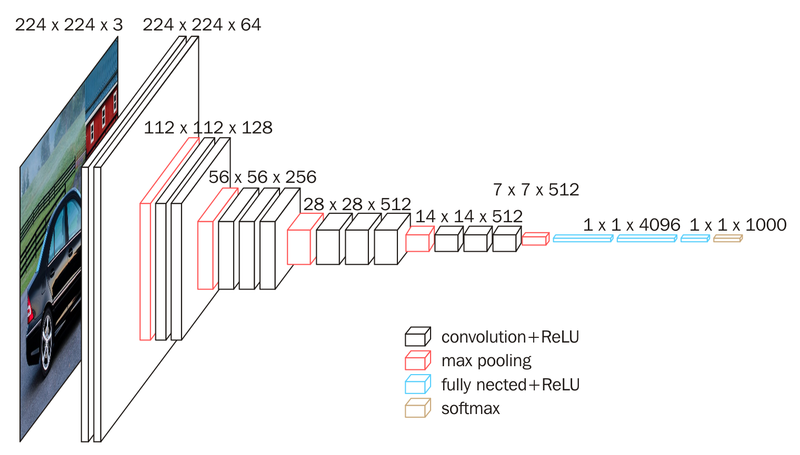
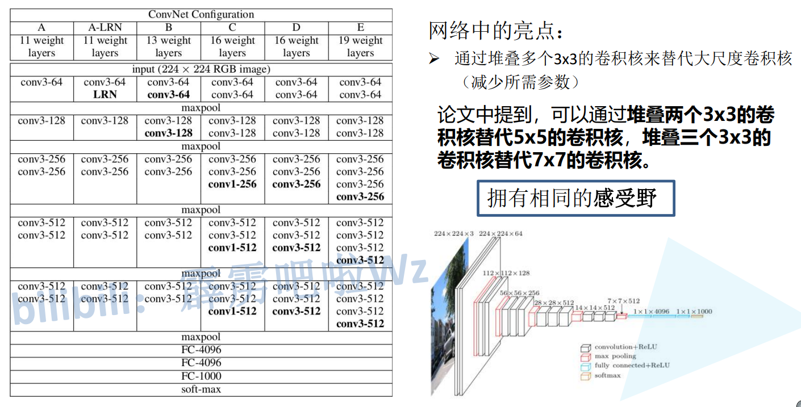
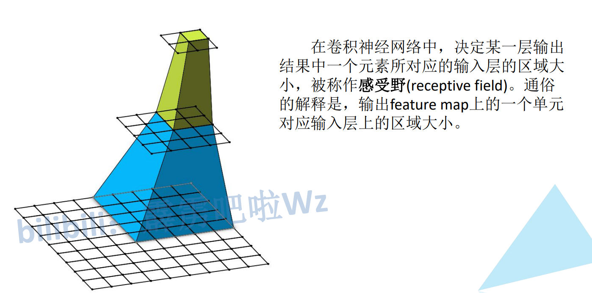
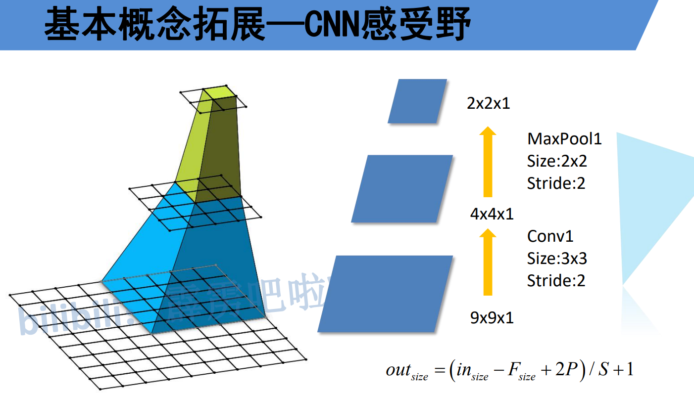
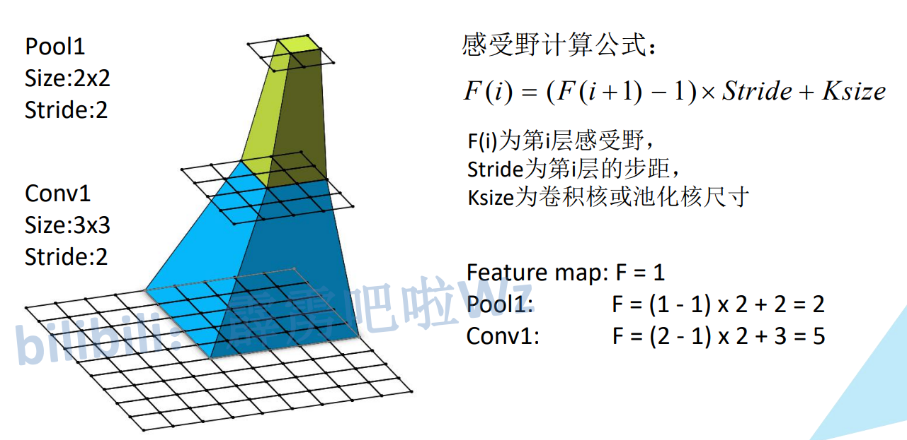
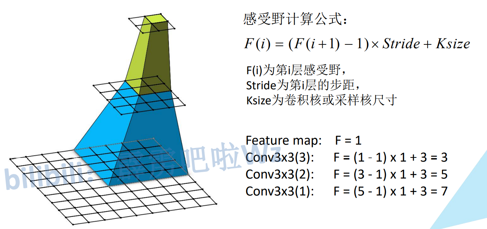
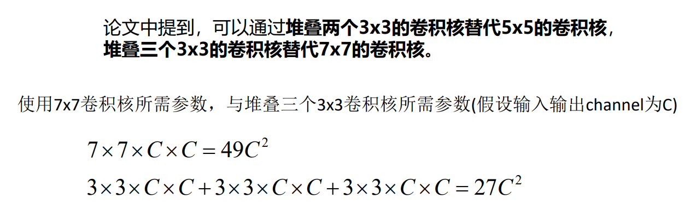
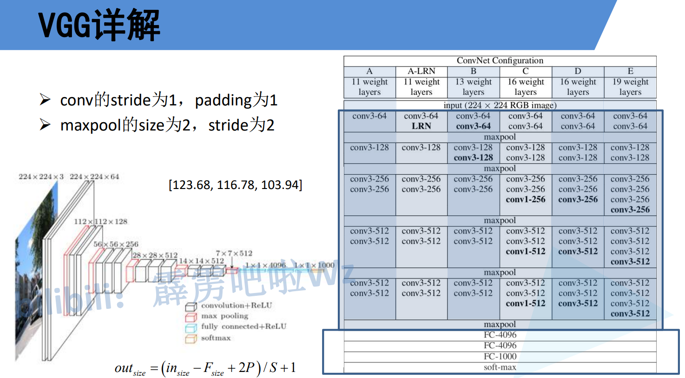

# VGG

13个卷积层+3个全连接层

# 感受野

> 下图：
>
> 最下面时9x9大小，通过一个 k=3 s=2的卷积，大小变为4x4，再通过一个maxpool k=2=2，变为2x2

## 计算感受野公式

> F(i) 代表第i层感受野
>
> Stride代表第i层的步距
>
> Ksize代表卷积核或者池化核的大小
>
> 特征层3在特征层2上的感受野是   (1 - 1) * 2 + 2 = 2   最前面的1是特征层3的感受野
>
> 特征层2在特征层1上的感受野是   (2 - 1) * 3 + 2 = 5    最前面的2是特征层2的感受野

$$
F(i) = (F(i+1) - 1) * Stride + Ksize
$$

## 使用多个小卷积和代替一个大卷积核可以节省计算量

# VGG16解释

> 13个卷积层 + 3个线性层
>
> 卷积大小不变
>
> $F_{size}$ 指的是 Kernel Size  (224 - 3 + 2) / 1 + 1 = 224

$$
Out_{size} = (In_{size} - F_{size} + 2P) / S + 1
$$

> 池化宽高减半

