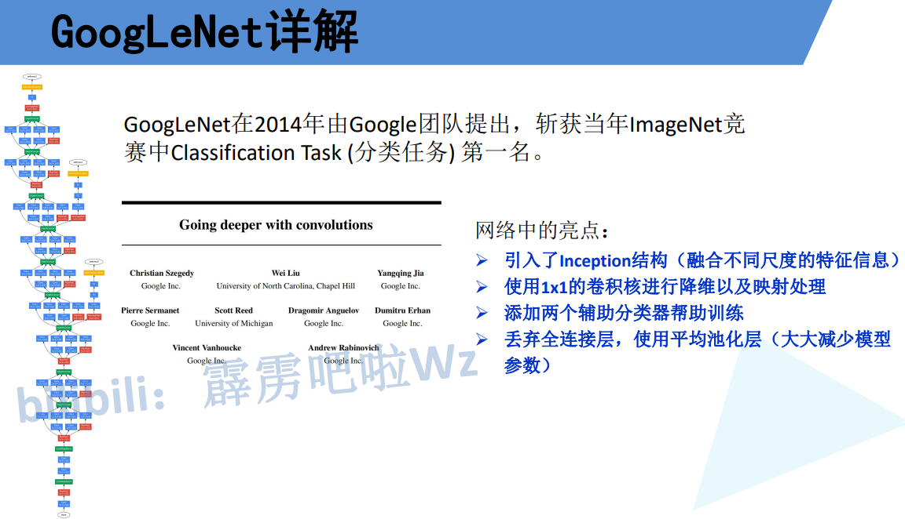
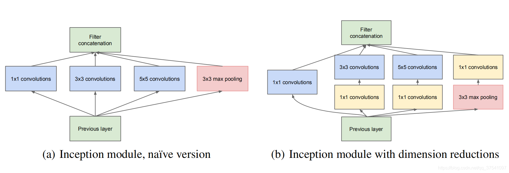
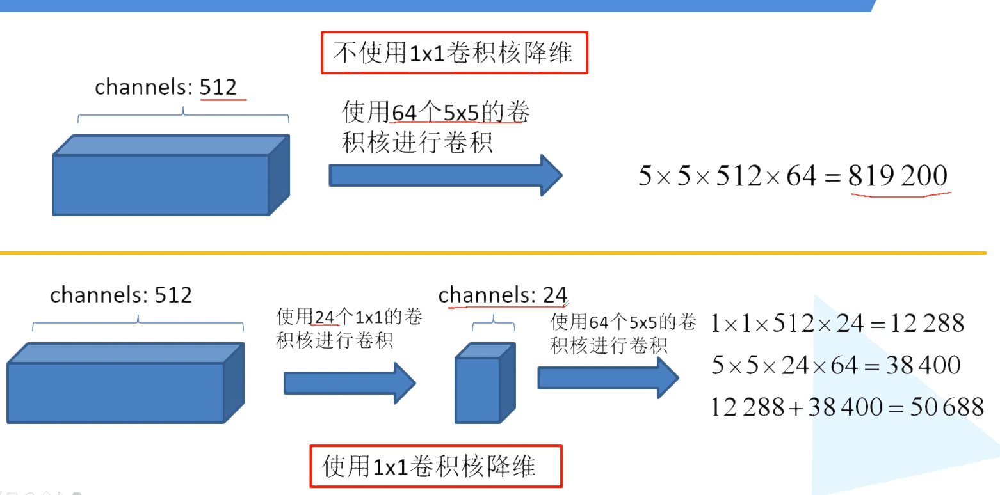
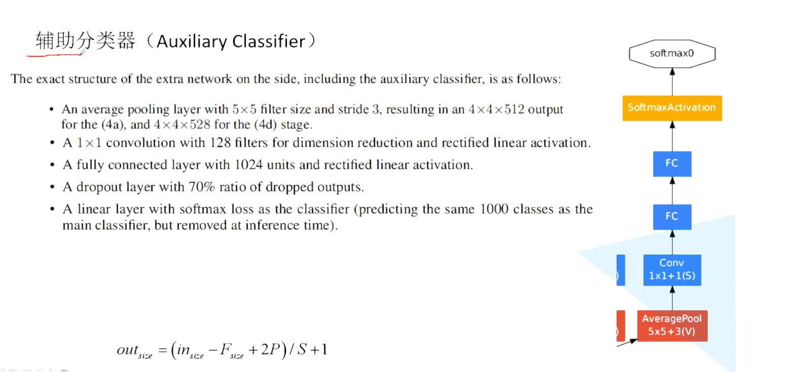
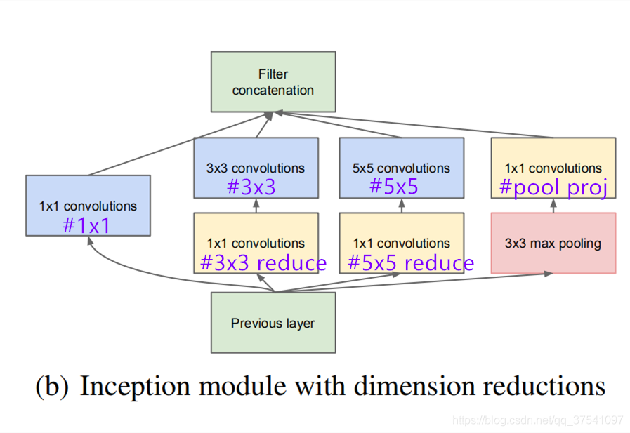
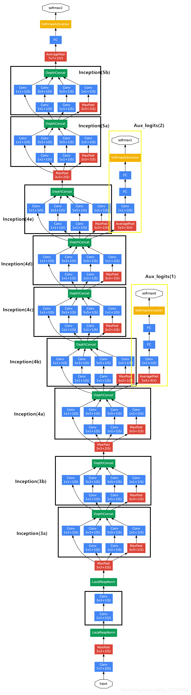
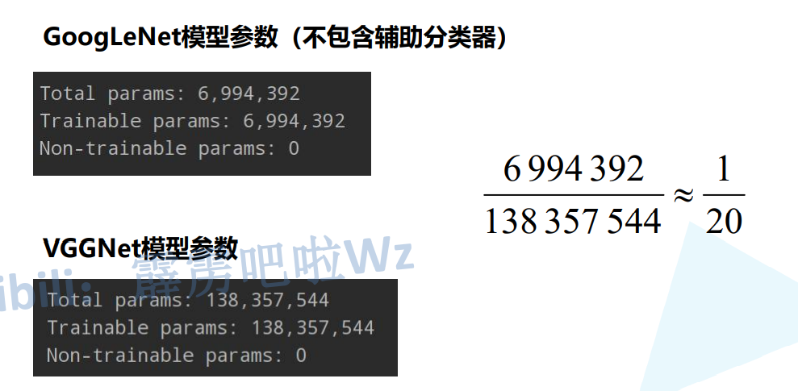

# 1 性能

> 引入了Inception结构

> 使用了1x1卷积核进行降维处理

> 最上面的黄色是主分类器
>
> 右侧两个黄色的是辅助分类器

> 丢弃全连接层,使用平均池化层

# Inception结构

> 并联,最后拼接
>
> 每个分支得到的特征矩阵高和块必须相同
>
> 右侧添加了 1x1Conv, 起到了降维的作用
>
> GooLeNet中所有的Inception都是相同的
>
> **所有branch的宽高都不变,是输入的宽高,维度会变化**

> 使用 1x1 降维更节省参数

# 辅助分类器

> AveragePool 5x5Conv Stride=3  不会改变深度
>
> out = (in - kernel_size + 2 * padding) / s + 1
>
> 4a层: 14 x 14 x 512 => 4 x 4 x 512     (14 - 5 + 2 * 0) / 3 + 1 = 4
>
> 4d层: 14 x 14 x 528 => 4 x 4 x 528     (14 - 5 + 2 * 0) / 3 + 1 = 4
>
> Conv 1x1 
>
> 两个全连接层
>
> 两个全连接层之间加入Dropout

# 模型详解

> depth: 重复次数

> #1x1 指的是下图最左侧的卷积核个数
>
> #3x3 reduce 是第二列下采样层的卷积核个数
>
> #3x3 是第二列3x3的卷积核个数
>
> #5x5 reduce 是第三列下采样层的卷积核个数
>
> #5x5 是第三列5x5的卷积核个数
>
> #pool proj 是最右侧的卷积核个数

> 

# GoogLeNet VS Vgg

