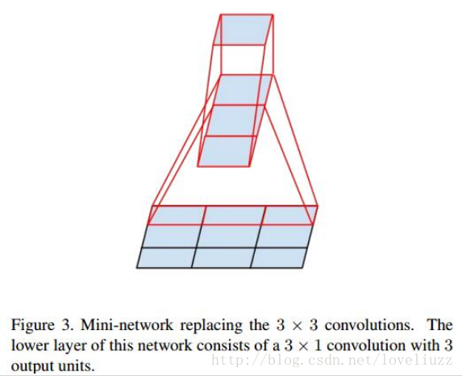
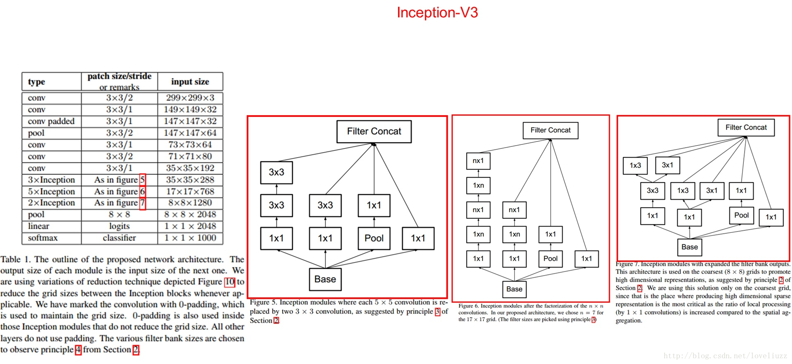
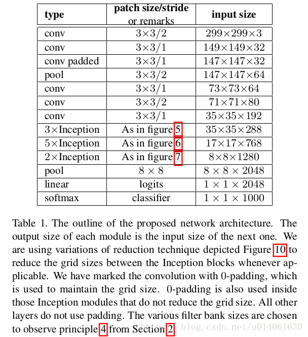

# 长方形卷积核

大卷积核完全可以由一系列的3x3卷积核来替代，那能不能分解的更小一点呢?

> 文章考虑了 nx1 卷积核，如下图所示的取代3x3卷积：
>
> ​    于是，任意nxn的卷积都可以通过1xn卷积后接nx1卷积来替代。实际上，作者发现在网络的前期使用这种分解效果
>
> 并不好，还有在中度大小的feature map上使用效果才会更好，对于mxm大小的feature map,建议m在12到20之间。
>
> 用nx1卷积来代替大卷积核，这里设定n=7来应对17x17大小的feature map。该结构被正式用在GoogLeNet V2中。

> ​    而 Inception V3网络则主要有两方面的改造:一是引入了Factorization into small convolutions的思想，将一个较大的二维卷积拆成两个较小的一维卷积]比如将7x7卷积一拆成 1x7卷积和 7x1卷积，或者将3x3卷积拆成 1x3卷积和3x1卷积，如上图所示。
> ​    一方面节约了大量参数，加速运算并减轻了过拟合](比将7x7卷积拆成lx7卷积和7x1卷积，，比拆成3个3x3卷积更节约参数)，同时增加了一层非线性扩展模型表达能力。论文中指出，这种非对称的卷积结构拆分,其结果比对称地拆为几个相同的小卷积核效果更明显，可以处理更多、更丰富的空间特征，增加特征多样性。:

> 另一方面, Inception V3优化了 Inception Module的结构,现在 nception Module有35×35、17×17和8×8三种不同结构,如下图所示。这些 nception Modu山e只在网络的后部出现,前部还是普通的卷积层。并且 Inception V3除了在 Inception Module中使用分支,还在分支中使用了分支(8×8的结构中),可以说是 Network In Network In Network

----

# Inception不同结构

----

# InceptionV3结构

