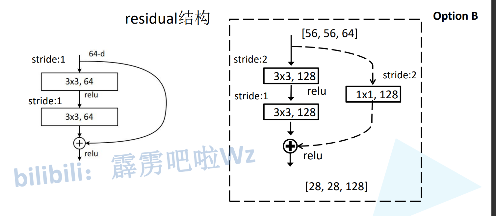
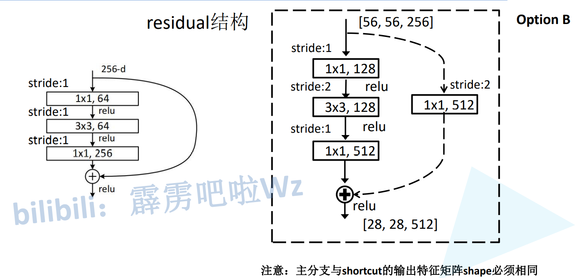
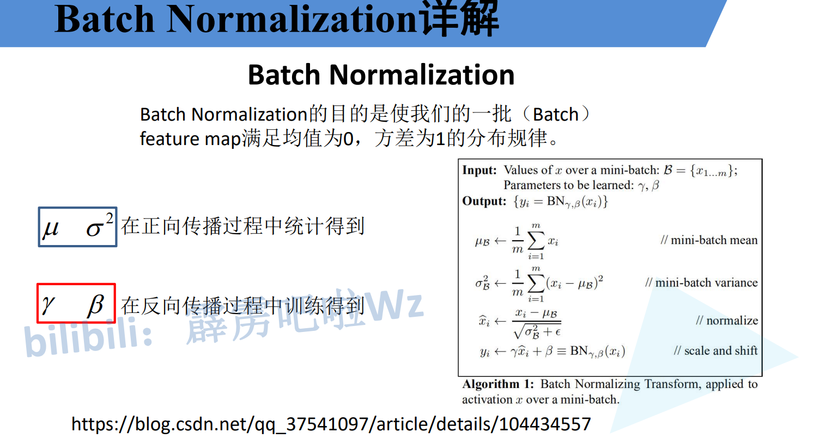
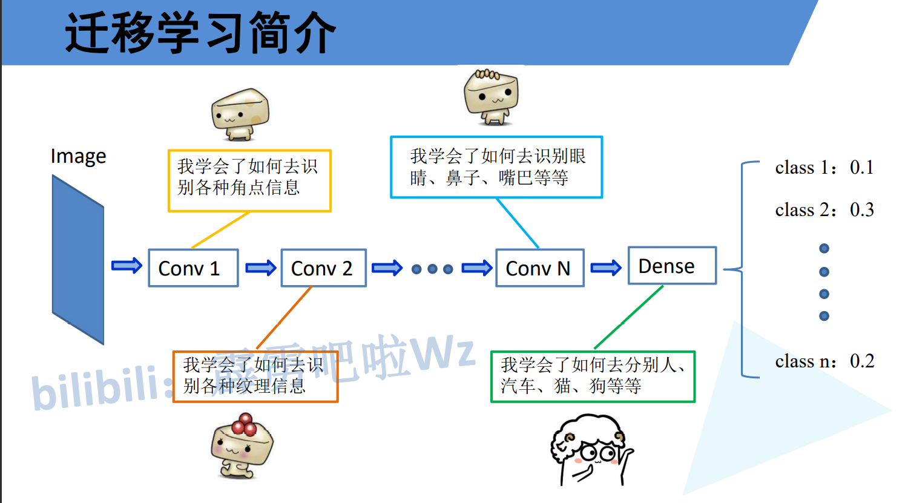
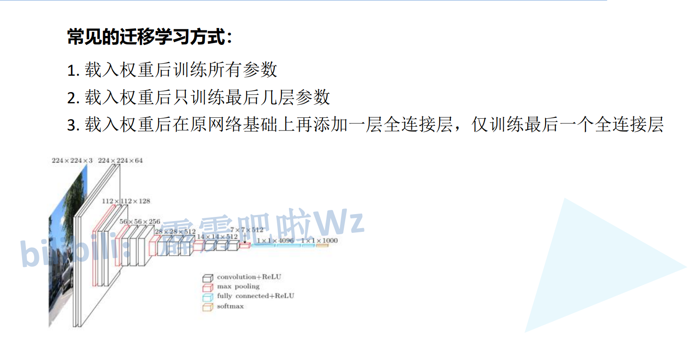

# ResNet FLOPS对比


# 主分支和捷径

> 主分支维度和宽高变化,捷径也得变化







> Conv Block的结构如下：


> Identity Block的结构如下：


这两个都是残差网络结构。

# BN 要注意别人的预处理方式







```python
'''
resnet18 34 50 101 152 实现

resnet18
[2, 2, 2, 2] = 8 * 2 + 2 = 18
resnet34
[3, 4, 6, 3] = 16 * 2 + 2 = 34
ResNet50
[3, 4, 6, 3] = 16 * 3 + 2 = 50
ResNet101
[3, 4, 23, 3] = 33 * 3 + 2 = 101
ResNet125
[3, 8, 36, 3] = 150 * 3 + 2 = 152
'''


import torch.nn as nn
import torch


class BasicBlock(nn.Module):
    '''
    18 34

    channel变化示例: 64 => 64
    '''
    # 残差结构中主分支中间和最后一层的核心数变化比例
    expansion = 1

    def __init__(self, in_channel, out_channel, stride=1, downsample=None, **kwargs):
        '''
        in_channel: 输入维度
        out_channel: 中间的维度
        out_channel*self.expansion: 输出维度
        downsample: 下采样 短阶层特征矩阵维度变化
        '''
        super().__init__()

        # 卷积层1
        self.conv1 = nn.Conv2d(in_channel, out_channel, kernel_size=3, stride=stride, padding=1, bias=False)
        self.bn1   = nn.BatchNorm2d(out_channel)
        self.relu  = nn.ReLU()

        # 卷积层2
        self.conv2 = nn.Conv2d(out_channel, out_channel, kernel_size=3, stride=1, padding=1, bias=False)
        self.bn2   = nn.BatchNorm2d(out_channel)

        # 下采样
        self.downsample = downsample


    def forward(self, x):
        # 捷径输出值
        identity = x
        # 有下采样才执行
        if self.downsample is not None:
            identity = self.downsample(x)

        out = self.conv1(x)
        out = self.bn1(out)
        out = self.relu(out)

        out = self.conv2(out)
        out = self.bn2(out)

        out += identity
        out = self.relu(out)

        return out


#-------------------------------------------------------------------------#
#   主干: 卷积+bn+relu -> 卷积+bn+relu -> 卷积+bn
#   短接: 卷积+bn
#   短接后有relu
#-------------------------------------------------------------------------#
class Bottleneck(nn.Module):
    """
    50 101 152
    注意:原论文中，在虚线残差结构的主分支上，第一个1x1卷积层的步距是2，第二个3x3卷积层步距是1。
    但在pytorch官方实现过程中是第一个1x1卷积层的步距是1，第二个3x3卷积层步距是2，
    这么做的好处是能够在top1上提升大概0.5%的准确率。
    可参考Resnet v1.5 https://ngc.nvidia.com/catalog/model-scripts/nvidia:resnet_50_v1_5_for_pytorch


    ResNext主要就是在卷积层2进行了分组,分为了32个组,其余的和ResNet相同,还有就是ResNext的width是ResNet的2或4倍,总的输出维度是相同的

    channel变化示例: 64 => 64 => 256
    """
    # 残差结构中主分支中间和最后一层的核心数变化比例
    expansion = 4

    def __init__(self, in_channel, out_channel, stride=1, downsample=None, groups=1, width_per_group=64):
        '''
        in_channel:     输入维度
        out_channel:    中间的维度
        out_channel*self.expansion: 输出维度
        downsample:     下采样 短阶层特征矩阵维度变化
        groups:         分组个数,对于ResNet为1, ResNext为32
        width_per_group: 每个组的宽度(卷积核个数) 作用是对卷积层中间维度宽度做出调整 对于ResNet是64, 对于ResNeXt是4或8
        '''
        super().__init__()

        # ResNet就是out_channel,ResNeXt是out_channel的n倍
        # 对于ResNet:     width = out_channel * (64 / 64) * 1 = out_channel
        # 对于ResNeXt50:  width = out_channel * (4 / 64) * 32 = out_channel * 2  中间维度是原来的2倍
        # 对于ResNeXt101: width = out_channel * (8 / 64) * 32 = out_channel * 4  中间维度是原来的4倍
        width = int(out_channel * (width_per_group / 64.)) * groups

        # 卷积层1
        self.conv1 = nn.Conv2d(in_channel, width, kernel_size=1, stride=1, bias=False)  # squeeze channels
        self.bn1   = nn.BatchNorm2d(width)
        # -----------------------------------------

        # Conv2d 支持分组,参数是groups
        # 卷积层2, ResNext主要就是在这一层进行了分组,分为了32个组,其余的和ResNet相同,还有就是ResNext的width是ResNet的2或4倍,总的输出维度是相同的
        self.conv2 = nn.Conv2d(width, width, kernel_size=3, stride=stride, padding=1, groups=groups, bias=False)
        self.bn2   = nn.BatchNorm2d(width)
        # -----------------------------------------

        # 卷积层3
        self.conv3 = nn.Conv2d(width, out_channel*self.expansion, kernel_size=1, stride=1, bias=False)  # unsqueeze channels
        self.bn3   = nn.BatchNorm2d(out_channel*self.expansion)

        # 激活函数是共用的
        self.relu  = nn.ReLU(inplace=True)
        self.downsample = downsample


    def forward(self, x):
        identity = x
        if self.downsample is not None:
            identity = self.downsample(x)

        out = self.conv1(x)
        out = self.bn1(out)
        out = self.relu(out)

        out = self.conv2(out)
        out = self.bn2(out)
        out = self.relu(out)

        out = self.conv3(out)
        out = self.bn3(out)
        # 最后一层conv没有relu

        out += identity
        out = self.relu(out)

        return out


class ResNet(nn.Module):

    def __init__(self,
                block,                 # 残差结构 Basic Bottle
                blocks_num,            # 每层层数的列表
                num_classes=1000,      # 最后输出维度
                include_top=True,      # 方便在以后扩展
                groups=1,              # 分组个数,对于ResNet为1, ResNext为32
                width_per_group=64):   # 每个组的宽度(卷积核个数) 作用是对卷积层中间维度宽度做出调整 对于ResNet是64, 对于ResNeXt是4或8

        super().__init__()

        self.include_top = include_top

        # layer1的输入维度
        self.in_channel = 64

        # 分组个数 32
        self.groups = groups
        # 每个组的卷积核数量 4 / 8
        self.width_per_group = width_per_group

        # [b, 3, h, w] => [b, 64, h/4, w/4]
        self.conv1 = nn.Conv2d(3, self.in_channel, kernel_size=7, stride=2, padding=3, bias=False)
        self.bn1 = nn.BatchNorm2d(self.in_channel)
        self.relu = nn.ReLU(inplace=True)
        self.maxpool = nn.MaxPool2d(kernel_size=3, stride=2, padding=1)
        #                                  out_channel 重复次数
        self.layer1 = self._make_layer(block, 64, blocks_num[0])
        self.layer2 = self._make_layer(block, 128, blocks_num[1], stride=2)
        self.layer3 = self._make_layer(block, 256, blocks_num[2], stride=2)
        self.layer4 = self._make_layer(block, 512, blocks_num[3], stride=2)

        if self.include_top:
            self.avgpool = nn.AdaptiveAvgPool2d((1, 1))  # output size = (1, 1)
            self.fc = nn.Linear(512 * block.expansion, num_classes)

        for m in self.modules():
            if isinstance(m, nn.Conv2d):
                nn.init.kaiming_normal_(m.weight, mode='fan_out', nonlinearity='relu')


    def _make_layer(self, block, out_channel, block_num, stride=1):
        '''
        创建卷积层
        block: basic bottle
        channel: 每一层输出维度个数(卷积核个数)
        block_num: 几个卷积层
        stride: 步长
        '''
        # 下采样层
        downsample = None
        # 步长不为1或者进出通道不相等就设置下采样层 conv+bn 没有relu
        if stride != 1 or self.in_channel != out_channel * block.expansion:
            downsample = nn.Sequential(
                            nn.Conv2d(self.in_channel, out_channel * block.expansion, kernel_size=1, stride=stride, bias=False),
                            nn.BatchNorm2d(out_channel * block.expansion)
                        )

        layers = []
        # 增加第一层,有下采样,因此特殊处理
        layers.append(block(self.in_channel,
                            out_channel,
                            downsample=downsample,  # 第一层有downsample,下面的没有
                            stride=stride,
                            groups=self.groups,
                            width_per_group=self.width_per_group)
                    )

        self.in_channel = out_channel * block.expansion

        # 后面的层数处理方式
        for _ in range(1, block_num):
            layers.append(block(self.in_channel,
                                out_channel,
                                groups=self.groups,
                                width_per_group=self.width_per_group)
                        )

        return nn.Sequential(*layers)


    def forward(self, x):
        # [b, 3, h, w] => [b, 64, h/4, w/4]
        x = self.conv1(x)
        x = self.bn1(x)
        x = self.relu(x)
        x = self.maxpool(x)

        x = self.layer1(x)
        x = self.layer2(x)
        x = self.layer3(x)
        x = self.layer4(x)

        if self.include_top:
            x = self.avgpool(x)
            x = torch.flatten(x, 1)
            x = self.fc(x)

        return x


def resnet18(num_classes=1000, include_top=True):
    # https://download.pytorch.org/models/resnet18-f37072fd.pth
    return ResNet(BasicBlock, [2, 2, 2, 2], num_classes=num_classes, include_top=include_top)

def resnet34(num_classes=1000, include_top=True):
    # https://download.pytorch.org/models/resnet34-b627a593.pth
    return ResNet(BasicBlock, [3, 4, 6, 3], num_classes=num_classes, include_top=include_top)

def resnet50(num_classes=1000, include_top=True):
    # https://download.pytorch.org/models/resnet50-0676ba61.pth
    return ResNet(Bottleneck, [3, 4, 6, 3], num_classes=num_classes, include_top=include_top)

def resnet101(num_classes=1000, include_top=True):
    # https://download.pytorch.org/models/resnet101-63fe2227.pth
    return ResNet(Bottleneck, [3, 4, 23, 3], num_classes=num_classes, include_top=include_top)

def resnet152(num_classes=1000, include_top=True):
    # https://download.pytorch.org/models/resnet152-394f9c45.pth
    return ResNet(Bottleneck, [3, 8, 36, 3], num_classes=num_classes, include_top=include_top)


if __name__ == "__main__":
    pre_weights= torch.load(r'D:\AI\预训练权重\resnet34-b627a593.pth')

    model = resnet34()
    model.load_state_dict(pre_weights)

    x = torch.ones(2, 3, 224, 224)

    model.eval()
    y = model(x)
    print(y.size())
```

