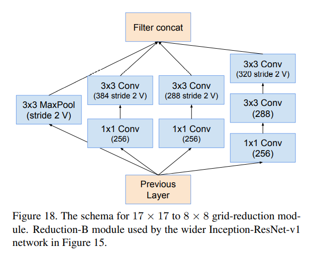

# ResNet优点

> Inception-ResNet-v1的准确率与Inception-v3的准确率接近，Inception-ResNet-v2的与Inception-V4的接近。
>
> 但是Inception-ResNet-v1和Inception-ResNet-v2的收敛速度明显比Inception-v3和Inception-v4的快得多。

----

# Inception-ResNet-V1

----

## stem 14

----

## Inception-ResNet-A 10 

----

## Reduction-A 7

----

## Inception-ResNet-B 11

----

## Reduction-B 12

----

## Inception-ResNet-C 13

----

# Inception-ResNet-V2

----

## stem 3 和代码不一样

> 和InceptionV4完全相同,但是和代码不一样
>

----

## Inception-resnet-A 16 Block35

> 残差模块
>
> 通道,高宽不变
>
> 高宽: 35 x 35
>
> in_channels  = out_channels = 320
>
> branch0, branch1, branch2拼接之后交给conv2d,再和输入x相加

----

## Reduction-A 7 Mixed_6a

> 通道,高宽变化
>
> kernel_size=3, stride=2
>
> 高宽: 35 x 35 => 17 x 17
>
> in_channels  = 320
>
> out_channels = 384 + 384 + 320 = 1088

----

## Inception-ResNet-B 17 Block17

> 残差模块
>
> 通道,高宽不变
>
> 高宽: 17 x 17
>
> in_channels  = out_channels = 1088
>
> branch0, branch1拼接之后交给conv2d,再和输入x相加

----

## Reduction-B 18 Mixed_7a

> 通道,宽高变化
>
> kernel_size=3, stride=2
>
> 宽高: 17 x 17 => 8 x 8
>
> in_channels  = 1088
>
> out_channels = 384 + 288 + 320 + 1088 = 2080

----

## Inception-ResNet-C 19 Block8

> 残差模块
>
> 通道,高宽不变
>
> 高宽: 8 x 8
>
> in_channels  = out_channels = 2080
>
> branch0, branch1拼接之后交给conv2d,再和输入x相加

----

# 性能对比

## I-V3 I-R-V1 I-R-V2

----

## I-V3 Vs I-R-V1 Top-1 error

----

## I-V3 Vs I-R-V1 Top-5 error

----

## I-V4 Vs I-R-V2 Top-1 error

----

## I-V4 Vs I-R-V2 Top-5 error

----

## 四个模型 Top-1 error

----

## 四个模型 Top-5 error

