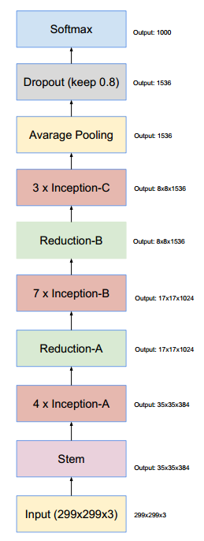
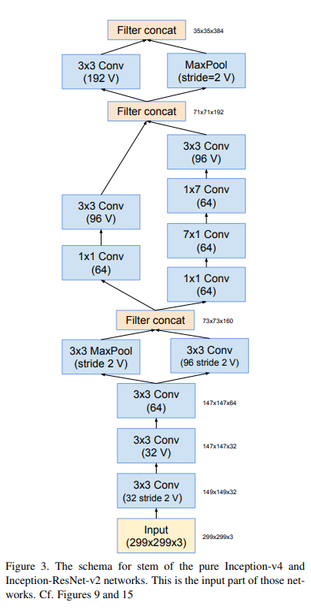
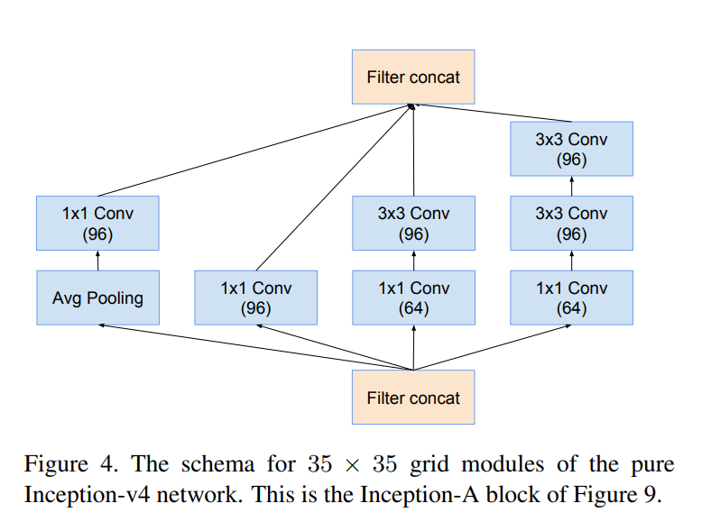
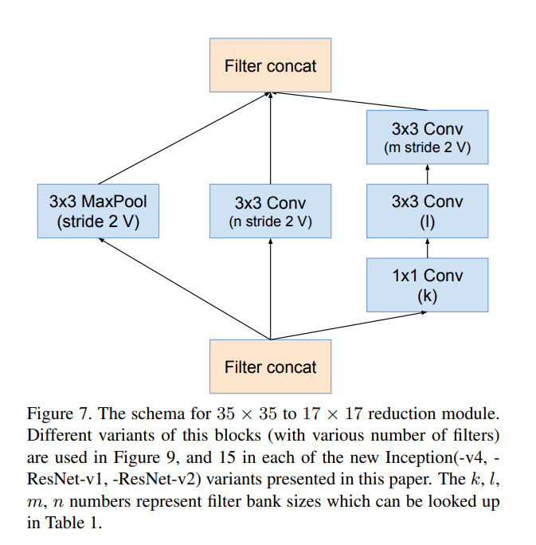
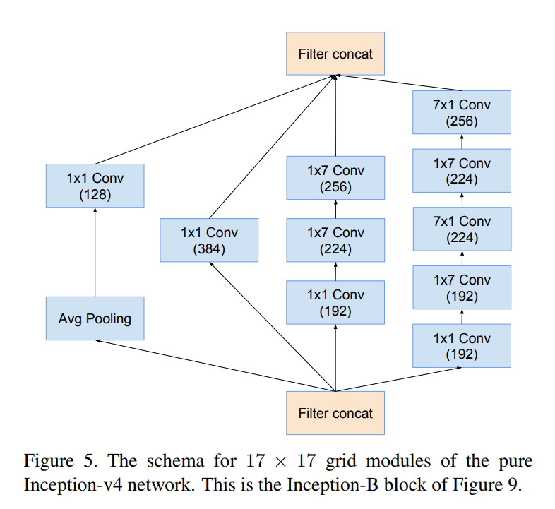
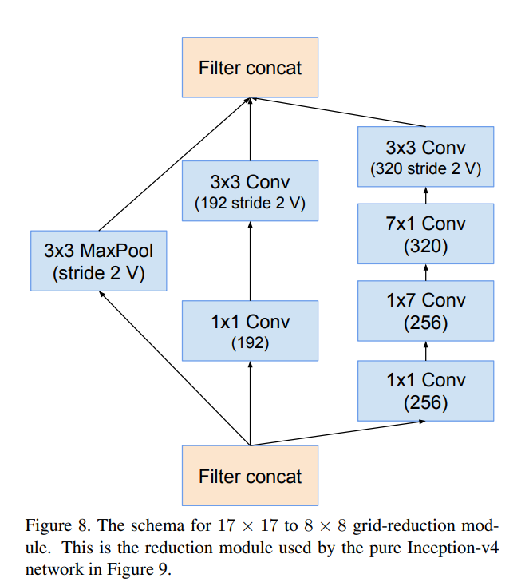
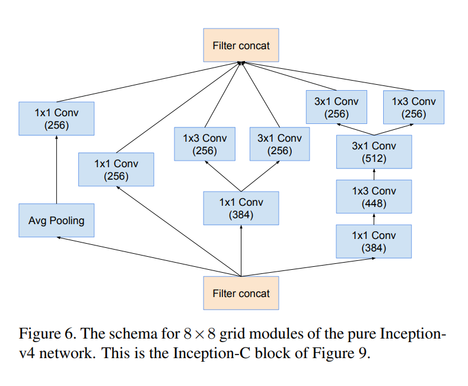

论文地址: https://arxiv.org/pdf/1602.07261.pdf

# Inception V4

## 1.纯Inception块的构建：

> 以往inception块的构建包袱：
>
> 以往的inception网络，我们对inceptin结构方面的选择比较保守，没有在结构上做很大的改动。以前结构的保守、固定直接导致了网络和结构的灵活性欠佳。反而导致网络看起来更复杂。
>
> 我们这次做的工作：
> 摆脱以往的包袱，我们做了一个统一，为每一个Inception块做出统一的选择。

> 总网络结构：
>
> 值得注意的是，在网络的最后，softmax层之前， 使用了keep prob为0.8的dropout来防止过拟合。

> 开始的3层卷积和Mixed_3a Mixed_4a Mixed_5a是开始的stem模块
>
> Inception_A Inception_B Inception_C 的维度不会发生变化
>
> Reduction_A Reduction_B 在Inception中间起到维度变化的作用
>
> 源代码中没有使用 dropout

> 子模块：（图中**没有**标记为“V”的所有卷积是相同填充的，意味着它们的输出网格与其输入的大小相匹配）

## 2.stem模块：

> **开始的3层卷积和Mixed_3a Mixed_4a Mixed_5a是开始的stem模块**
>
> 该模块解读：
>
> 我们发现Stem中使用了Inception V3中使用的并行结构、不对称卷积核结构，可以在保证信息损失足够小的情况下，使得计算量降低。结构中1x1的卷积核也用来降维，并且也增加了非线性。图中带V的标记说明该卷积核使用valid padding，其余的使用same padding。之后的结构也是这样。我们发现这个stem结构实际上是替代了Inception V3中第一个Inception block之前的结构，在V3中仅仅是一些3x3卷积核的堆积，输出的feature map为35x35x288，而在这里结构更加复杂、层次更深，输出的feature map为35x35x384，比V3的也更多。但是这一方案也在一定程度上保证了计算量。

## 3.Inception-A模块

> 通道不变
>
> 高宽: 35 x 35
>
> 模块解读：
>
> 我们发现这三个结构和Inception V3中的三种Inception block的结构一样。
>
> 不同之处在于，在这里，三种Inception block的个数分别为4、7、3个，而V3中为3、5、2个，因此新的Inception层次更深、结构更复杂，feature map的channel更多，为了降低计算量，在Inception-A和Inception-B后面分别添加了Reduction-A和Reduction-B的结构，用来降低计算量。

## 4.Redution-A模块

> **维度,宽高变化**
>
> **维度: 384 => 1024**
>
> **高宽: 35 x 35 => 17 x 17**
>
> **起到 Inception-A 和 Inception-B 连接的作用**
>
> 模块解读：
>
> 我们发现这两种结构中，卷积的步长（stride）为2，并且都是用了valid padding，来降低feature map的尺寸。结构中同样是用并行、不对称卷积和1*1的卷积来降低计算量。

## 5.Inception-B模块

> 通道不变
>
> 高宽: 17 x 17

## 6.Redution-B模块

> **维度,宽高变化**
>
> **维度: 1024 => 1536**
>
> **宽高: 17 x 17 => 8 x 8**
>
> **起到 Inception-B 和 Inception-C 连接的作用**

## 7.Inception-C模块 

> 通道通道不变
>
> 高宽: 8 x 8

