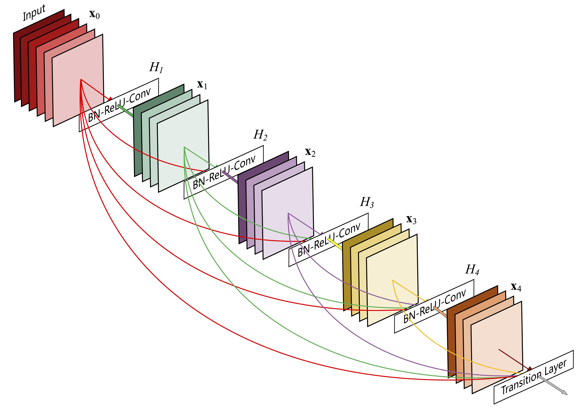
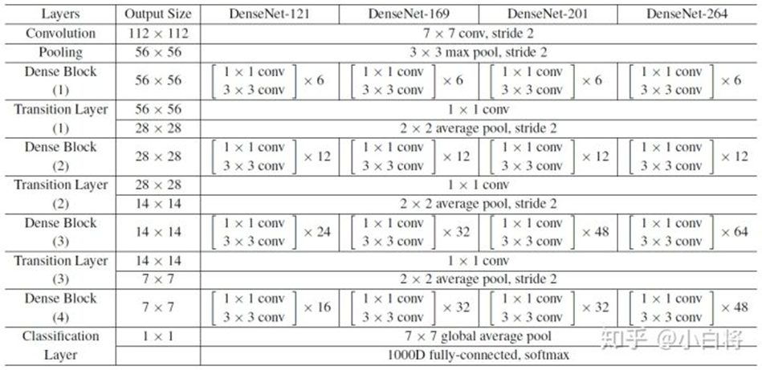

# 1Densenet和其他网络差别

## vgg

## ResNet

> （深度残差网络，Deep residual network, ResNet）:通过建立前面层与后面层之间的“短路连接”，这有助于训练过程中梯度的反向传播，从而能训练出更深的CNN网络。

## DenseNet

> 采用密集连接机制，即互相连接所有的层，每个层都会与前面所有层在channel维度上连接（concat）在一起，实现特征重用，作为下一层的输入。
>
> **最后的输出维度是 out_channel =  input_c + num_layers * growth_rate**

> 注意是拼接不是相加

## 公式表示

传统的网络在 $L$ 层的输出为：

对于ResNet，增加了来自上一层输入：

在DenseNet中，会连接前面所有层作为输入：

> $H_i(.)$代表是非线性转化函数，它是一个组合操作，其可能包括一系列的 BN(Batch Normalization)，ReLU，Pooling及Conv 操作。

**特征传递方式是直接将前面所有层的特征concat后传到下一层，而不是前面层都要有一个箭头指向后面的所有层**

----

# 2 网络结构 = DenseBlock+Transition

DenseNet的密集连接方式需要特征图大小保持一致。所以DenseNet网络中使用DenseBlock+Transition的结构。

**DenseBlock是包含很多层的模块，每个层的特征图大小相同，层与层之间采用密集连接(bottleneck)方式。**

# 3 DenseBlock

> **代码中将Input放进列表features中,将它作为参数传入DenseLayer,然后将output添加到features列表中,循环放入DenseLayer,最后获得输入+全部输出列表,然后拼接到一起并返回**
>
> **最后的输出维度是 out_channel =  input_c + num_layers * growth_rate**

> 在DenseBlock中，各个层的特征图大小一致，可以在channel维度上连接。DenseBlock中的非线性组合函数$H_i(.)$采用的是
>
> `BN + ReLU + 3x3Conv`的结构。

> $K$ out_channel
>
> $L$ Layers
>
> **假定输入层的特征图的channel数为$K_0$，DenseBlock中各个层卷积之后均输出k个特征图，即得到的特征图的channel数为$K$，那么$L$层输入的channel数为$K_0+(L−1)k$, 我们将$K$称之为网络的增长率（growth rate）。**
>
> **因为每一层都接受前面所有层的特征图，即特征传递方式是直接将前面所有层的特征concat后传到下一层，一般情况下使用较小的K（比如12），要注意这个K的实际含义就是这层新提取出的特征。**

> Dense Block采用了激活函数在前、卷积层在后的顺序，即BN-ReLU-Conv的顺序，这种方式也被称为pre-activation。
>
> 通常的模型relu等激活函数处于卷积conv、批归一化batchnorm之后，即Conv-BN-ReLU，也被称为post-activation。作者证明，如果采用post-activation设计，性能会变差。

## bottleneck层 降低 in_channels 降低为 4 x 32 = 128

> 由于后面层的输入会非常大，DenseBlock内部可以采用bottleneck层来减少计算量，主要是原有的结构中增加1x1 Conv，
>
> 即 `BN + ReLU+ 1x1Conv + BN + ReLU + 3x3Conv`
>
> 称为DenseNet-B结构。
>
> **其中1x1 Conv得到4k个特征图它起到的作用是降低特征数量，从而提升计算效率。**
>
> **默认 K=32, 所以降低维度后为 128**
>
> $L*K$ Channel  ==>  $4*K$ Channel 
>
> ​	$L = K_0+(L−1)k$
>
> ​	$K$ = out_channel

> **每一个Bottleneck输出的特征通道数是相同的,是$4*K$ Channel 。**
>
> **这里1×1卷积的作用是固定输出通道数，达到降维的作用，1×1卷积输出的通道数通常是GrowthRate的4倍: $4*K$ Channel 。**
>
> 当几十个Bottleneck相连接时，concat后的通道数会增加到上千，如果不增加1×1的卷积来降维，后续3×3卷积所需的参数量会急剧增加。
>
> 比如，输入通道数64，增长率K=32(out_channel)，经过15个Bottleneck，通道数输出为64+15*32=544，
>
> ​    如果不使用1×1卷积，第16个Bottleneck层参数量是 3x3x544x32=156672，
>
> ​    如果使用1×1卷积，第16个Bottleneck层参数量是 1x1x544x128+3x3x128x32=106496，可以看到参数量大大降低。
>
> ​                                                                   544 => 32x4 => 32 每层输出都是32,1x1是将输入变为 32x4     

> 下图:
>
> 64+32=96+32=128+32=160+32=192

----

# 4 Transition层 通道和宽高减半

> 它主要是连接两个相邻的DenseBlock，并且降低特征图大小。Transition层包括一个1x1的卷积和2x2的AvgPooling，结构为
>
> `BN + ReLU + 1x1Conv + 2x2AvgPooling`

> Transition层可以起到压缩模型的作用。假定Transition的上接DenseBlock得到的特征channels数为 m ,Transition层可以产生$Θ_m$个特征（通过卷积层），其中$0<Θ<=1$是压缩系数（compression rate）。当$Θ=1$时，特征个数经过Transition层没有变化，即无压缩，而当压缩系数小于1时，这种结构称为DenseNet-C，一般使用$Θ=0.5$。对于使用bottleneck层的DenseBlock结构和压缩系数小于1的Transition组合结构称为DenseNet-BC。

----

# 5 模型结构

----

# 6 性能对比

DenseNet在CIFAR-100和ImageNet数据集上与ResNet的对比结果。

从图8中可以看到，只有0.8M的DenseNet-100性能已经超越ResNet-1001，并且后者参数大小为10.2M。而从图9中可以看出，同等参数大小时，DenseNet也优于ResNet网络。

> 图8

> 图9

----

# 7 DenseNet的优势

**1.更强的梯度流动**：由于密集连接方式，DenseNet提升了梯度的反向传播，使得网络更容易训练。由于每层可以直达最后的误差信号，实现了隐式的“deep supervision”。误差信号可以很容易地传播到较早的层，所以较早的层可以从最终分类层获得直接监管（监督）。

减轻了vanishing-gradient（梯度消失）  过梯度消失问题在网络深度越深的时候越容易出现，原因就是输入信息和梯度信息在很多层之间传递导致的，而现在这种dense connection相当于每一层都直接连接input和loss，因此就可以减轻梯度消失现象，这样更深网络不是问题。

**2.减少了参数数量**

**3.保存了低维度的特征**

在标准的卷积网络中，最终输出只会利用提取最高层次的特征

而在DenseNet中，它使用了不同层次的特征，倾向于给出更平滑的决策边界。这也解释了为什么训练数据不足时DenseNet表现依旧良好。

----

# 8 DenseNet的不足

DenseNet的不足在于由于需要进行多次Concatnate操作，数据需要被复制多次，显存容易增加得很快，需要一定的显存优化技术。另外，DenseNet是一种更为特殊的网络，ResNet则相对一般化一些，因此ResNet的应用范围更广泛。

