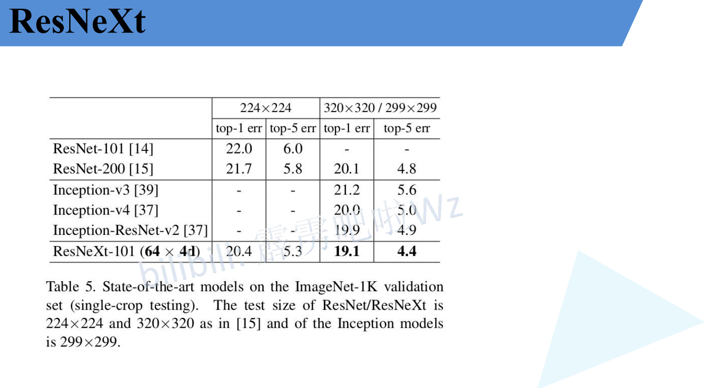

# ResNeXt 相比于ResNet进化

# 对比ResNet InceptionV3/4 Inception-ResNet

# 组卷积

> 普通卷积:
>
> ​	输入卷积核个数 = 输入通道个数
>
> ​	输出卷积核个数 = 输出通道个数
>
> ​	参数个数: k * k * C_in * C_out  (k指的是卷积核大小)
>
> 组卷积:
>
> ​	输出通道划分为g个组,分别卷积操作,最后concat
>
> ​	输入卷积核个数 = 输入通道个数 / g
>
> ​	输出卷积核个数 = 输出通道个数 / g
>
> ​	参数个数: (k * k * (C_in / g) * (C_out / g)) * g =  k * k * C_in * C_out / g
>
> ​    当 g = C_in C_out=C_in 时,就是DW卷积,就是输入通道每一个通道都分组进行卷积,输出也是一个通道,最后拼接到一起

> 下面每一行都可以等价处理
>
> 第一层 4 * 32 = 128 
>
> 第二层 维度都不变
>
> 第三层 中间的使用了拼接,最左边使用 **1*1** 卷积变为256维度再相加

> 示例详解

# ResNeXt50结构

> **32 x 4d**
>
> **32表示分为32组,4d表示conv2组第二层使用的卷积核个数 32*4=128**
>
> C=32 Group是32 分为了32个组
>
> 

# group=32的原因

> 右侧的 1x1, 64 中 64指的是输出维度
>
> 可以看到ResNeXt50相比于ResNet50的中间维度翻倍了

# 18和34 进行分组没意义,因为卷积组应该至少为3层

