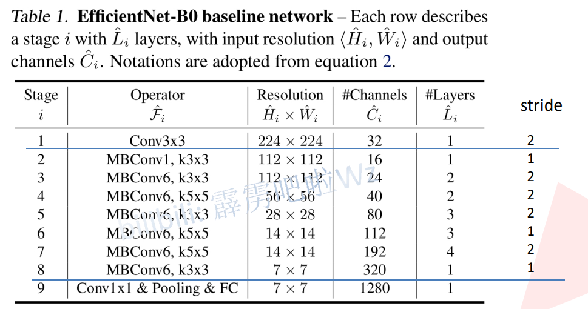

# 秒杀

[论文下载地址](https://arxiv.org/abs/1905.11946)

[博文]([EfficientNet网络详解_霹雳吧啦Wz-CSDN博客_efficientnet网络结构](https://blog.csdn.net/qq_37541097/article/details/114434046))

----

# 深度 宽度 图片大小

## 同时改变深度,宽度,图片大小能提高准确率

----

# 模型结构

> 下表为EfficientNet-B0的网络框架（B1-B7就是在B0的基础上修改`Resolution`，`Channels`以及`Layers`），可以看出网络总共分成了9个`Stage`，
>
> 第一个`Stage`就是一个卷积核大小为`3x3`步距为2的普通卷积层（包含BN和激活函数Swish），
>
> `Stage2～Stage8`都是在重复堆叠`MBConv`结构（最后一列的`Layers`表示该`Stage`重复`MBConv`结构多少次），
>
> 而`Stage9`由一个普通的`1x1`的卷积层（包含BN和激活函数Swish）一个平均池化层和一个全连接层组成。
>
> 表格中每个`MBConv`后会跟一个数字1或6，这里的1或6就是倍率因子`n`即`MBConv`中第一个`1x1`的卷积层会将输入特征矩阵的`channels`扩充为`n`倍，
>
> 其中`k3x3`或`k5x5`表示`MBConv`中`Depthwise Conv`所采用的卷积核大小。`Channels`表示通过该`Stage`后输出特征矩阵的`Channels`。

> MBConv1:    就是 MobileNet Conv
>
> ​	`k3x3`或`k5x5`表示`MBConv`中`Depthwise Conv`所采用的卷积核大小
>
> Resolution:    输入分辨率 高宽
>
> Channels:      out_channels
>
> Layers:        重复次数
>
> Stride:        每个Layers第一次的步长

> **MBConv1 和 MBConv6 后面的 1 和 6 是 MBConv中第一个卷积的channel扩展倍率**
>
> **当扩展倍率为1的时候,是不需要第一个 1x1 卷积来变换维度的(只有stage2是这样)**

----

# MBConv MobileNet 

> `MBConv`其实就是MobileNetV3网络中的`InvertedResidualBlock`，但也有些许区别。一个是采用的激活函数不一样（EfficientNet的`MBConv`中使用的都是**Swish**激活函数），另一个是在每个`MBConv`中都加入了SE（**Squeeze-and-Excitation**）模块。下图是我自己绘制的`MBConv`结构。

> 如图所示，`MBConv`结构主要由一个`1x1`的普通卷积（升维作用，包含BN和Swish），一个`kxk`的`Depthwise Conv`卷积（包含BN和Swish）`k`的具体值可看EfficientNet-B0的网络框架主要有`3x3`和`5x5`两种情况，一个`SE`模块，一个`1x1`的普通卷积（降维作用，包含BN），一个`Droupout`层构成。搭建过程中还需要注意几点：

- 第一个升维的1x1卷积层，它的卷积核个数是输入特征矩阵channel的$n$倍， $n \in \left\{1, 6\right\}$。
- 当 n=1 时，不要第一个升维的1x1卷积层，即Stage2中的MBConv结构都没有第一个升维的1x1卷积层（这和MobileNetV3网络类似）。
- 关于`shortcut`连接，仅当输入`MBConv`结构的特征矩阵与输出的特征矩阵`shape`相同时才存在（代码中可通过`stride==1 and inputc_channels==output_channels`条件来判断）。

> **当 stride==1 且 in_channel == out_channel 时才有shortcut连接**
>
> **注意最后 1x1Conv没有激活函数**

> MobileNet Block

----

# SE机制

> 注意力机制:
>
> ​    对特征矩阵每一个channel进行池化,得到长度为channel的一维向量,使用两个全连接层,
>
> ​    两个线性层的长度,最后得到权重,然后乘以每层矩阵的原值
>
> ​    线性层长度变化:    channel -> channel / 4 -> channel  
>
> ​		**efficientnetv1中是: channel是MBConv开始输入维度**
>
> ​		**mobilenetv3中: channel是经过DW卷积后的维度**
>
> 激活函数:
>
> ​	**efficientnetv1中是: swish(silu) sigmoid**
>
> ​	**mobilenetv3中是:  relu hardsigmoid**
>
> **最后的 1x1 卷积, 线性激活,不做任何处理**

- SE模块如下所示，由一个全局平均池化，两个全连接层组成。第一个全连接层的节点个数是输入该MBConv特征矩阵channels的 $\frac{1}{4}$，且使用Swish激活函数。第二个全连接
- Dropout层的`dropout_rate`在tensorflow的keras源码中对应的是`drop_connect_rate`后面会细讲（**注意，在源码实现中只有使用shortcut的时候才有Dropout层**）。

----

# Dropout 不是普通的Dropout

> **会以一定的概率,会以主分支输出进行丢弃,直接从上一层输出引到下一层的输入,相当于随机深度**
>
> 可以小幅提升正确率

----

# B0 => B7

> input_size: 1	
>
> width:	  宽度系数 out_channel * width
>
> depth:	  针对stage2~8, layers * depth
>
> drop:	   MBConv中Dropout层的随机丢弃倍率
>
> dropout:	对应最后全连接层之前的Dropout

| Model          | input_size | width_coefficient | depth_coefficient | drop_connect_rate | dropout_rate |
| -------------- | ---------- | ----------------- | ----------------- | ----------------- | ------------ |
| EfficientNetB0 | 224x224    | 1.0               | 1.0               | 0.2               | 0.2          |
| EfficientNetB1 | 240x240    | 1.0               | 1.1               | 0.2               | 0.2          |
| EfficientNetB2 | 260x260    | 1.1               | 1.2               | 0.2               | 0.3          |
| EfficientNetB3 | 300x300    | 1.2               | 1.4               | 0.2               | 0.3          |
| EfficientNetB4 | 380x380    | 1.4               | 1.8               | 0.2               | 0.4          |
| EfficientNetB5 | 456x456    | 1.6               | 2.2               | 0.2               | 0.4          |
| EfficientNetB6 | 528x528    | 1.8               | 2.6               | 0.2               | 0.5          |
| EfficientNetB7 | 600x600    | 2.0               | 3.1               | 0.2               | 0.5          |

- `input_size`代表训练网络时输入网络的图像大小
- `width_coefficient`代表`channel`维度上的倍率因子，比如在 EfficientNetB0中`Stage1`的`3x3`卷积层所使用的卷积核个数是32，那么在B6中就是 $32 \times 1.8=57.6$接着取整到离它最近的8的整数倍即56，其它`Stage`同理。
- `depth_coefficient`代表`depth`维度上的倍率因子（仅针对`Stage2`到`Stage8`），比如在EfficientNetB0中Stage7的 ${\widehat L}_i=4 $，那么在B6中就是$4 \times 2.6=10.4$接着向上取整即11.

- drop_connect_rate`是在`MBConv`结构中dropout层使用的`drop_rate`，在官方keras模块的实现中`MBConv结构的`drop_rate`是从0递增到`drop_connect_rate`的（具体实现可以看下官方[源码](https://github.com/tensorflow/tensorflow/blob/master/tensorflow/python/keras/applications/efficientnet.py)，**注意，在源码实现****中只有使用shortcut的时候才有Dropout层**）。还需要注意的是，这里的Dropout层是`Stochastic Depth`，即会随机丢掉整个block的主分支（只剩捷径分支，相当于直接跳过了这个block）也可以理解为减少了网络的深度。具体可参考`Deep Networks with Stochastic Depth`这篇文章。
- `dropout_rate`是最后一个全连接层前的`dropout`层（在`stage9`的Pooling与FC之间）的`dropout_rate`。

----

# 性能

----

# 缺点: 占显存

