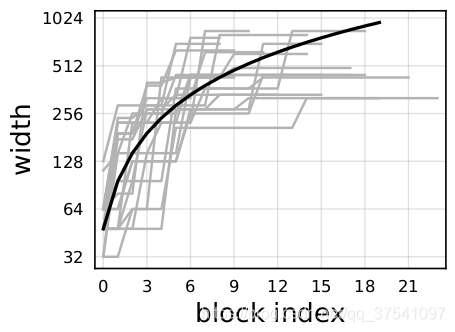

# RegNet网络结构与搭建

## 前言

原论文名称：Designing Network Design Spaces
原论文下载地址：https://arxiv.org/abs/2003.13678.pdf
论文中提供的源码： https://github.com/facebookresearch/pycls
自己使用Pytorch实现的RegNet代码： Test10_regnet/model.py

> 近些年来，NAS（Neural Architecture Search）网络搜索技术非常火，但这对计算资源要求也比较高（都是大厂玩的东西）。包括这篇论文中的RegNet也有使用到NAS技术。但在论文中作者一再强调这篇论文与之前的一些NAS论文不同（例如MobileNetv3，EfficientNet），之前的一些有关NAS的论文都是在给定的设计空间（**designed search space**）中通过搜索算法去搜索出一组最佳参数组合。但在这篇论文中作者要探究的是如何去设计`设计空间`（**design design spaces**）并发现一些**网络的通用设计准则**（**network design principles**），而不是仅仅去搜索出一组参数。原论文中有这么一段话：
>
> The majority of work in NAS focuses on the search algorithm, i.e., efficiently finding the best network instances within a fixed, manually designed search space (which we call a design space). Instead, our focus is on a paradigm for designing novel design spaces. The two are complementary: better design spaces can improve the efficiency of NAS search algorithms and also lead to existence of better models by enriching the design space.

# RegNet性能

那RegNet的性能到底如何呢，参考原论文给出的一些指标：

- 在轻量级网络领域，低FLOPs的RegNet模型也能达到很好的效果，和MobileNetV2以及ShuffleNetV2性能有的一比。


- 与当时分类网络的天花板EfficientNet对比，可以看到`RegNetY-8.0GF`的错误率比`EfficientNet-B5`更低，且推理速度(infer)快五倍。


# 设计设计空间

> 这篇论文中的主要内容基本都是在讲，如何从一个给定的原始设计空间`AnyNet`一步步探索出最终的`RegNet`空间。如下图所示，从最开始的`设计空间A`到`设计空间B`再到`设计空间C`，随着加入的限制越来越多搜索范围越来越小，通过右侧的`error-cumulative prob.`曲线可以看出，`设计空间B`内的模型效果总体是要好于`设计空间A`，而`设计空间C`内的模型效果总体是要好于`设计空间B`。这就是这篇论文在探索的事情。如果不想看论文中的设计过程，可以直接跳到后面的网络结构解析部分。


## AnyNet Design Space

> ?AnyNet设计空间是这篇论文中提出的最原始的设计空间，如下图所示：


> 在该设计空间中，网络的主体就是由三部分组成（`stem`，`body`，`head`）。其中`stem`和`head`是固定不变的，`stem`是一个普通的卷积层（默认包含`bn`以及`relu`），卷积核大小为`3x3`，步距为2，卷积核个数为32，`head`就是分类网络就中常见的分类器，由一个全局平均池化层和全连接层构成。所以网络中最主要的就是`body`部分，`body`是由4个`stage`堆叠组成，而`stage`是由一系列`block`堆叠组成。但`block`的详细结构以及参数并没有做任何限制，这就是AnyNet。

## AnyNetX（A）Design Space

> 论文作者说，根据他们的经验将`block`设计为`standard residual bottlenecks block with group convolution`即带有组卷积的残差结构（和ResNeXt的`block`类似），如下图所示，左图为`block`的`stride=1`的情况，右图为`block`的`stride=2`的情况：


> 由图可知，主分支都是一个`1x1`的卷积（包括`bn`和`relu`）、一个`3x3`的group卷积（包括`bn`和`relu`）、再接一个`1x1`的卷积（包括`bn`）。`shortcut`捷径分支上当`stride=1`时不做任何处理，当`stride=2`时通过一个`1x1`的卷积（包括`bn`）进行下采样。图中的`r`代表分辨率简单理解为特征矩阵的高、宽，当步距`s`等于1时，输入输出的`r`保持不变，当s等于2时，输出的r为输入的一半。w代表特征矩阵的channel（注意当`s=2`时，输入的是$w_{i-1}$ 输出的是$w_i$`chennel`会发生变化）。`g`代表group卷积中每个group的`group width`，`b`代表bottleneck ratio即输出特征矩阵的`channel`缩减为输入特征矩阵channel的$\frac{1}{b}$
>
> 此时就从AnyNet的设计空间缩小到AnyNetX空间了，该空间也称为$AnyNetX_A$。此时的设计空间依旧很大，接着论文中说为了获得有效的模型，又加了些限制：$d_i \leq 16$ （有**16**种可能）, $w_i \leq 1024$  且取8的整数倍（有**128**种可能），$b_i \in \{1, 2, 4 \} $ （有**3**种可能）, $g_i \in \{1, 2, 4, 8, 16, 32 \} $ （有6种可能），其中$d_i$表示`stage`中重复`block`的次数，由于`body`中由**4**个`stage`组成。那么现在还有大约$10^{18}$种模型配置参数（想要在这么大的空间去搜索基本不可能）：

$$
(16 * 128 *3 *6)^4 \approx 10^{18}
$$

## AnyNetX（B）Design Space

> 接着作者又尝试将所有`stage`中的`block`的 $b_i$都设置为同一个参数$b$（`shared bottleneck ratio`），此时的设计空间记为$AnyNetX_B$，然后在$AnyNetX_A$和$AnyNetX_B$中通过`log-uniform sampling`采样方法分别采样500的模型，并在`imagenet`上训练10个epochs，绘制的`error-cumulative prob.`对比如下图所示：


> 通过上图可以发现，将所有stage中的block的$b_i$都设置为同一个参数$b$（shared bottleneck ratio）后并没有什么明显的变化。

## AnyNetX（C）Design Space

> 接着作者又尝试将所有`stage`中的`block`的$g_i$都设置为同一个参数$g$（`shared group width`），此时的设计空间记为$AnyNetX_C$，和之前同样采样500个模型样本并进行训练接着与$AnyNetX_B$进行比较，如下图所示：


> 通过上图可以发现，将所有stage中的block的$g_i$都设置为同一个参数$g$（shared group width）后并没有什么明显的变化。并且作者发现了一个有趣的现象当$g > 1$时，效果会更好。

## AnyNetX（D）Design Space

> 作者进一步分析了$AnyNetX_C$空间中效果好的模型以及效果差的模型，发现在好的模型中$w_i$是呈现递增的趋势。如下图所示，第一行是效果好的模型$w_i$的变化趋势，第二行是效果差的模型$w_i$的变化趋势：


> 然后在$AnyNetX_C$空间的基础上加上$w_{i+1} \leq w_i$限制得到$AnyNetX_D$空间。下图展示了不对$w_i$做限制以及对$w_i$做不同限制的对比，明显加上$ w_{i+1} \geq w_i$限制后效果更好：


## AnyNetX（E）Design Space

> 作者在$AnyNetX_D$空间中进一步分析，发现对于好的模型$d_i$同样有递增的趋势（**注意**，这个趋势仅指`stage1`到stage3，不包括stage4）. 然后在$AnyNetX_D$空间基础上加上$d_{i+1}≥d_i$的限制得到$AnyNetX_E$空间。下图展示了不对$d_i$做限制以及对$d_i$做不同限制的对比可以发现加上$d_{i+1}≥d_i$限制后效果更好：


## RegNet Design Space

> 如下图所示，作者在$AnyNetX_E $空间采样的一系列模型中选取了`Top-20`，并绘制了他们每个`block`输出特征矩阵的`width`变化趋势。图中每一条灰色实线就代表一个模型。图中的黑色实线是作者通过一个线性函数来拟合的（注意图中的纵坐标刻度不是线性的，所以黑色的实线看着是一条曲线）。
>

$w_j=48⋅(j+1) \quad for\; 0≤j≤20$



> 刚刚提到作者是用一个线性函数来拟合的，也就是说每个`block`的`width`都是不一样的，但在我们实际搭建网络过程中，每个`stage`中的所有`block`的`width`应该是一样的，即应该是分段常数函数形式（`piecewise constant function`）。所以接下来的工作就是去想办法获得这个分段常数函数（`To see if a similar pattern applies to individual models, we need a strategy to quantize a line to a piecewise constant function.`。接下来就是作者给出的关于获取分段常数函数的流程：

- 首先引入一个线性参数化函数，其中$j$为`block`的索引，$d$为`block`的总数量论文中称`depth`，初始化$w_0 > 0$（线性函数中的$y=ax+b$的$b$），斜率$w_a > 0$，$u_j$为对应`block`的`width`：

$u_j=w_0+w_a*j \quad for\; 0≤j<d\quad  (2)$

- 为了量化$u_j$，作者引入了一个新的参数$w_m > 0$
- ，根据下面的公式(3)以及上面的公式(2)可以计算得到每个$u_j$对应的$s_j$:

$u_j=w_0 * w_m^{s_j}\quad  (3)$

- 接着将上一步计算得到的每个$u_j$对应的$s_j$进行四舍五入（记为$⌈s_j⌋$），并根据下面的公式(4)可以得到量化后的$w_j$：

$w_j=w_0 * w_m^{⌈s_j⌋}\quad  (4)$

- 其实在源码实现中还有两个小细节，一个是将刚刚计算得到的$w_j$给调整到离他最近的8的整数倍。还有一个是会根据传入的参数$g$（`Group Conv`中每个`group`的`group width`）进一步调整，将$w_j$给调整到离他最近的$g$的整数倍（详情可看下源码）。

> 通过上面公式我们就能对每个`block`的`width`进行量化，量化后相同的`width`就属于同一`stage`，如下图所示，作者也说了，该论文只讨论`stage`的个数4的情况，所以使用论文中给的参数计算得到的`stage`数肯定等于4：


> 通过以上分析，我们在$AnyNetX_E$空间基础上指定$d,w_0, w_a, w_m, b, g$值（通过上面的公式(2)-(4)可以得到`block`的`width`和`depths`），那么整个网络的结构就固定了。所以作者称在$AnyNetX_E$ 空间基础上使用$d,w_0, w_a, w_m, b, g$这6个自由变量来控制网络结构的空间为RegNet空间。接着我们再看论文中的一张表，下表展示了从$AnyNetX_A$到$RegNet$空间的变化过程（记录了限制条件，自由度以及空间内所有可能的组合的数）：


> 后面还有一些内容，大家可以去看下原论文，这里就不在赘述了。对于论文中给的每个网络的$d,w_0, w_a, w_m, b, g$参数在**RegNetX/Y模型详细参数**章节有给出，可通过本文目录跳转至相应章节。

# RegNet网络结构详解

## RegNet结构框架

> 首先看下下面这幅图，这幅图是原论文中给出的`General Network structure`，Regnet的框架结构也是一样的。


(a）图中展示了网络主要由三部分组成，`stem`、`body`和`head`。

- 其中`stem`就是一个普通的卷积层（默认包含`bn`以及`relu`），卷积核大小为`3x3`，步距为2，卷积核个数为32.

- 其中`body`就是由4个`stage`堆叠组成，如图（b）所示。每经过一个`stage`都会将输入特征矩阵的height和width缩减为原来的一半。而每个`stage`又是由一系列`block`堆叠组成，每个`stage`的第一个`block`中存在步距为2的组卷积（主分支上）和普通卷积（捷径分支上），剩下的`block`中的卷积步距都是1，和ResNet类似。

- 其中`head`就是分类网络中常见的分类器，由一个全局平均池化层和全连接层构成。

## RegNet block详解

> 接下来再看下论文中关于`block`的结构图，（a）图为步距`stride=1`的情况，（b）图是步距`stride=2`的情况。
>
> **最后一个 1x1Conv 不要激活函数**


> 通过上图可知，文中的`block`和`ResNext`网络中的`block`基本一致。主分支都是一个`1x1`的卷积（包括`bn`和`relu`）、一个`3x3`的group卷积（包括`bn`和`relu`）、再接一个`1x1`的卷积（包括`bn`）。
>
> `shortcut`捷径分支上当`stride=1`时不做任何处理，当`stride=2`时通过一个`1x1`的卷积（包括`bn`）进行下采样。

- `r`代表分辨率简单理解为特征矩阵的高、宽，当步距`s`等于1时，输入输出的`r`保持不变，当`s`等于2时，输出的`r`为输入的一半。
- `w`代表特征矩阵的channel（注意当`s=2`时，输入的是`$w_{i-1}$ `输出的是`$w_i$`即chennel会发生变化）。
- `g`代表group卷积中每个group的`group width`，`b`代表bottleneck ratio即输出特征矩阵的`channel`缩减为输入特征矩阵`channel`的$ \frac 1 b$

> 而在论文章节四中，作者给出了一个结论：
>
> `We also observe that the best models use a bottleneck ratio b of 1.0 (top-middle), which effectively removes the bottleneck (commonly used in practice).`
>
> 就是说当`b`取1时效果最好（感觉和`ShuffleNetV2`中G1准则相似）。下面这副图是我重绘的，比原图要更清楚点。
>
> **MobileNet和EfficientNet中如果维度不变化就不要第一个1x1Conv了,这里还需要,不清楚原因**


> MobileNetV2 V3 EfficientNetV1 V2 都跳过了不变化维度的第一个1x1Conv
>
> 45行

```python
class ConvBNReLU(nn.Sequential):
    '''
    卷积层 = 卷积+ BN + ReLU6
    '''
    def __init__(self, in_channel, out_channel, kernel_size=3, stride=1, groups=1):
        '''
        groups: 默认为1,就是普通卷积,和ResNeXt相同,如果和in_channel相同,就是DW卷积
        '''
        # 这个padding仅适用于k为奇数的情况,偶数不适用
        padding = (kernel_size - 1) // 2

        # 继承自Sequential只需要在super().__init__()中添加序列即可
        super().__init__(
            nn.Conv2d(in_channel, out_channel, kernel_size, stride, padding, groups=groups, bias=False),
            nn.BatchNorm2d(out_channel),
            nn.ReLU6(inplace=True)
        )


class InvertedResidual(nn.Module):
    '''
    倒残差结构
    残差:   两端channel多,中间channel少
​       降维 --> 升维
    倒残差: 两端channel少,中间channel多
​       升维 --> 降维
    '''

    def __init__(self, in_channel, out_channel, stride, expand_ratio):
        '''
        expand_ratio: 扩展因子,表格中的t

        '''
        super().__init__()

        # 第一层卷积核个数,第一层输出维度
        hidden_channel = in_channel * expand_ratio

        # 判断是否使用捷径分支 只有当stride=1且n_channel == out_channel才使用
        self.use_shortcut = (stride == 1) and (in_channel == out_channel)

        # 层列表
        layers = []
        # 扩展因子是否为1,第一层为1就不需要使用第一个 1x1 的卷积层
        if expand_ratio != 1:
            # 1x1 pointwise conv
            layers.append(ConvBNReLU(in_channel, hidden_channel, kernel_size=1))
        layers.extend([
            # 3x3 depthwise conv  DW卷积,in_channel = out_channel = gropus
            ConvBNReLU(hidden_channel, hidden_channel, stride=stride, groups=hidden_channel),
            # 1x1 pointwise conv(linear) PW卷积,变换维度,不使用激活函数,就是线性激活
            nn.Conv2d(hidden_channel, out_channel, kernel_size=1, bias=False),
            nn.BatchNorm2d(out_channel),
        ])

        self.conv = nn.Sequential(*layers)
```

> RegNet 没有跳过维度不变化的1x1Conv
>
> 97行
>
> MobileNetV2 V3 EfficientNetV1 V2 都跳过了不变化维度的第一个1x1Conv
>
> 这里使用 width_in == w_b 作为判断即可跳过,因为维度维度变化为 $c_i => c_i => c_i$ 或者 $c_{i-1} => c_i => c_i$
>
> 主要就是第一个1x1Conv变化维度

```python
class ConvNormActivation(nn.Sequential):
    '''
    标准卷积块
    Conv + BN + ReLU
    默认宽高不变
    '''
    def __init__(
        self,
        in_channels: int,
        out_channels: int,
        kernel_size: int = 3,
        stride: int = 1,
        padding: Optional[int] = None,
        groups: int = 1,
        norm_layer: Optional[Callable[..., nn.Module]] = nn.BatchNorm2d,    # BN,默认BatchNorm2d
        activation_layer: Optional[Callable[..., nn.Module]] = nn.ReLU,     # 激活函数,默认ReLU
        dilation: int = 1,
        inplace: bool = True,
    ) -> None:
        # 自动调整padding,让宽高不变
        if padding is None:
            padding = (kernel_size - 1) // 2 * dilation
        layers = [nn.Conv2d(in_channels, out_channels, kernel_size, stride, padding,
                            dilation=dilation, groups=groups, bias=norm_layer is None)]
        # 默认BN
        if norm_layer is not None:
            layers.append(norm_layer(out_channels))
        # 默认ReLU
        if activation_layer is not None:
            layers.append(activation_layer(inplace=inplace))
        super().__init__(*layers)
        self.out_channels = out_channels


class SqueezeExcitation(nn.Module):
    '''
    注意力机制
    ​   对特征矩阵每一个channel进行池化,得到长度为channel的一维向量,使用两个全连接层,
​       两个线性层的长度,最后得到权重,然后乘以每层矩阵的原值
​       线性层长度变化: expand_c -> input_c / 4 -> expand_c

    fc1的输出是该Block的in_channel的四分之一
    '''
    def __init__(
        self,
        input_channels: int,    # in_channels&out_channels
        squeeze_channels: int,  # 中间维度,是输入block维度的1/4
        activation: Callable[..., nn.Module] = nn.ReLU,
        scale_activation: Callable[..., nn.Module] = nn.Sigmoid,
    ) -> None:
        super().__init__()
        self.avgpool = nn.AdaptiveAvgPool2d(1)
        # 两个卷积作为全连接层,kernel为1
        self.fc1 = nn.Conv2d(input_channels, squeeze_channels, 1)
        self.fc2 = nn.Conv2d(squeeze_channels, input_channels, 1)
        self.activation = activation()
        self.scale_activation = scale_activation()

    def _scale(self, input: Tensor) -> Tensor:
        scale = self.avgpool(input)
        scale = self.fc1(scale)
        scale = self.activation(scale)
        scale = self.fc2(scale)
        return self.scale_activation(scale)

    def forward(self, input: Tensor) -> Tensor:
        scale = self._scale(input)
        # 高维度矩阵相乘是最后两个维度相乘,所以是 [h, w] 点乘 [1, 1]
        return scale * input

    
class BottleneckTransform(nn.Sequential):
    """
    block中的3层卷积+SE
    Bottleneck transformation: 1x1, 3x3 [+SE], 1x1.
    """

    def __init__(
        self,
        width_in: int,
        width_out: int,
        stride: int,
        norm_layer: Callable[..., nn.Module],
        activation_layer: Callable[..., nn.Module],
        group_width: int,               # 每一个group的channels
        bottleneck_multiplier: float,   # 第一个1x1Conv维度变化倍率,默认为1,代表输出维度不变化,这样效果最好
        se_ratio: Optional[float],      # SE机制倍率 0.25
    ) -> None:
        layers: OrderedDict[str, nn.Module] = OrderedDict()

        # 确定中间维度变化,默认不变化
        w_b = int(round(width_out * bottleneck_multiplier))

        # 分组数量 = in_channels / group_width
        g = w_b // group_width

        # 1x1
        layers["a"] = ConvNormActivation(width_in, w_b, kernel_size=1, stride=1,
                                        norm_layer=norm_layer, activation_layer=activation_layer)
        # 3x3
        layers["b"] = ConvNormActivation(w_b, w_b, kernel_size=3, stride=stride, groups=g,
                                        norm_layer=norm_layer, activation_layer=activation_layer)

        # 注意力机制
        if se_ratio:
            # The SE reduction ratio is defined with respect to the
            # 中间维度,是输入block维度的1/4
            width_se_out = int(round(se_ratio * width_in))
            layers["se"] = SqueezeExcitation(
                input_channels=w_b,             # in_channels&out_channels
                squeeze_channels=width_se_out,  # 中间维度,是输入block维度的1/4
                activation=activation_layer,
            )

        # 1x1
        layers["c"] = ConvNormActivation(w_b, width_out, kernel_size=1, stride=1,
                                        norm_layer=norm_layer, activation_layer=None)
        # layers是字典,不需要拆开
        super().__init__(layers)
```


> **这里还要注意一点，论文中有RegNetX和RegNetY，两者的区别仅在于RegNetY在block中的Group Conv后接了个SE（Squeeze-and-Excitation）模块。**从SENet的提出，近些年的网络基本都会使用SE模块。在RegNet中的SE模块与EfficientNet中的SE模块类似。如下图所示，SE模块一般是由一个全局平均池化层和两个全连接层组成。

> 在RegNet中，全连接层1（FC1）的节点个数是等于输入该`block`的特征矩阵`channel`的四分之一（不是`Group Conv`输出特征矩阵`channal`的四分之一），并且激活函数是`ReLU`。全连接层2（FC2）的节点个数是等于`Group Conv`输出特征矩阵的`channal`，并且激活函数是`Sigmoid`。
>
> 维度变化和EfficientNet相同,不同的是EfficientNetV1&V2的FC1激活函数是 `SiLU(Swish)`


## RegNetX模型详细参数

> 下图为论文中给出的不同FLOPs下的RegNetX模型详细参数。搭建网络我们仅需使用$d_i,w_i,g$这三个参数，加上刚刚讲的内容就能搭建网络了（`b`参数都是1）。其中$d_i$代表每个`stage`重复`block`的次数（前面说了`body`都是由4个`stage`堆叠组成的，所以$d_i$中都是4个元素）。$w_i$代表每个`stage`输出特征矩阵的`out_channel`。$g$代表`block`中`Group Conv`每个group的`group_width`。
>
> 至于$w_a,w_0,w_m$三个参数是用来计算$d_i, w_i$这两个参数的（在上文**RegNet Design Space**章节有讲，有兴趣的可以看下），在源码实现中都是通过$w_a,w_0,w_m$来计算$d_i, w_i$。但如果嫌麻烦，可以直接使用图中标注好的$d_i, w_i$参数。

- $d_i$代表每个`stage`重复`block`的次数（前面说了`body`都是由4个`stage`堆叠组成的，所以$d_i$中都是4个元素）。
- $w_i$代表每个`stage`输出特征矩阵的`out_channe`
- $g$ 代表`block`中`Group Conv`每个group的`group_width`。 `分组数量 = channels / group_width`


> 下表展示了RegNetX这一系列网络在ImegeNet上训练100epoch后的`top-1 error`。


## RegNetY模型详细参数

> 下图为论文中给出的不同FLOPs下的RegNetY模型详细参数（刚刚也说了，RegNetY和RegNetX在结构上的唯一不同就
>
> 是在`Group Conv`后加上了`Squeeze-and-Excitation`模块）。同样我们仅需使用$w_a,w_0,w_m$这三个参数即可搭建出网络。其中$d_i$代表每个`stage`重复`block`的次数（前面说了`body`都是由4个`stage`堆叠组成的，所以$d_i$中都是4个元素）。$w_i$代表每个`stage`输出特征矩阵的`out_channel`。$g$​代表`block`中`Group Conv`每个group的`group_width`

- $d_i$代表每个`stage`重复`block`的次数（前面说了`body`都是由4个`stage`堆叠组成的，所以$d_i$中都是4个元素）。
- $w_i$​代表每个`stage`输出特征矩阵的`out_channel`
- $g$ 代表`block`中`Group Conv`每个group的`group_width`。 `分组数量 = channels / group_width`


> 下表展示了RegNetY这一系列网络在ImegeNet上训练100epoch后的`top-1 error`。

