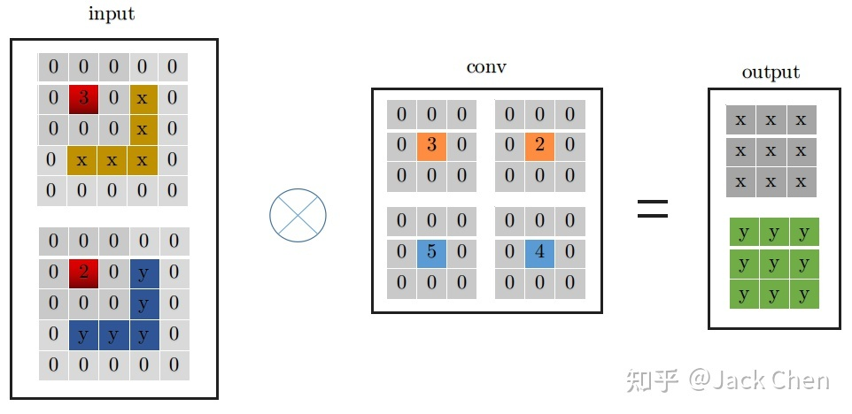
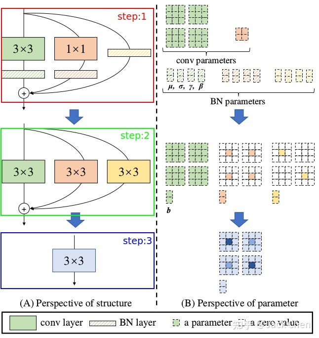
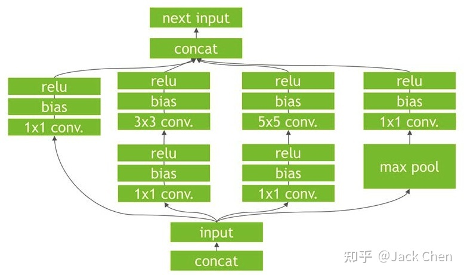

> https://blog.csdn.net/WZZ18191171661/article/details/112691604
>
> https://zhuanlan.zhihu.com/p/353697121
>
> https://github.com/DingXiaoH/RepVGG

# 1、需求解读

通过总结，你可能会发现计算机视觉中的多种不同任务的网络架构大致都可以分为3个通用的模块，具体包括：**通用Backbone网络、任务特定网络和任务头网络**，其中**通用Backbone网络用来提取一些低级的通用特征，具体包括颜色、形状和纹理等；任务特定网络用来对这些通用的特征进行进一步的加工，将这些特征变换成该任务需要的特征；任务头网路根据不同的任务来输出不同形式的结果**，例如分类算法输出类别概率，检测任务输出类别和检测框等。总而言之，**分类网络中的Backbone网络是很多高级任务的基准网络，它的性能在很大程度上决定了该网络的部分上限**。

在常见的计算机视觉任务中，我们经常会看到ResNet和MobileNet两个网络的身影，大量的实验结果表明：ResNet网络能够提取到鲁邦的特征表示，用户可以根据自己的需要灵活的选择ResNet18、ResNet34和ResNet50等网路架构；MobileNet适合应用在一些低算力的嵌入式设备中，可以在速度和精度之中达到很好的均衡。但是我们很好看到过VGG网络的身影，这几年越来越少！！！主要的原因包含2点：

1. VGG网络的模型更大，不便于模型部署；
2. 与ResNet网络相比，VGG网络的性能会有些逊色。

RepVGG，这个网络就是在VGG的基础上面进行改进，主要的思路包括：

1. **在VGG网络的Block块中加入了Identity和残差分支，相当于把ResNet网络中的精华应用 到VGG网络中**；
2. **模型推理阶段，通过Op融合策略将所有的网络层都转换为Conv3\*3，便于网络的部署和加速**。

如果你做过模型的部署，你可能会比较清楚，当前很多的模型推理框架中都对Conv3\*3卷积做了一些特定的加速操作，如果我们可以将所有卷积层转换成Conv3\*3，整个网络在推理阶段还是能获得较大的速度提升！！！

# 2、RepVGG算法简介

RepVGG是一个分类网路，该网络是在VGG网络的基础上进行改进，主要的改进点包括：

1. **在VGG网络的Block块中加入了Identity和残差分支，相当于把ResNet网络中的精华应用 到VGG网络中**；
2. **模型推理阶段，通过Op融合策略将所有的网络层都转换为Conv3\*3，便于模型的部署与加速** 。

该论文中的包含的亮点包括：**网络训练和网络推理阶段使用不同的网络架构，训练阶段更关注精度，推理阶段更关注速度**，这个思路很值得体会，是一种提升模型部署速度的方案！！！

# 3、RepVGG网络架构详解


上图展示了部分RepVGG网络，图A表示的是原始的ResNet网络，**该网络中包含着Conv1\*1的残差结构和Identity的残差结构，正是这些残差结构的存在解决了深层网路中的梯度消失问题，使得网络更加易于收敛**。图B表示的是训练阶段的RepVGG网络架构，整个网络的主体结构和ResNet网络类似，两个网络中都包含残差结构。

两个网络中的主要差异如下所述：

1. **RepVGG网络中的残差块并没有跨层**，如图中的绿框所示；
2. **整个网络包含2种残差结构**，如图中的绿框和红框所示，**绿框中的残差结构仅仅包含Conv1\*1残差分支；红框中不仅包含Conv1\*1的残差结构，而且包含Identity残差结构**。**由于残差结构具有多个分支，就相当于给网络增加了多条梯度流动的路径，训练一个这样的网络，其实类似于训练了多个网络，并将多个网络融合在一个网络中，类似于模型集成的思路，不过这种思路更加简单和高效！！！**
3. 模型的初始阶段使用了简单的残差结构，随着模型的加深，使用了复杂的残差结构，这样不仅仅能够在网络的深层获得更鲁邦的特征表示，而且可以更好的处理网络深层的梯度消失问题。图C表示的是推理阶段的RepVGG网络，该网络的结构非常简单，整个网络均是由Conv3*3+Relu堆叠而成，易于模型的推理和加速。

这种架构的主要优势包括：

1. **当前大多数推理引擎都对Conv3\*3做了特定的加速，假如整个网络中的每一个Conv3\*3都能节省3ms，如果一个网络中包含30个卷积层，那么整个网络就可以节省3\*30=90ms的时间，这还是初略的估算**。

2. **当推理阶段使用的网络层类别比较少时，我们愿意花费一些时间来完成这些模块的加速，因为这个工作的通用性很强，不失为一种较好的模型加速方案**。

3. **对于残差节点而言，需要当所有的残差分支都计算出对应的结果之后，才能获得最终的结果，这些残差分支的中间结果都会保存在设备的内存中，这样会对推理设备的内存具有较大的要求，来回的内存操作会降低整个网络的推理速度**。

而推理阶段首先在线下将模型转换为单分支结构，在设备推理阶段就能更好的提升设备的内存利用率，从而提升模型的推理速度，更直观的理解请看下图。总而言之，模型推理阶段的网络结构越简单越能起到模型加速的效果。


## 3.1 推理阶段Op融合细节详解


上图展示了模型推理阶段的重参数化过程，其实就是一个OP融合和OP替换的过程。图A从结构化的角度展示了整个重参数化流程， 图B从模型参数的角度展示了整个重参数化流程。整个重参数化步骤如下所示：

- **步骤1-首先通过式3将残差块中的卷积层和BN层进行融合，该操作在很多深度学习框架的推理阶段都会执行**。图中的灰色框中执行Conv3\*3+BN层的融合，图中的黑色矩形框中执行Conv1\*1+BN层的融合，图中的黄色矩形框中执行Conv3*3(卷积核设置为全1)+BN层的融合。其中 $W_i$ 表示转换前的卷积层参数，$μ_i$ 表示BN层的均值，$σ_i$ 表示BN层的方差， $\gamma_i$和 $\beta_{i}$ 分别表示BN层的尺度因子和偏移因子，$W’$ 和 $b’$ 分别表示融合之后的卷积的权重和偏置。
  $$
  W_{i,:,:,:}^{'} = \frac {\gamma_i} {\sigma_i} W_{i,:,:,:}, 
  \quad 
  b_{i}^{'} = - \frac {{\mu_i}{\gamma_i}} {{\sigma_i}} + \beta_i
  $$
  
- **步骤2-将融合后的卷积层转换为Conv3\*3**即将具体不同卷积核的卷积均转换为具有3\*3大小的卷积核的卷积。由于整个残差块中可能包含Conv1\*1分支和Identity两种分支，如图中的黑框和黄框所示。对于Conv1\*1分支而言，整个转换过程就是利用3\*3的卷积核替换1\*1的卷积核，具体的细节如图中的黑框所示，即将1\*1卷积核中的数值移动到3\*3卷积核的中心点即可(周围为0)；对于Identity分支而言，该分支并没有改变输入的特征映射的数值，那么我们可以设置一个3\*3的卷积核，将所有的9个位置处的权重值都设置为1，那么它与输入的特征映射相乘之后，保持了原来的数值，具体的细节如图中的褐色框所示。

- **步骤3-合并残差分支中的Conv3\*3**。即将所有分支的权重W和偏置B叠加起来，从而获得一个融合之后的Conv3*3网络层。

> 1x1Conv和identity分支测试代码示例

```python
import torch

x = torch.ones(1, 1, 5, 5)


#--------------------------------------------#
# 1x1Conv分支
# 中心为1x1Conv的卷积核，周围为0的卷积相当于恒等映射
#--------------------------------------------#
r = torch.ones(1)
print(r)        # tensor([0.7974])

conv1 = torch.nn.Conv2d(1, 1, 1, bias=False)
kernel1 = torch.tensor([[[[r]]]])
conv1.weight.data = kernel1
y1 = conv1(x)

conv2 = torch.nn.Conv2d(1, 1, 3, 1, 1, bias=False)
kernel2 = torch.tensor([[[[0, 0, 0],
                          [0, r, 0],
                          [0, 0, 0]]]])
conv2.weight.data = kernel2
y2 = conv2(x)

print(y1==y2)
# tensor([[[[True, True, True, True, True],
#           [True, True, True, True, True],
#           [True, True, True, True, True],
#           [True, True, True, True, True],
#           [True, True, True, True, True]]]])


#--------------------------------------------#
# identity分支
# 中心为1，周围为0的卷积相当于恒等映射
#--------------------------------------------#
conv3 = torch.nn.Conv2d(1, 1, 3, 1, 1, bias=False)
kernel3 = torch.tensor([[[[0, 0, 0],
                          [0, 1, 0],
                          [0, 0, 0.]]]])
conv3.weight.data = kernel3
y3 = conv3(x)
print(x==y3)
# tensor([[[[True, True, True, True, True],
        #   [True, True, True, True, True],
        #   [True, True, True, True, True],
        #   [True, True, True, True, True],
        #   [True, True, True, True, True]]]])
```


### 3.1.1 卷积层和BN层合并：

repVGG中大量运用conv+BN层，我们知道将层合并，减少层数能提升网络性能，下面的推理是conv带有bias的过程：

卷积公式为
$$
Conv(x) = W(x) + b
$$
而BN层公式为
$$
BN(x) = \gamma * \frac {x - mean} { \sqrt {var}} + \beta
$$
然后我们将卷积结果带入到BN公式中
$$
BN(Conv(x)) = \gamma * \frac {W(x)+b-mean} {\sqrt{var}} + \beta
$$
进一步化简为
$$
BN(Conv(x))
=
\frac{\gamma * W(x)} {\sqrt{var}}
+
\left(\frac{\gamma *(b-mean)}{\sqrt{v a r}}+\beta\right)
$$


这其实就是一个卷积层，只不过权重考虑了BN的参数 我们令：
$$
W_{fused}=\frac{\gamma * W}{\sqrt{v a r}} \\
B_{fused}=\frac{\gamma *(b-mean)}{\sqrt{var}}+\beta
$$
注意，在使用BN时卷积一般没有偏执，就是上面公式中的$b$，化简结果如下
$$
W_{fused}=\frac{\gamma * W}{\sqrt{v a r}} \\
B_{fused}=\beta - \frac{\gamma *mean}{\sqrt{var}}
$$


最终的融合结果即为：
$$
BN(Conv(x)) = W_{fused}(x) + B_{fused}
$$
相关融合代码如下图所示：

```python
    #--------------------------------------------#
    #   合并1条分支的卷积和bn，返回kernel和bias
    #--------------------------------------------#
    def _fuse_bn_tensor(self, branch):
        # rbr_identity分支在形状变化时为None
        if branch is None:
            return 0, 0
        # conv1x1和conv3x3
        if isinstance(branch, nn.Sequential):
            kernel = branch.conv.weight
            running_mean = branch.bn.running_mean
            running_var = branch.bn.running_var
            gamma = branch.bn.weight
            beta = branch.bn.bias
            eps = branch.bn.eps
        else:
            # identity分支只有一个bn
            assert isinstance(branch, nn.BatchNorm2d)
            # 创建中心为1，周围为0的3x3卷积核，这样经过卷积后值不变
            if not hasattr(self, 'id_tensor'):
                input_dim = self.in_channels // self.groups
                kernel_value = np.zeros((self.in_channels, input_dim, 3, 3), dtype=np.float32)
                for i in range(self.in_channels):
                    kernel_value[i, i % input_dim, 1, 1] = 1
                self.id_tensor = torch.from_numpy(kernel_value).to(branch.weight.device)
            kernel = self.id_tensor
            running_mean = branch.running_mean
            running_var = branch.running_var
            gamma = branch.weight
            beta = branch.bias
            eps = branch.eps
        std = (running_var + eps).sqrt()        # 标准差
        t = (gamma / std).reshape(-1, 1, 1, 1)  # γ
        return kernel * t, beta - running_mean * gamma / std
```

上述融合过程是conv带有bias的，现在一般带有BN的conv几乎已经不带bias了，已经将其与BN层中的β进行合并，带有BN层的conv+bn计算过程如下图所示：


### 3.1.2 conv_3x3和conv_1x1合并

这里为了详细说明下，假设输入特征图特征图尺寸为(1, 2, 3, 3)，输出特征图尺寸与输入特征图尺寸相同，且stride=1，下面展示是conv_3x3的卷及过程：


conv_3x3卷积过程大家都很熟悉，看上图一目了然，首先将特征图进行pad=kernel_size//2，然后从左上角开始(上图中红色位置)做卷积运算，最终得到右边output输出。下面是conv_1x1卷积过程：


同理，conv_1x1跟conv_3x3卷积过程一样，从上图中左边input中红色位置开始进行卷积，得到右边的输出，观察conv_1x1和conv_3x3的卷积过程，可以发现他们都是从input中红色起点位置开始，走过相同的路径，因此，将conv_3x3和conv_1x1进行融合，只需要将conv_1x1卷积核padding成conv_3x3的形式，然后于conv_3x3相加，再与特征图做卷积(这里依据卷积的可加性原理)即可，也就是conv_1x1的卷积过程变成如下形式：



### 3.1.3  identity 等效为特殊权重的卷积层

identity层就是输入直接等于输出，也即input中每个通道每个元素直接输出到output中对应的通道，用一个什么样的卷积层来等效这个操作呢，我们知道，卷积操作必须涉及要将每个通道加起来然后输出的，然后又要保证input中的每个通道每个元素等于output中，从这一点，我们可以从PWConv想到，只要令当前通道的卷积核参数为1，其余的卷积核参数为0，就可以做到；从DWconv中可以想到，用conv_1x1卷积且卷积核权重为1，就能保证每次卷积不改变输入，因此，identity可以等效成如下的conv_1x1的卷积形式：


从上面的分析，我们进一步可以将indentity -> conv_1x1 -> conv_3x3的形式，如下所示：


上述过程就是对应论文中所属的下述从step1到step2的变换过程，涉及conv于BN层融合，conv_1x1与identity转化为等价的conv_3x3的形式：



结构重参数化的最后一步也就是上图中step2 -> step3， 这一步就是利用卷积可加性原理，将三个分支的卷积层和bias对应相加组成最终一个conv3x3的形式即可。

这里，大家可能既然把BN，identity，conv_1x1和conv_3x3都融合在一起了，为什么不干脆把ReLU也融合进去呢？其实也是可以将ReLU层进行融合的，**但是需要进行量化**，**conv输出tensor的值域直接使用relu输出的值阈（同时对应计算Ｓ和Z），就可以完成conv和relu合并。无量化动作的优化是无法完成conv+relu的合并***。这里的知识请大家参考论文：
[Quantization and Training of Neural Networks for Efficient Integer-Arithmetic-Only Inference](https://arxiv.org/abs/1712.05877)。

## 3.2 不同配置版本的ResVGG网络


**对于基准分类网络而言，一般都会包含多个具有不同配置的网络架构，具有代表性的就是MobileNet和ShuffleNet网络，小模型可以进行轻量化部署，适合应用于一个算力较弱的嵌入式设备中，如rk3399、rk3288和Rapi3等；大模型用来进行服务端部署，适合应用到带有显卡的服务器上面，如GTX1080Ti、GTX2080Ti等，由于该设备的算力比较充足，即使是利用大模型也能获得实时的运行速度。**

RepVGG也提供两大类型的网络配置，具体的细节如上表所示，RepVGG-A表示的是一种比较轻量型的网络，整个网络的层数会少一些，当前分类性能也会差一些；RepVGG-B表示的是一种高精度类型的网络，整个网路会更深一些，分类精度更高一些，适用于服务端部署。整个RepVGG网络包含5个Stage,Stage1仅仅包含一个残差块，输出的特征映射大小为112\*112，残差块的通道个数取min(64,64a)；Stage2包含2个残差块，输出的特征映射大小为56\*56，残差块的通道个数为64a个；Stage3包含4个残差块，输出的特征映射大小为28\*28,残差块的通道个数为128a个；Stage4包含14个残差块，输出的特征映射大小为14\*14，残差块的通道个数为256a个；Stage5包含1个残差块，输出的特征映射大小为7\*7,残差块的通道个数为512b个。**整个网络通过参数a和参数b来形成不同版本的变种，具体的变种如下表所示，参数a和参数b用来控制残差块的通道个数，参数a用来控制stage1-stage4阶段的通道个数，参数b用来控制stage5阶段的通道个数，一般情况下a < b，主要的原因是Stage5中需要具有更多的通道个数，从而获得一些更鲁邦的特征表示，有利于后续的头网络输出更准确的预测结果。**


# 4、RepVGG算法实现步骤

1. 获取并划分训练数据集，并对训练集执行数据增强操作；

2. 搭建RepVGG训练网络，训练分类网络，直到网络收敛为止；
3. **加载训练好的网络，对该网络执行重参数化操作**，具体的细节如上节所述；
4. **加载重参数化后的模型，执行模型推理**。

# 5、RepVGG算法效果展示与分析


上图展示了ResVGG网络与ResNet网络在相同测试数据集上面的性能指标。评估的性能指标包括Top-1准确率、模型推理速度、模型参数量、FLOPS和Wino卷积的MUL个数。通过观察我们可以得出以下的初步结论：

1. **相同测试条件下，最小的模型RepVGG-A0与ResNet-18相比，各项指标都有显著的提升，RepVGG-A0网络不仅具有更少的参数量，更快的推理速度，而且获得了更高的分类精度；**

2. **与EfficientNet-B0相比，RepVGG-B1g4不仅具有更快的执行速度，而且获得了更高的分类精度，当然该模型也更大一些。**

3. **与VGG-16网络相比，RepVGG-B2在各个指标上面都有一定的性能提升。**


为了进一步验证RepVGG网络的通用性，作者验证了该Backbone在语义分割任务上面的性能，并和基准Backbon ResNet50和ResNet101进行了性能比较，具体的评估指标包括Mean IoU、Mean pixel acc和Speed。通过观察我们可以得出以下初步的结论：

1. **与ResNet-50网络相比，RepVGG-B1g2-fast网络不仅获得较高的精度，而且在速度上也有一些优势；**
2. **与ResNet-101网络相比，RepVGG-B2-fast网络不均获得了较高的速度，各项指标上也都有所提升。**

# 6、总结与分析

RepVGG是一个分类网路，该网络是在VGG网络的基础上进行改进，结合了VGG网络和ResNet网络的思路，主要的创新点包括：

1. 在VGG网络的Block块中加入了Identity和残差分支，相当于把ResNet网络中的精华应用 到VGG网络中；
2. 模型推理阶段，通过Op融合策略将所有的网络层都转换为Conv3*3，便于模型的部署与加速。
3. 这是一个通用的提升性能的Tricks,可以利用该Backbone来替换不同任务中的基准Backbone，算法性能会得到一定程度的提升。

尽管RepVGG网络具有以上的优势，但是该网络中也存在一些问题，具体的问题包括：

1. **从训练阶段转推理阶段之前，需要执行模型重参数化操作；**
2. **在模型重参数化过程中会增加一些额外的计算量；**
3. **由于每个残差块中引入了多个残差分支，网络的参数量也增加了一些。**


# 6、tensorrt加速流程

repVGG总的来说，是一篇非常棒的关于backbone工作，将常规的工作思路：**train model -> deploy model**，转换为：**train model -> redefine model -> deploy model**，我猜测与TensorRT在根据train model构建高效率的inference engine思路一样，tensorRT对模型进行加速，也是在模型进行优化和等效变换，看下述模型：



可以看到上图中很多零散的OP节点，我们知道OP越多，会导致网络推理越慢，因为，cudnn是一个动态库，对于每个op，程序运行时都是需要在.so库(Win系统下是.dll)找到对应的实现，因为会导致推理变慢。


TensorRT的优化如上图，将CONV+BN+ReLU层进行合并（也称之为***\*垂直融合\****），至于为什么上图中写的是bias而不是BN层，这是因为，带有BN的层的conv的实现，其bias和BN层的beta项进行合并了。


进一步的发现，TensorRT会继续做合并优化处理，在上图的基础上，你会发现conv_1*1被合并成了一个超级大的层。这里是水平融合机制，也即在同一个level层面上的相同操作进行融合。


在concat这一层，比如说这边计算出来一个1×3×24×24，另一边计算出来1×5×24×24，concat到一起，变成一个1×8×24×24的矩阵，这个叫concat。这层这其实是完全没有必要的，因为TensorRT完全可以实现直接接到需要的地方，不用专门做concat的操作，所以这一层也可以取消掉。