论文名称：**RepVGG: Making VGG-style ConvNets Great Again**

论文下载地址：https://arxiv.org/abs/2101.03697

官方源码（Pytorch实现）：https://github.com/DingXiaoH/RepVGG

------

https://blog.csdn.net/qq_37541097/article/details/125692507

https://mp.weixin.qq.com/s/c7o8xK0mSqF9aKK3w_7EIQ

目录

- 0 前言

- 1 RepVGG Block详解

- 2 结构重参数化

- - 2.1 融合Conv2d和BN
    - 2.2 Conv2d+BN融合实验(Pytorch)
    - 2.3 将1x1卷积转换成3x3卷积
    - 2.4 将BN转换成3x3卷积
    - 2.5 多分支融合
    - 2.6 结构重参数化实验(Pytorch)

- 3 模型配置

## 0 前言

VGG网络是2014年由牛津大学著名研究组VGG (Visual Geometry Group)  提出的。在2014到2016年（ResNet提出之前），VGG网络可以说是当时最火并被广泛应用的Backbone。后面由于各种新的网络提出，论精度VGG比不上ResNet，论速度和参数数量VGG比不过MobileNet等轻量级网络，慢慢地VGG开始淡出人们的视线。当VGG已经被大家遗忘时，2021年清华大学、旷视科技以及香港科技大学等机构共同提出了RepVGG网络，希望能够让VGG-style网络Great Again。

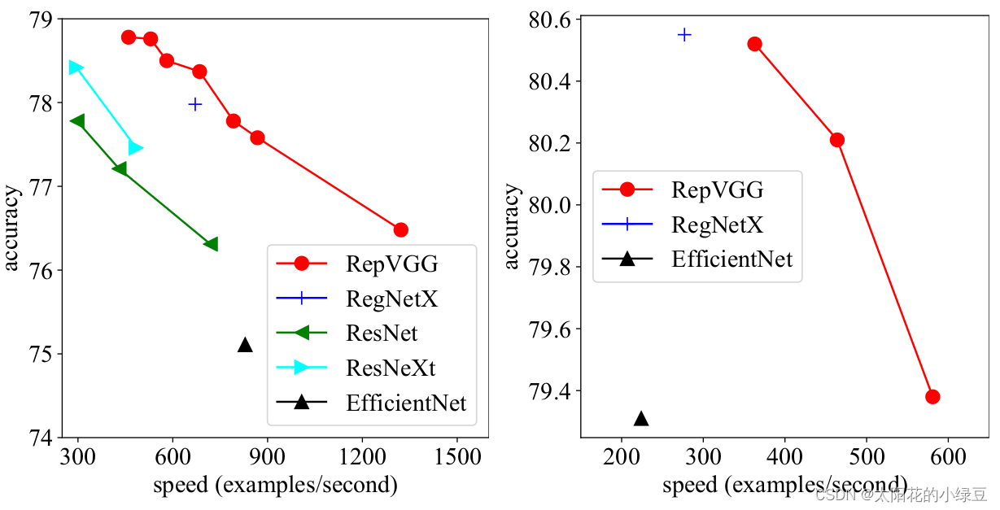

通过论文的图一可以看出，RepVGG无论是在精度还是速度上都已经超过了ResNet、EffcientNet以及ReNeXt等网络。那RepVGG究竟用了什么方法使得VGG网络能够获得如此大的提升呢，在论文的摘要中，作者提到了`structural re-parameterization technique`方法，即**结构重参数化**。实际上就是在训练时，使用一个类似ResNet-style的多分支模型，而推理时转化成VGG-style的单路模型。如下图所示，图（B）表示RepVGG训练时所采用的网络结构，而在推理时采用图（C）的网络结构。关于如何将图（B）转换到图（C）以及为什么要这么做后面再细说，如果对模型优化部署有了解就会发现这和做网络图优化或者说算子融合非常类似。

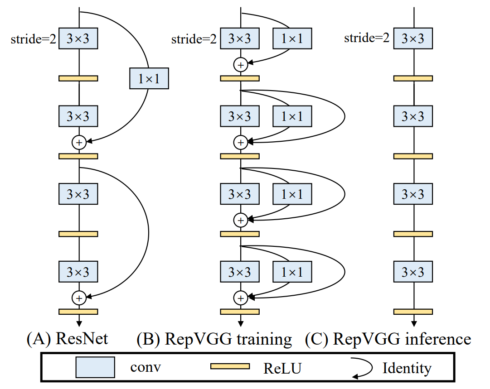

## 1 RepVGG Block详解

其实关于RepVGG整个模型没太多好说的，就是在不断堆叠RepVGG Block，只要之前看过VGG以及ResNet的代码，那么RepVGG也不在话下。这里主要还是聊下RepVGG  Block中的一些细节。由于论文中的图都是简化过的，于是我自己根据源码绘制了下图的RepVGG  Block（注意是针对训练时采用的结构）。

图（a）是进行下采样（stride=2）时使用的RepVGG  Block结构，

图（b）是正常的（stride=1）RepVGG Block结构。通过图（b）可以看到训练时RepVGG  Block并行了三个分支：一个卷积核大小为`3x3`的主分支，一个卷积核大小为`1x1`的shortcut分支以及一个只连了BN的shortcut分支。

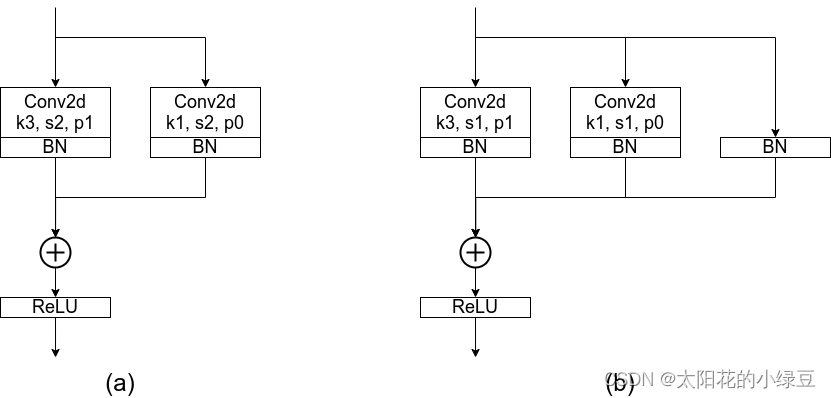

这里首先抛出一个问题，**为什么训练时要采用多分支结构**。如果之前看过像Inception系列、ResNet以及DenseNet等模型，我们能够发现这些模型都并行了多个分支。至少根据现有的一些经验来看，并行多个分支一般能够增加模型的表征能力。所以你会发现一些论文喜欢各种魔改网络并行分支。在论文的表6中，作者也做了个简单的消融实验，在使用单路结构时（不使用其他任何分支）Acc大概为`72.39`，在加上`Identity branch`以及`1x1 branch`后Acc达到了`75.14`。

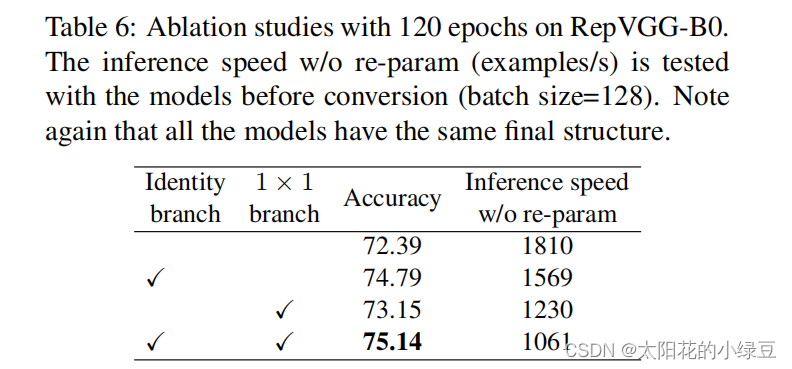

接着再问另外一个问题，**为什么推理时作者要将多分支模型转换成单路模型**。根据论文`3.1`章节的内容可知，采用单路模型会更快、更省内存并且更加的灵活。

- **更快**：主要是考虑到模型在推理时硬件计算的并行程度以及MAC（memory access  cost），对于多分支模型，硬件需要分别计算每个分支的结果，有的分支计算的快，有的分支计算的慢，而计算快的分支计算完后只能干等着，等其他分支都计算完后才能做进一步融合，这样会导致硬件算力不能充分利用，或者说并行度不够高。而且每个分支都需要去访问一次内存，计算完后还需要将计算结果存入内存（不断地访问和写入内存会在IO上浪费很多时间）。

- **更省内存**：在论文的图3当中，作者举了个例子，如图（A）所示的Residual模块，假设卷积层不改变channel的数量，那么在主分支和shortcut分支上都要保存各自的特征图或者称Activation，那么在add操作前占用的内存大概是输入Activation的两倍，而图（B）的Plain结构占用内存始终不变。

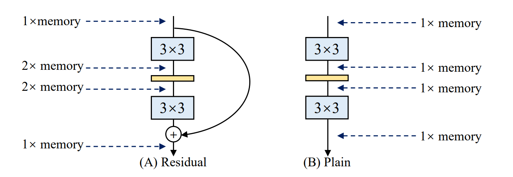

- **更加灵活**：作者在论文中提到了模型优化的剪枝问题，对于多分支的模型，结构限制较多剪枝很麻烦，而对于Plain结构的模型就相对灵活很多，剪枝也更加方便。

其实除此之外，在多分支转化成单路模型后很多算子进行了融合（比如Conv2d和BN融合），使得计算量变小了，而且算子减少后启动kernel的次数也减少了（比如在GPU中，每次执行一个算子就要启动一次kernel，启动kernel也需要消耗时间）。而且现在的硬件一般对`3x3`的卷积操作做了大量的优化，转成单路模型后采用的都是`3x3`卷积，这样也能进一步加速推理。如下图多分支模型（B）转换成单路模型图（C）。


## 2 结构重参数化

在简单了解RepVGG Block的训练结构后，接下来再来聊聊怎么将训练好的RepVGG Block转成推理时的模型结构，即`structural re-parameterization technique`过程。根据论文中的图4（左侧）可以看到，结构重参数化主要分为两步，第一步主要是将Conv2d算子和BN算子融合以及将只有BN的分支转换成一个Conv2d算子，第二步将每个分支上的`3x3`卷积层融合成一个卷积层。关于参数具体融合的过程可以看图中右侧的部分，如果你能看懂图中要表达的含义，那么ok你可以跳过本文后续所有内容干其他事去了，如果没看懂可以接着往后看。

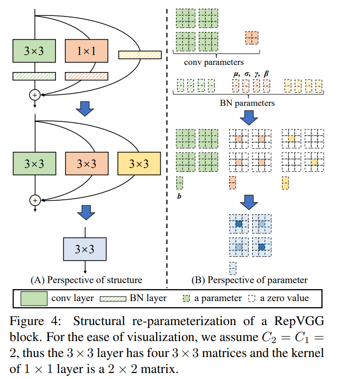

### 2.1 融合Conv2d和BN

---

另一篇博文

repVGG中大量运用conv+BN层，我们知道将层合并，减少层数能提升网络性能，下面的推理是conv带有bias的过程：

卷积公式为
$$
Conv(x) = W(x) + b
$$
而BN层公式为
$$
BN(x) = \gamma * \frac {x - mean} { \sqrt {var}} + \beta
$$
然后我们将卷积结果带入到BN公式中
$$
BN(Conv(x)) = \gamma * \frac {W(x)+b-mean} {\sqrt{var}} + \beta
$$
进一步化简为
$$
BN(Conv(x))
=
\frac{\gamma * W(x)} {\sqrt{var}}
+
\left(\frac{\gamma *(b-mean)}{\sqrt{v a r}}+\beta\right)
$$


这其实就是一个卷积层，只不过权重考虑了BN的参数 我们令：
$$
W_{fused}=\frac{\gamma * W}{\sqrt{v a r}} \\
B_{fused}=\frac{\gamma *(b-mean)}{\sqrt{var}}+\beta
$$
注意，在使用BN时卷积一般没有偏置，就是上面公式中的$b$，化简结果如下
$$
W_{fused}=\frac{\gamma * W}{\sqrt{va r}} \\
B_{fused}=\beta - \frac{\gamma *mean}{\sqrt{var}}
$$


最终的融合结果即为：
$$
BN(Conv(x)) = W_{fused}(x) + B_{fused}
$$
相关融合代码如下图所示：

```python
    #--------------------------------------------#
    #   合并1条分支的卷积和bn，返回kernel和bias
    #--------------------------------------------#
    def _fuse_bn_tensor(self, branch):
        # rbr_identity分支在形状变化时为None
        if branch is None:
            return 0, 0
        # conv1x1和conv3x3
        if isinstance(branch, nn.Sequential):
            kernel = branch.conv.weight
            running_mean = branch.bn.running_mean
            running_var = branch.bn.running_var
            gamma = branch.bn.weight
            beta = branch.bn.bias
            eps = branch.bn.eps
        else:
            # identity分支只有一个bn
            assert isinstance(branch, nn.BatchNorm2d)
            # 创建中心为1，周围为0的3x3卷积核，这样经过卷积后值不变
            if not hasattr(self, 'id_tensor'):
                input_dim = self.in_channels // self.groups
                kernel_value = np.zeros((self.in_channels, input_dim, 3, 3), dtype=np.float32)
                for i in range(self.in_channels):
                    kernel_value[i, i % input_dim, 1, 1] = 1
                self.id_tensor = torch.from_numpy(kernel_value).to(branch.weight.device)
            kernel = self.id_tensor
            running_mean = branch.running_mean
            running_var = branch.running_var
            gamma = branch.weight
            beta = branch.bias
            eps = branch.eps
        std = (running_var + eps).sqrt()        # 标准差
        t = (gamma / std).reshape(-1, 1, 1, 1)  # γ
        return kernel * t, beta - running_mean * gamma / std
```


---

关于Conv2d和BN的融合对于网络的优化而言已经是基操了。因为Conv2d和BN两个算子都是做线性运算，所以可以融合成一个算子。如果不了解卷积层的计算过程以及BN的计算过程的话建议先了解后再看该部分的内容。这里还需要强调一点，融合是在网络训练完之后做的，所以现在讲的默认都是推理模式，**注意BN在训练以及推理时计算方式是不同的**。对于卷积层，每个卷积核的通道数是与输入特征图的通道数相同，卷积核的个数决定了输出特征图的通道个数。

对于BN层（推理模式），主要包含4个参数： $\mu$（均值）、$\sigma^2$（方差）、 $\gamma$ 和 $\beta$，其中 $\mu$ 和 $\sigma^2$ 是训练过程中统计得到的，$\gamma$ 和 $\beta $ 是训练学习得到的。对于特征图第`i`个通道BN的计算公式如下，其中 $\epsilon$ 是一个非常小的常量，防止分母为零：
$$
y_{i} = 
\frac{x_{i}-\mu_{i}}{\sqrt{\sigma_{i}^{2}+\epsilon}} 
\cdot
\gamma_{i}+\beta_{i}
$$
在论文的`3.3`章节中，作者给出了转换公式（对于通道`i`），其中 $M$ 代表输入BN层的特征图(Activation)，这里忽略了 $\epsilon$ ，因为：
$$
bn(M, \mu, \sigma, \gamma, \beta)_{:, i,:,:}
=
\left(M_{:, i,:,:}-\mu_{i}\right)
\frac{\gamma_{i}}{\sigma_{i}}+\beta_{i}
$$
所以转换后新的卷积层权重计算公式为（对于通道`i`）， $W^{\prime}$ 和 $b^{\prime}$ 是新的权重和偏执：
$$
W_{i,:,:,:}^{\prime}
=
\frac{\gamma_{i}}{\sigma_{i}} W_{i,:,:,:}, 
\quad 
b_{i}^{\prime}
=
\beta_{i}-\frac{\mu_{i} \gamma_{i}}{\sigma_{i}}
$$
如果看懂了，可以直接跳过该小结，如果没看懂可以再看看下面的例子。

这里假设输入的特征图（Input feature map）如下图所示，输入通道数为2，然后采用两个卷积核（图中只画了第一个卷积核对应参数）。

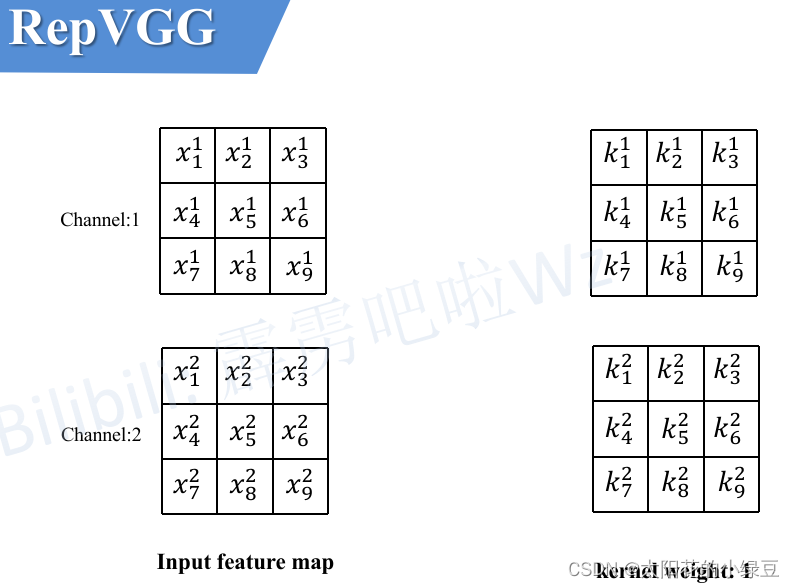

接着计算一下输出特征图（Output feature  map）通道1上的第一个元素，即当卷积核1在输入特征图红色框区域卷积时得到的值（为了保证输入输出特征图高宽不变，所以对Input feature map进行了Padding）。其他位置的计算过程类似这里就不去演示了。

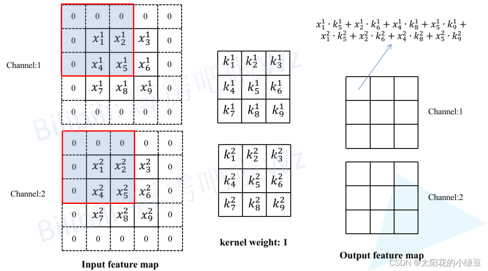

然后再将卷积层输出的特征图作为BN层的输入，这里同样计算一下输出特征图（Output feature map）通道1上的第一个元素，按照上述BN在推理时的计算公式即可得到如下图所示的计算结果。


最后对上述计算公式进行简单的变形，可以得到转化后新卷积层的权重只需在对应通道`i`上乘以 $\frac{\gamma_{i}}{\sqrt{\sigma_{i}^{2}+\epsilon}}$ 系数即可，对应通道`i`上新的偏执就等于 $\beta_{i}-\frac{\mu_{i} \gamma_{i}}{\sqrt{\sigma_{i}^{2}+\epsilon}}$因为之前采用Conv2d+BN的组合中Conv2d默认是不采用偏执的或者说偏执为零）。

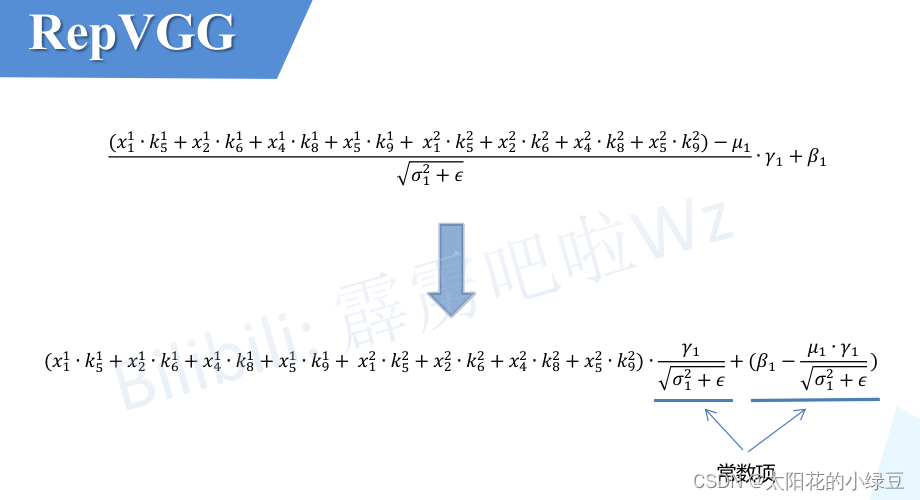

### 2.2 Conv2d+BN融合实验(Pytorch)

下面是参考作者提供的源码改的一个小实验，首先创建了一个`module`包含了卷积和BN模块，然后按照上述转换公式将卷积层的权重和BN的权重进行融合转换，接着载入到新建的卷积模块`fused_conv`中，最后随机创建一个Tensor（`f1`）将它分别输入到`module`以及`fused_conv`中，通过对比两者的输出可以发现它们的结果是一致的。

```python
from collections import OrderedDict

import numpy as np
import torch
import torch.nn as nn


def main():
    torch.onesom.manual_seed(0)

    f1 = torch.ones(1, 2, 3, 3)

    module = nn.Sequential(OrderedDict(
        conv=nn.Conv2d(in_channels=2, out_channels=2, kernel_size=3, stride=1, padding=1, bias=False),
        bn=nn.BatchNorm2d(num_features=2)
    ))

    module.eval()

    with torch.inference_mode():
        output1 = module(f1)
        print(output1)

    # fuse conv + bn
    kernel = module.conv.weight  # [in_ch, out_ch, k, k]
    running_mean = module.bn.running_mean
    running_var = module.bn.running_var
    gamma = module.bn.weight
    beta = module.bn.bias
    eps = module.bn.eps
    std = (running_var + eps).sqrt()
    t = (gamma / std).reshape(-1, 1, 1, 1)  # [in_ch] -> [in_ch, 1, 1, 1]
    kernel = kernel * t
    bias = beta - running_mean * gamma / std
    fused_conv = nn.Conv2d(in_channels=2, out_channels=2, kernel_size=3, stride=1, padding=1, bias=True)
    fused_conv.load_state_dict(OrderedDict(weight=kernel, bias=bias))

    with torch.inference_mode():
        output2 = fused_conv(f1)
        print(output2)

    np.testing.assert_allclose(output1.numpy(), output2.numpy(), rtol=1e-03, atol=1e-05)
    print("convert module has been tested, and the result looks good!")


if __name__ == '__main__':
    main()
```

终端输出结果：

```python
tensor([[[[ 0.2554, -0.0267,  0.1502],
          [ 0.8394,  1.0100,  0.5443],
          [-0.7252, -0.6889,  0.4716]],

         [[ 0.6937,  0.1421,  0.4734],
          [ 0.0168,  0.5665, -0.2308],
          [-0.2812, -0.2572, -0.1287]]]])
tensor([[[[ 0.2554, -0.0267,  0.1502],
          [ 0.8394,  1.0100,  0.5443],
          [-0.7252, -0.6889,  0.4716]],

         [[ 0.6937,  0.1421,  0.4734],
          [ 0.0168,  0.5665, -0.2308],
          [-0.2812, -0.2572, -0.1287]]]])
convert module has been tested, and the result looks good!
```

### 2.3 将1x1卷积转换成3x3卷积

这个过程比较简单，如下图所示，以`1x1`卷积层中某一个卷积核为例，**只需在原来权重周围补一圈0**就行了，这样就变成了`3x3`的卷积层，注意为了保证输入输出特征图高宽不变，此时需要将padding设置成1（原来卷积核大小为`1x1`时padding为0）。最后按照上述`2.1`中讲的内容将卷积层和BN层进行融合即可。


### 2.4 将BN转换成3x3卷积

对于只有BN的分支由于没有卷积层，所以我们可以先自己构建出一个卷积层来。如下图所示，构建了一个`3x3`的卷积层，该卷积层只做了恒等映射，即输入输出特征图不变。既然有了卷积层，那么又可以按照上述`2.1`中讲的内容将卷积层和BN层进行融合。

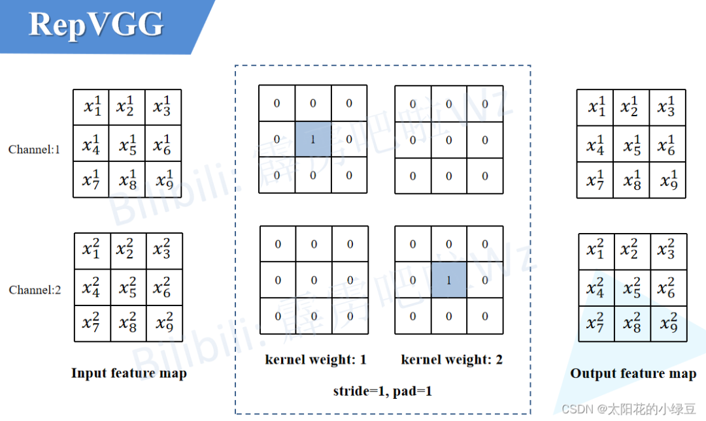

### 2.5 多分支融合

在上面的章节中，我们已经讲了怎么把每个分支融合转换成一个`3x3`的卷积层，接下来需要进一步将多分支转换成一个单路`3x3`卷积层。

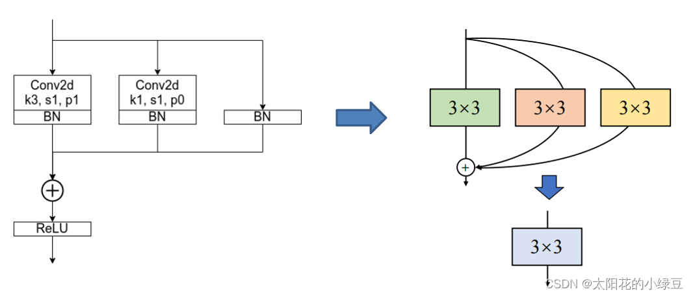

合并的过程其实也很简单，直接将这三个卷积层的参数相加即可，具体推理过程就不讲了，如果不了解的可以自己动手算算。

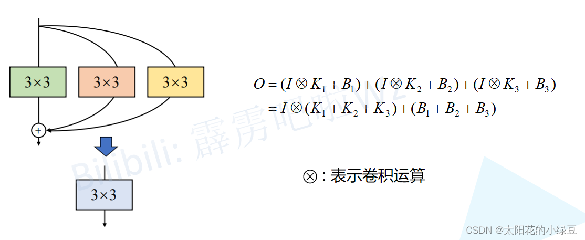

最后我们再来看下原论文中的图4就非常清晰了。


### 2.6 结构重参数化实验(Pytorch)

下面是参考作者提供的源码改的一个小实验，在该实验中测试了 **结构重参数化** 前后推理速度的比较，以及检查转换前后的输出是否一致。

```python
import time
import torch.nn as nn
import numpy as np
import torch


def conv_bn(in_channels, out_channels, kernel_size, stride, padding, groups=1):
    result = nn.Sequential()
    result.add_module('conv', nn.Conv2d(in_channels=in_channels, out_channels=out_channels,
                                        kernel_size=kernel_size, stride=stride, padding=padding,
                                        groups=groups, bias=False))
    result.add_module('bn', nn.BatchNorm2d(num_features=out_channels))
    return result


class RepVGGBlock(nn.Module):
    def __init__(self, in_channels, out_channels, kernel_size=3,
                 stride=1, padding=1, dilation=1, groups=1, padding_mode='zeros', deploy=False):
        super(RepVGGBlock, self).__init__()
        self.deploy = deploy
        self.groups = groups
        self.in_channels = in_channels
        self.nonlinearity = nn.ReLU()

        if deploy:
            self.rbr_reparam = nn.Conv2d(in_channels=in_channels, out_channels=out_channels,
                                         kernel_size=kernel_size, stride=stride,
                                         padding=padding, dilation=dilation, groups=groups,
                                         bias=True, padding_mode=padding_mode)

        else:
            self.rbr_identity = nn.BatchNorm2d(num_features=in_channels) \
                if out_channels == in_channels and stride == 1 else None
            self.rbr_dense = conv_bn(in_channels=in_channels, out_channels=out_channels, kernel_size=kernel_size,
                                     stride=stride, padding=padding, groups=groups)
            self.rbr_1x1 = conv_bn(in_channels=in_channels, out_channels=out_channels, kernel_size=1,
                                   stride=stride, padding=0, groups=groups)

    def forward(self, inputs):
        if hasattr(self, 'rbr_reparam'):
            return self.nonlinearity(self.rbr_reparam(inputs))

        if self.rbr_identity is None:
            id_out = 0
        else:
            id_out = self.rbr_identity(inputs)

        return self.nonlinearity(self.rbr_dense(inputs) + self.rbr_1x1(inputs) + id_out)

    def get_equivalent_kernel_bias(self):
        kernel3x3, bias3x3 = self._fuse_bn_tensor(self.rbr_dense)
        kernel1x1, bias1x1 = self._fuse_bn_tensor(self.rbr_1x1)
        kernelid, biasid = self._fuse_bn_tensor(self.rbr_identity)
        return kernel3x3 + self._pad_1x1_to_3x3_tensor(kernel1x1) + kernelid, bias3x3 + bias1x1 + biasid

    def _pad_1x1_to_3x3_tensor(self, kernel1x1):
        if kernel1x1 is None:
            return 0
        else:
            return torch.nn.functional.pad(kernel1x1, [1, 1, 1, 1])

    def _fuse_bn_tensor(self, branch):
        if branch is None:
            return 0, 0
        if isinstance(branch, nn.Sequential):
            kernel = branch.conv.weight
            running_mean = branch.bn.running_mean
            running_var = branch.bn.running_var
            gamma = branch.bn.weight
            beta = branch.bn.bias
            eps = branch.bn.eps
        else:
            assert isinstance(branch, nn.BatchNorm2d)
            if not hasattr(self, 'id_tensor'):
                input_dim = self.in_channels // self.groups
                kernel_value = np.zeros((self.in_channels, input_dim, 3, 3), dtype=np.float32)
                for i in range(self.in_channels):
                    kernel_value[i, i % input_dim, 1, 1] = 1
                self.id_tensor = torch.from_numpy(kernel_value).to(branch.weight.device)
            kernel = self.id_tensor
            running_mean = branch.running_mean
            running_var = branch.running_var
            gamma = branch.weight
            beta = branch.bias
            eps = branch.eps
        std = (running_var + eps).sqrt()
        t = (gamma / std).reshape(-1, 1, 1, 1)
        return kernel * t, beta - running_mean * gamma / std

    def switch_to_deploy(self):
        if hasattr(self, 'rbr_reparam'):
            return
        kernel, bias = self.get_equivalent_kernel_bias()
        self.rbr_reparam = nn.Conv2d(in_channels=self.rbr_dense.conv.in_channels,
                                     out_channels=self.rbr_dense.conv.out_channels,
                                     kernel_size=self.rbr_dense.conv.kernel_size, stride=self.rbr_dense.conv.stride,
                                     padding=self.rbr_dense.conv.padding, dilation=self.rbr_dense.conv.dilation,
                                     groups=self.rbr_dense.conv.groups, bias=True)
        self.rbr_reparam.weight.data = kernel
        self.rbr_reparam.bias.data = bias
        for para in self.parameters():
            para.detach_()
        self.__delattr__('rbr_dense')
        self.__delattr__('rbr_1x1')
        if hasattr(self, 'rbr_identity'):
            self.__delattr__('rbr_identity')
        if hasattr(self, 'id_tensor'):
            self.__delattr__('id_tensor')
        self.deploy = True

def main():
    f1 = torch.ones(1, 64, 64, 64)
    block = RepVGGBlock(in_channels=64, out_channels=64)
    block.eval()
    with torch.inference_mode():
        output1 = block(f1)
        start_time = time.time()
        for _ in range(100):
            block(f1)
        print(f"consume time: {time.time() - start_time}")

        # re-parameterization
        block.switch_to_deploy()
        output2 = block(f1)
        start_time = time.time()
        for _ in range(100):
            block(f1)
        print(f"consume time: {time.time() - start_time}")

        np.testing.assert_allclose(output1.numpy(), output2.numpy(), rtol=1e-03, atol=1e-05)
        print("convert module has been tested, and the result looks good!")


if __name__ == '__main__':
    main()
```

终端输出结果如下：

```python
consume time: 0.6152701377868652
consume time: 0.30626463890075684
convert module has been tested, and the result looks good!
```

通过对比能够发现，**结构重参数化**后推理速度翻倍了，并且转换前后的输出保持一致。

## 3 模型配置

在论文中对模型进一步细分有`RepVGG-A`、`RepVGG-B`以及`RepVGG-Bxgy`三种配置。

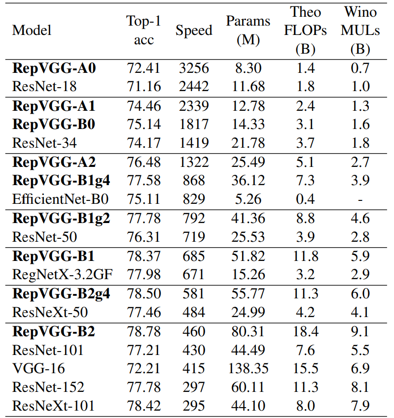


根据表2可以看出`RepVGG-B`比`RepVGG-A`要更深。可以细看这两种配置在每个stage重复block的次数。`RepVGG-A`中的base Layers of each stage为`1, 2, 3, 14, 1`而`RepVGG-B`中的base Layers of each stage为`1, 4, 6, 16, 1`，更加详细的模型配置可以看表3. 其中`a`代表模型stage2~4的宽度缩放因子，`b`代表模型最后一个stage的宽度缩放因子。


而`RepVGG-Bxgy`配置是在`RepVGG-B`的基础上加入了组卷积（Group Convolution），其中`gy`表示组卷积采用的groups参数为`y`，注意并不是所有卷积层都采用组卷积，根据源码可以看到，是从Stage2开始（索引从1开始）的第`2, 4, 6, 8, 10, 12, 14, 16, 18, 20, 22, 24, 26`的卷积层采用组卷积。

```python
optional_groupwise_layers = [2, 4, 6, 8, 10, 12, 14, 16, 18, 20, 22, 24, 26]
```

到此，有关RepVGG的内容就基本讲完了。如果觉得这篇文章对你有用，记得点赞、收藏并分享给你的小伙伴们哦😄。