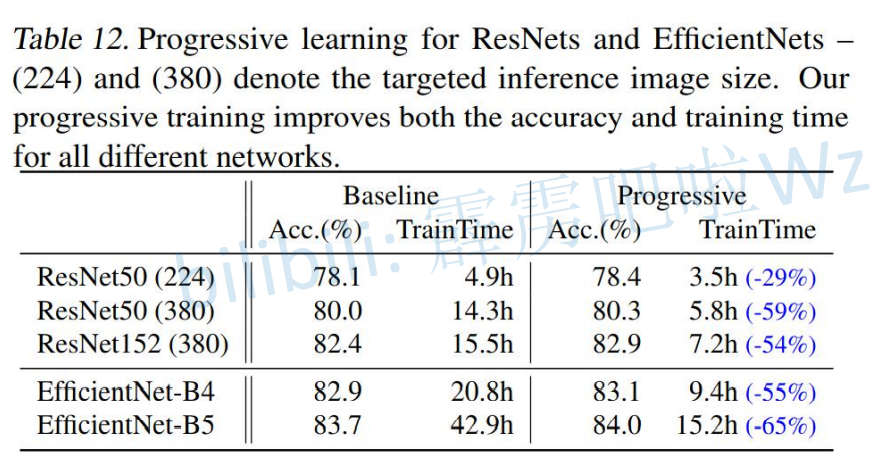

# 1

> 红色的是V2在ImageNet21K上预训练 ImageNet1k上进行迁移学习
>
> 粉色的是V2
>
> ViT VisionTransfomer

# 性能对比

> 推理和训练速度并不快

# V2更关注训练速度

### V2-S 对比 V1-B5 更快

### V2-M 相比 V1-B7 更快

# V1缺陷

## 图像尺寸大,训练速度慢

> 数字是每秒训练图片张数

## DW卷积在浅层网络中速度慢

> 替换MBConv为FusedConv
>
> 数字是每秒训练图片张数
>
> stage1-3 指的是 1-3层 最好就是替换这3层
>
> 

## 深度和宽度均匀缩放每个stage是次优的

# V2贡献

# V2架构

> Stage
>
> Operator
>
>   Fused-MBConv1 1,4,6代表扩展维度比例
>
> ​	SE0.25 SE注意力结构 0.25 指的是第一个全连接层相对比MBConv通道的降低倍率
>
> Stride 步长
>
> #Channels out_channel
>
> #Layers 重复次数
>
> ----
>
> 右侧不同点中最后的移除了EfficientNetV1中的stage8指的是 V2-S,其他的没说

# Fused-MBConv 没有添加SE模块

> 论文中有SE模块,在实际搭建中没有添加SE模块
>
> **Expansion  = 1 有 3x3Conv**
>
> **Expansion != 1 有 3x3Expansion  1x1Conv**
>
> ----
>
> **当 stride==1 且 in_channel == out_channel 时才有shortcut连接**
>
> **注意最后一层Conv没有激活函数**
>
> **当有捷径分支的时候才有Dropout**

# Dropout 不是普通的Dropout

> **会以一定的概率,会以主分支输出进行丢弃,直接从上一层输出引到下一层的输入,相当于随机深度**
>
> 可以小幅提升正确率

# MBConv

> **当 stride==1 且 in_channel == out_channel 时才有shortcut连接**
>
> **注意最后一层Conv没有激活函数**

# V2参数

## V2

> 后3行没写C1,用的全都是MBConv模块

## V2-S

> 后3行没写C1,用的全都是MBConv模块

## V2-M

> 多了一个Stage(多了一行)

## V2-L

## 其他训练参数

> **最大图像尺寸,使用了渐进式学习,图像大小会变化**
>
> **验证时直接使用最大的即可**
>
> 对于S:  
>
> ​	train_size = 300 
>
> ​	valid_size = 384
>
> 对于M:
>
> ​	train_size = 384
>
> ​	valid_size = 480
>
> 对于L:
>
> ​	train_size = 384
>
> ​	valid_size = 480
>
> **dropout是对于全连接层之前的Dropout**
>
> 最后3个参数是使用渐进式学习使用的参数

# 渐进式学习策略

> 不同的size,在RandAug不同的情况下,准确率不同

## 图像尺寸和正则方法的关系

## 参数变化

## 具体参数 图像尺寸变化

> min: 开始图像尺寸
>
> max: 最终图像尺寸

## 其他模型使用渐进式

> 右侧是渐进式学习
>
> 可以减少训练时间,略微提升准确度

-