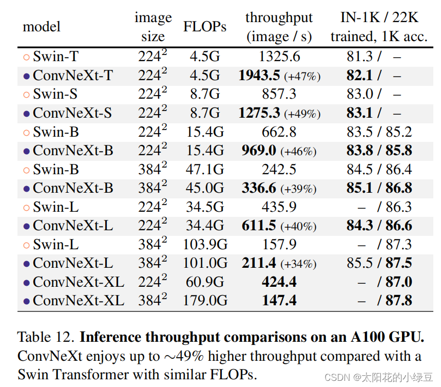
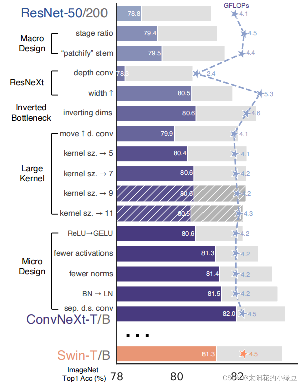
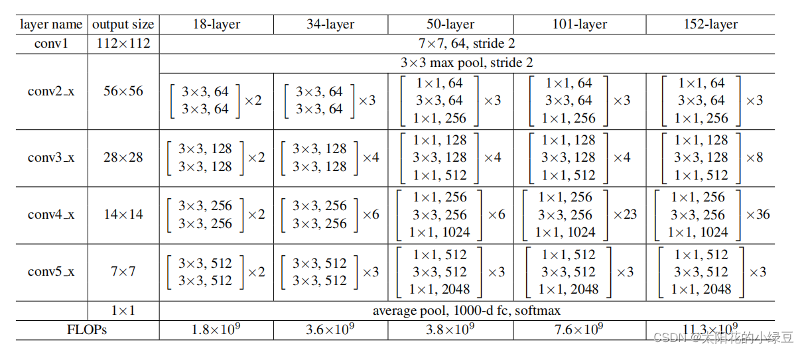
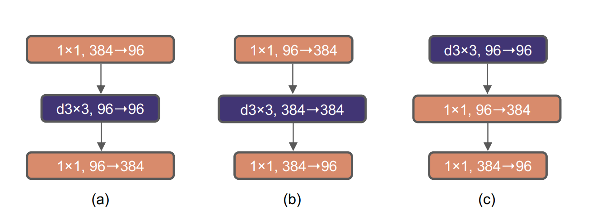
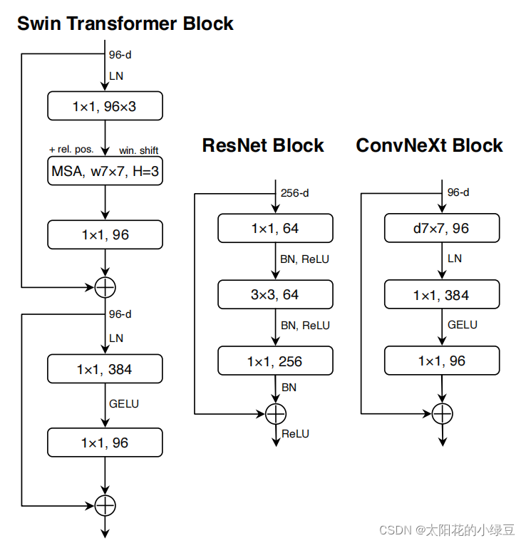
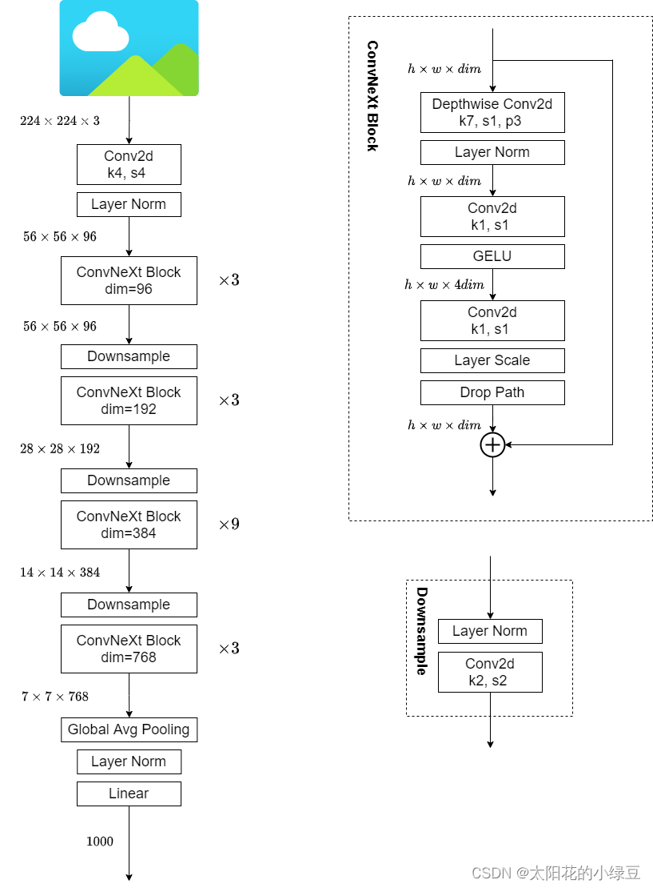

# 0 前言

> 自从`ViT(Vision Transformer)`在CV领域大放异彩，越来越多的研究人员开始拥入`Transformer`的怀抱。回顾近一年，在CV领域发的文章绝大多数都是基于`Transformer`的，比如2021年ICCV 的best paper `Swin Transformer`，而卷积神经网络已经开始慢慢淡出舞台中央。卷积神经网络要被`Transformer`取代了吗？也许会在不久的将来。
>
> 今年(2022)一月份，`Facebook AI Research`和`UC Berkeley`一起发表了一篇文章`A ConvNet for the 2020s`，在文章中提出了`ConvNeXt`纯卷积神经网络，它对标的是2021年非常火的`Swin Transformer`，通过一系列实验比对，在相同的FLOPs下，`ConvNeXt`相比`Swin Transformer`拥有更快的推理速度以及更高的准确率，在`ImageNet 22K`上`ConvNeXt-XL`达到了`87.8%`的准确率，参看下图(原文表12)。看来`ConvNeXt`的提出强行给卷积神经网络续了口命。
>
> 右侧准确率现在22K上训练,再在1k上训练



如果你仔细阅读了这篇文章，你会发现`ConvNeXt`“毫无亮点”，`ConvNeXt`使用的全部都是现有的结构和方法，没有任何结构或者方法的创新。且源码也非常的精简，100多行代码就能搭建完成，相比`Swin Transformer`简直不要太简单。之前看`Swin Transformer`时，滑动窗口，相对位置索引，不光原理理解起来有些吃力，源码多的也挺让人绝望的（但无法否认`Swin Transformer`的成功以及设计的很巧妙）。为什么现在基于`Transformer`架构的模型效果比卷积神经网络要好呢？论文中的作者认为可能是随着技术的不断发展，各种新的架构以及优化策略促使`Transformer`模型的效果更好，那么使用相同的策略去训练卷积神经网络也能达到相同的效果吗？抱着这个疑问作者就以`Swin Transformer`作为参考进行一系列实验。

> In this work, we investigate the architectural distinctions between ConvNets and Transformers and try to identify the confounding variables when comparing the network performance. Our research is intended to bridge the gap between the pre-ViT and post-ViT eras for ConvNets, as well as to test the limits of what a pure ConvNet can achieve.

---

# 1 设计方案

作者首先利用训练`vision Transformers`的策略去训练原始的`ResNet50`模型，发现比原始效果要好很多，并将此结果作为后续实验的基准`baseline`。然后作者罗列了接下来实验包含哪些部分：

- macro design
- ResNeXt
- inverted bottleneck
- large kerner size
- various layer-wise micro designs

> Our starting point is a ResNet-50 model. We first train it with similar training techniques used to train vision Transformers and obtain much improved results compared to the original ResNet-50. This will be our baseline. We then study a series of design decisions which we summarized as 1) macro design, 2) ResNeXt, 3) inverted bottleneck, 4) large kernel size, and 5) various layer-wise micro designs.

下图（原论文图2）展现了每个方案对最终结果的影响（Imagenet 1K的准确率）。很明显最后得到的`ConvNeXt`在相同FLOPs下准确率已经超过了`Swin Transformer`。接下来，针对每一个实验进行解析。



---

# 2 Macro design

在这个部分作者主要研究两方面：

## 改变不同阶段占比(Changing stage compute ratio)

> 在原`ResNet`网络中，一般`conv4_x`（即`stage3`）堆叠的block的次数是最多的。如下图中的`ResNet50`中`stage1`到`stage4`堆叠block的次数是`(3, 4, 6, 3)`比例大概是`1:1:2:1`，但在`Swin Transformer`中，比如`Swin-T`的比例是`1:1:3:1`，`Swin-L`的比例是`1:1:9:1`。很明显，在`Swin Transformer`中，`stage3`堆叠block的占比更高。所以作者就将`ResNet50`中的堆叠次数由`(3, 4, 6, 3)`调整成`(3, 3, 9, 3)`，和`Swin-T`拥有相似的FLOPs。进行调整后，准确率由`78.8%`提升到了`79.4%`。
>
> `ResNet50`中的堆叠次数由`(3, 4, 6, 3)`调整成`(3, 3, 9, 3)`



## stem k=4,s=4 (Changing stem to “Patchify”)

> 在之前的卷积神经网络中，一般最初的下采样模块`stem`一般都是通过一个卷积核大小为`7x7`步距为2的卷积层以及一个步距为2的最大池化下采样共同组成，高和宽都下采样4倍。但在`Transformer`模型中一般都是通过一个卷积核非常大且相邻窗口之间没有重叠的（即`stride`等于`kernel_size`）卷积层进行下采样。比如在`Swin Transformer`中采用的是一个卷积核大小为`4x4`步距为4的卷积层构成`patchify`，同样是下采样4倍。所以作者将`ResNet`中的`stem`也换成了和`Swin Transformer`一样的`patchify`。替换后准确率从`79.4%` 提升到`79.5%`，并且FLOPs也降低了一点。
>
> conv k=7,s=2 + maxpool k=3,s=2  => conv k=4,s=4

---

# 3 ResNeXt-ify DWConv

> 接下来作者借鉴了`ResNeXt`中的组卷积`grouped convolution`，因为`ResNeXt`相比普通的`ResNet`而言在FLOPs以及accuracy之间做到了更好的平衡。而作者采用的是更激进的`depthwise convolution`，即group数和通道数channel相同，之前在讲`MobileNet`时由很详细讲解过，如果不了解的可以翻翻之前的[文章](https://blog.csdn.net/qq_37541097/article/details/105771329)。这样做的另一个原因是作者认为`depthwise convolution`和`self-attention`中的加权求和操作很相似。
>
> 这里是将stage中的3x3Conv变为了DWConv,导致准确率降低,下面提高了通道数让准确率提高

> We note that depthwise convolution is similar to the weighted sum operation in self-attention.

> 接着作者将最初的通道数由64调整成96和`Swin Transformer`保持一致，最终准确率达到了`80.5%`。
>
> 就是增大最初通道数

---

# 4 Inverted Bottleneck

作者认为`Transformer block`中的`MLP`模块非常像`MobileNetV2`中的`Inverted Bottleneck`模块，即两头细中间粗。下图a是`ReNet`中采用的`Bottleneck`模块，b是`MobileNetV2`采用的`Inverted Botleneck`模块，c是`ConvNeXt`采用的是`Inverted Bottleneck`模块。关于`MLP`模块可以参考之前讲的[Vision Transformer博文](https://blog.csdn.net/qq_37541097/article/details/118242600)，关于`Inverted Bottleneck`模块可以参考之前讲的[MobileNetv2博文](https://blog.csdn.net/qq_37541097/article/details/105771329)。



作者采用`Inverted Bottleneck`模块后，在较小的模型上准确率由`80.5%`提升到了`80.6%`，在较大的模型上准确率由`81.9%`提升到`82.6%`。

> Interestingly, this results in slightly improved performance (80.5% to 80.6%). In the ResNet-200 / Swin-B regime, this step brings even more gain (81.9% to 82.6%) also with reduced FLOPs.

---

# 5 Large Kernel Sizes

在`Transformer`中一般都是对全局做`self-attention`，比如`Vision Transformer`。即使是`Swin Transformer`也有`7x7`大小的窗口。但现在主流的卷积神经网络都是采用`3x3`大小的窗口，因为之前`VGG`论文中说通过堆叠多个`3x3`的窗口可以替代一个更大的窗口，而且现在的GPU设备针对`3x3`大小的卷积核做了很多的优化，所以会更高效。接着作者做了如下两个改动：

## DWConv -> 1x1Conv -> 1x1Conv DWConv前移

**Moving up depthwise conv layer**，即将`depthwise conv`模块上移，原来是`1x1 conv` -> `depthwise conv` -> `1x1 conv`，现在变成了`depthwise conv` -> `1x1 conv` -> `1x1 conv`。这么做是因为在`Transformer`中，`MSA`模块是放在`MLP`模块之前的，所以这里进行效仿，将`depthwise conv`上移。这样改动后，准确率下降到了`79.9%`，同时FLOPs也减小了。

## DW卷积核大小 3x3 -> 7x7

**Increasing the kernel size**，接着作者将`depthwise conv`的卷积核大小由`3x3`改成了`7x7`（和`Swin Transformer`一样），当然作者也尝试了其他尺寸，包括`3, 5, 7, 9, 11`发现取到7时准确率就达到了饱和。并且准确率从`79.9% (3×3)` 增长到 `80.6% (7×7)`。

---

# 6 Micro Design

接下来作者在聚焦到一些更细小的差异，比如激活函数以及Normalization。

## ReLU -> GELU

**Replacing ReLU with GELU**，在`Transformer`中激活函数基本用的都是`GELU`，而在卷积神经网络中最常用的是`ReLU`，于是作者又将激活函数替换成了`GELU`，替换后发现准确率没变化。

## 更少的激活函数

**Fewer activation functions**，使用更少的激活函数。在卷积神经网络中，一般会在每个卷积层或全连接后都接上一个激活函数。但在`Transformer`中并不是每个模块后都跟有激活函数，比如`MLP`中只有第一个全连接层后跟了`GELU`激活函数。接着作者在`ConvNeXt Block`中也减少激活函数的使用，如下图所示，减少后发现准确率从`80.6%`增长到`81.3%`。



## 更少的BN层

**Fewer normalization layers**，使用更少的Normalization。同样在`Transformer`中，Normalization使用的也比较少，接着作者也减少了`ConvNeXt Block`中的Normalization层，只保留了`depthwise conv`后的Normalization层。此时准确率已经达到了`81.4%`，已经超过了`Swin-T`。

## BN层 -> LN层

**Substituting BN with LN**，将BN替换成LN。Batch Normalization（BN）在卷积神经网络中是非常常用的操作了，它可以加速网络的收敛并减少过拟合（但用的不好也是个大坑）。但在`Transformer`中基本都用的Layer Normalization（LN），因为最开始`Transformer`是应用在NLP领域的，BN又不适用于NLP相关任务。接着作者将BN全部替换成了LN，发现准确率还有小幅提升达到了`81.5%`。

## 单独的下采样层,conv:k=2,s=2

**Separate downsampling layers**，单独的下采样层。在`ResNet`网络中`stage2-stage4`的下采样都是通过将主分支上`3x3`的卷积层步距设置成2，捷径分支上`1x1`的卷积层步距设置成2进行下采样的。但在`Swin Transformer`中是通过一个单独的`Patch Merging`实现的。接着作者就为`ConvNext`网络单独使用了一个下采样层，就是通过一个Laryer Normalization加上一个**卷积核大小为2步距为2的卷积层**构成。更改后准确率就提升到了`82.0%`。

---

# 7 ConvNeXt variants

对于`ConvNeXt`网络，作者提出了`T/S/B/L`四个版本，计算复杂度刚好和`Swin Transformer`中的`T/S/B/L`相似。

> We construct different ConvNeXt variants, ConvNeXt-T/S/B/L, to be of similar complexities to Swin-T/S/B/L.

> 这四个版本的配置如下：
>
> C代表4个`stage`中输入的通道数，B代表每个`stage`重复堆叠block的次数。

- **ConvNeXt-T**: C = (96, 192, 384, 768), B = (3, 3, 9, 3)
- **ConvNeXt-S**: C = (96, 192, 384, 768), B = (3, 3, 27, 3)
- **ConvNeXt-B**: C = (128, 256, 512, 1024), B = (3, 3, 27, 3)
- **ConvNeXt-L**: C = (192, 384, 768, 1536), B = (3, 3, 27, 3)
- **ConvNeXt-XL**: C = (256, 512, 1024, 2048), B = (3, 3, 27, 3)

---

# 8 ConvNeXt-T 结构图

下图是我根据源码手绘的`ConvNeXt-T`网络结构图，仔细观察`ConvNeXt Block`会发现其中还有一个`Layer Scale`操作（论文中并没有提到），其实它就是将输入的特征层乘上一个可训练的参数，该参数就是一个向量，元素个数与特征层channel相同，即对每个channel的数据进行缩放。`Layer Scale`操作出自于`Going deeper with image transformers. ICCV, 2021`这篇文章，有兴趣的可以自行了解。

> stem 宽高变为1/4			224,224,3 -> 56,56,96
>
> ​	Conv k=4 s=4
>
> ​	LN
>
> stage1 通道,宽高不变		56,56,96 -> 56,56,96
>
> ​	ConvNextBlock x 3
>
> stage2 通道翻倍,宽高减半	56,56,96 -> 28,28,192
>
> ​	downsample
>
> ​	ConvNextBlock x 3
>
> stage3 通道翻倍,宽高减半	28,28,192 -> 14,14,384
>
> ​	downsample
>
> ​	ConvNextBlock x 9
>
> stage4 通道翻倍,宽高减半	14,14,384 -> 7,7,768
>
> ​	downsample
>
> ​	ConvNextBlock x 9
>
> final						7,7,768 -> 1
>
> ​	平均池化
>
> ​	LN
>
> ​	Linear
>
> -----------------------------------------------------
>
> downsample 通道翻倍,宽高减半:
>
> ​	LN
>
> ​	Conv k=2 s=2
>
> ConvNextBlock 改进的残差块,通道宽高不变 :	DWConv + 1x1Conv + 1x1Conv;  ReLU -> GeLU;  BN -> LN;  更少的激活函数和LN;  Layer Scale 
>
> ​	DWConv k=7,s=1,p=3  c -> c
>
> ​	LN
>
> ​	1x1Conv			 c -> 4c    作者使用Linear实现的,不用转换为二维数据就能运行
>
> ​	GELU
>
> ​	1x1Conv			 4c -> c    作者使用Linear实现的,不用转换为二维数据就能运行
>
> ​	Layer Scale		 对每一个通道数据单独进行缩放,乘以一个可训练的系数
>
> ​	Drop Path
>
> ​	最终残差相加




# 9 代码

```python
"""
original code from facebook research:
https://github.com/facebookresearch/ConvNeXt
"""

import torch
import torch.nn as nn
import torch.nn.functional as F
from torch.hub import load_state_dict_from_url


def drop_path(x, drop_prob: float = 0., training: bool = False):
    """x为输入的张量，其通道为[B,C,H,W]，那么drop_path的含义为在一个Batch_size中，随机有drop_prob的样本，不经过主干，而直接由分支进行恒等映射
    Drop paths (Stochastic Depth) per sample (when applied in main path of residual blocks).

    This is the same as the DropConnect impl I created for EfficientNet, etc networks, however,
    the original name is misleading as 'Drop Connect' is a different form of dropout in a separate paper...
    See discussion: https://github.com/tensorflow/tpu/issues/494#issuecomment-532968956 ... I've opted for
    changing the layer and argument names to 'drop path' rather than mix DropConnect as a layer name and use
    'survival rate' as the argument.
    """
    if drop_prob == 0. or not training:
        return x
    keep_prob = 1 - drop_prob
    # [B, 1, 1, 1] 随机将1条数据删除
    shape = (x.shape[0],) + (1,) * (x.ndim - 1)  # work with diff dim tensors, not just 2D ConvNets
    random_tensor = keep_prob + torch.rand(shape, dtype=x.dtype, device=x.device)
    random_tensor.floor_()  # binarize
    output = x.div(keep_prob) * random_tensor # 除以keep_prob用来保持均值不变
    return output


class DropPath(nn.Module):
    """Drop paths (Stochastic Depth) per sample  (when applied in main path of residual blocks).
    """
    def __init__(self, drop_prob=None):
        super(DropPath, self).__init__()
        self.drop_prob = drop_prob

    def forward(self, x):
        return drop_path(x, self.drop_prob, self.training)


#-----------------------------------------------------------#
#   Transformer中使用的Layer Normalization（LN）
#   pytorch的LayerNorm默认是对最后的维度进行计算,如果channel放在最后可以使用pytorch自带的,
#   如果channel在前面就用这个
#-----------------------------------------------------------#
class LayerNorm(nn.Module):
    r""" LayerNorm that supports two data formats: channels_last (default) or channels_first.
    The ordering of the dimensions in the inputs. channels_last corresponds to inputs with
    shape (batch_size, height, width, channels) while channels_first corresponds to inputs
    with shape (batch_size, channels, height, width).
    """

    def __init__(self, normalized_shape, eps=1e-6, data_format="channels_last"):
        super().__init__()
        self.weight = nn.Parameter(torch.ones(normalized_shape), requires_grad=True)
        self.bias   = nn.Parameter(torch.zeros(normalized_shape), requires_grad=True)
        self.eps    = eps
        self.data_format = data_format
        if self.data_format not in ["channels_last", "channels_first"]:
            raise ValueError(f"not support data format '{self.data_format}'")
        self.normalized_shape = (normalized_shape,)

    def forward(self, x: torch.Tensor) -> torch.Tensor:
        if self.data_format == "channels_last":
            #-----------------------------------------------------------#
            #   通道在最后就使用pytorch官方的方法
            #-----------------------------------------------------------#
            return F.layer_norm(x, self.normalized_shape, self.weight, self.bias, self.eps)
        elif self.data_format == "channels_first":
            # [b, c, h, w]
            #   1. 对channel求均值
            mean = x.mean(1, keepdim=True)
            #   2. (x-mean)^2再求均值得到方法
            var  = (x - mean).pow(2).mean(1, keepdim=True)
            #   3. (x-mean)/ 标准差
            x    = (x - mean) / torch.sqrt(var + self.eps)
            #   4. 最后乘以权重加上偏置
            x    = self.weight[:, None, None] * x + self.bias[:, None, None]
            return x


#-----------------------------------------------------------#
#   ConvNextBlock 改进的残差块:	DWConv + 1x1Conv + 1x1Conv;  ReLU -> GeLU;  BN -> LN;  更少的激活函数和LN;  Layer Scale
#      DWConv k=7,s=1,p=3  c -> c
# ​	    LN
# ​	    1x1Conv			    c -> 4c     作者使用Linear实现的
# ​	    GELU
# ​	    1x1Conv			    4c -> c     作者使用Linear实现的
# ​	    Layer Scale
# ​	    Drop Path
#-----------------------------------------------------------#
class Block(nn.Module):
    r""" ConvNeXt Block. There are two equivalent implementations:
    (1) DwConv -> LayerNorm (channels_first) -> 1x1 Conv -> GELU -> 1x1 Conv; all in (B, C, H, W)
    (2) DwConv -> Permute to (B, H, W, C); LayerNorm (channels_last) -> Linear -> GELU -> Linear; Permute back
    We use (2) as we find it slightly faster in PyTorch
    Args:
        dim (int): Number of input channels.
        drop_rate (float): Stochastic depth rate. Default: 0.0
        layer_scale_init_value (float): Init value for Layer Scale. Default: 1e-6.
    """
    def __init__(self, dim, drop_rate=0., layer_scale_init_value=1e-6):
        super().__init__()
        #-----------------------------------------------------------#
        #   DWConv k=7,s=1,p=3  c -> c
        #-----------------------------------------------------------#
        self.dwconv  = nn.Conv2d(dim, dim, kernel_size=7, padding=3, groups=dim)  # depthwise conv
        #-----------------------------------------------------------#
        #   channels_last: 使用pytorch自带的LN
        #-----------------------------------------------------------#
        self.norm    = LayerNorm(dim, eps=1e-6, data_format="channels_last")
        #-----------------------------------------------------------#
        #   1x1Conv			    c -> 4c     作者使用Linear实现的,不用转换为二维数据就能运行
        #-----------------------------------------------------------#
        self.pwconv1 = nn.Linear(dim, 4 * dim)  # pointwise/1x1 convs, implemented with linear layers
        self.act     = nn.GELU()
        #-----------------------------------------------------------#
        #   1x1Conv			    4c -> c     作者使用Linear实现的,不用转换为二维数据就能运行
        #-----------------------------------------------------------#
        self.pwconv2 = nn.Linear(4 * dim, dim)

        #-----------------------------------------------------------#
        #   Layer Scale: 对每一个通道数据进行缩放
        #   参数数量和数据通道数相等
        #-----------------------------------------------------------#
        self.gamma   = nn.Parameter(layer_scale_init_value * torch.ones((dim,)), requires_grad=True) if layer_scale_init_value > 0 else None
        #-----------------------------------------------------------#
        #   Layer Scale: 对每一个通道数据进行缩放
        #-----------------------------------------------------------#
        self.drop_path = DropPath(drop_rate) if drop_rate > 0. else nn.Identity()

    def forward(self, x: torch.Tensor) -> torch.Tensor:
        shortcut = x
        x = self.dwconv(x)
        x = x.permute(0, 2, 3, 1)  # [B, C, H, W] -> [B, H, W, C]
        x = self.norm(x)
        x = self.pwconv1(x)
        x = self.act(x)
        x = self.pwconv2(x)
        if self.gamma is not None:
            x = self.gamma * x
        x = x.permute(0, 3, 1, 2)  # [B, H, W, C] -> [B, C, H, W]

        x = shortcut + self.drop_path(x)
        return x


class ConvNeXt(nn.Module):
    r""" ConvNeXt
        A PyTorch impl of : `A ConvNet for the 2020s`  -
          https://arxiv.org/pdf/2201.03545.pdf
    Args:
        in_chans (int): Number of input image channels. Default: 3
        num_classes (int): Number of classes for classification head. Default: 1000
        depths (tuple(int)): Number of blocks at each stage. Default: [3, 3, 9, 3]
        dims (int): Feature dimension at each stage. Default: [96, 192, 384, 768]
        drop_path_rate (float): Stochastic depth rate. Default: 0.
        layer_scale_init_value (float): Init value for Layer Scale. Default: 1e-6.
        head_init_scale (float): Init scaling value for classifier weights and biases. Default: 1.
    """
    def __init__(self, in_chans: int    = 3,
                       num_classes: int = 1000,
                       depths: list     = None,       # 每个stage中Block重复次数
                       dims: list       = None,       # 每个stage中Block的in_channels
                       drop_path_rate: float = 0.,
                       layer_scale_init_value: float = 1e-6,
                       head_init_scale: float = 1.):
        super().__init__()

        #-----------------------------------------------------------#
        #   stem部分 + 3次downsample
        #   把stem当做stage1的下采样部分
        #-----------------------------------------------------------#
        self.downsample_layers = nn.ModuleList()  # stem and 3 intermediate downsampling conv layers

        #-----------------------------------------------------------#
        #   stem部分: Conv k=4 s=4 + LN
        #   224,224,3 -> 56,56,96
        #-----------------------------------------------------------#
        stem = nn.Sequential(nn.Conv2d(in_chans, dims[0], kernel_size=4, stride=4),
                             LayerNorm(dims[0], eps=1e-6, data_format="channels_first"))
        self.downsample_layers.append(stem)

        #-----------------------------------------------------------#
        #   对应stage2-stage4前的3个downsample
        #   LN + Conv k=2 s=2
        #   downsample2: 56,56,96  -> 28,28,192
        #   downsample3: 28,28,192 -> 14,14,384
        #   downsample4: 14,14,384 -> 7, 7, 768
        #-----------------------------------------------------------#
        for i in range(3):
            downsample_layer = nn.Sequential(LayerNorm(dims[i], eps=1e-6, data_format="channels_first"),
                                             nn.Conv2d(dims[i], dims[i+1], kernel_size=2, stride=2))
            self.downsample_layers.append(downsample_layer)

        #-----------------------------------------------------------#
        #   4个stage
        #   重复堆叠n次ConvNextBlock [3, 3, 9, 3]
        #   stage1的进出形状: 56,56,96
        #   stage2的进出形状: 28,28,192
        #   stage3的进出形状: 14,14,384
        #   stage4的进出形状: 7, 7, 768
        #-----------------------------------------------------------#
        self.stages = nn.ModuleList()  # 4 feature resolution stages, each consisting of multiple blocks

        #-----------------------------------------------------------#
        #   构造等差数列,总共有所有Block个数,从0到drop_path_rate
        #-----------------------------------------------------------#
        dp_rates = [x.item() for x in torch.linspace(0, drop_path_rate, sum(depths))]
        cur = 0
        # 构建每个stage中堆叠的block
        for i in range(4):
            stage = nn.Sequential(
                *[Block(dim=dims[i], drop_rate=dp_rates[cur + j], layer_scale_init_value=layer_scale_init_value)
                for j in range(depths[i])]
            )
            self.stages.append(stage)
            # 这里是计数,防止上面的j取到的都是开始的数据
            cur += depths[i]

        #-----------------------------------------------------------#
        #   平均池化 + LN + Linear
        #-----------------------------------------------------------#
        self.norm = nn.LayerNorm(dims[-1], eps=1e-6)  # final norm layer
        self.head = nn.Linear(dims[-1], num_classes)

        #-----------------------------------------------------------#
        #   初始化
        #-----------------------------------------------------------#
        self.apply(self._init_weights)
        self.head.weight.data.mul_(head_init_scale)
        self.head.bias.data.mul_(head_init_scale)

    def _init_weights(self, m):
        if isinstance(m, (nn.Conv2d, nn.Linear)):
            nn.init.trunc_normal_(m.weight, std=0.2)
            nn.init.constant_(m.bias, 0)

    def forward_features(self, x: torch.Tensor) -> torch.Tensor:
        for i in range(4):
            # downsample: stem + 3次下采样
            x = self.downsample_layers[i](x)
            x = self.stages[i](x)

        return self.norm(x.mean([-2, -1]))  # global average pooling, (N, C, H, W) -> (N, C)    mean默认会减少维度,两次就变为二维数据

    def forward(self, x: torch.Tensor) -> torch.Tensor:
        x = self.forward_features(x)
        x = self.head(x)
        return x


model_urls = {
    "convnext_tiny_1k":    "https://dl.fbaipublicfiles.com/convnext/convnext_tiny_1k_224_ema.pth",
    "convnext_small_1k":   "https://dl.fbaipublicfiles.com/convnext/convnext_small_1k_224_ema.pth",
    "convnext_base_1k":    "https://dl.fbaipublicfiles.com/convnext/convnext_base_1k_224_ema.pth",
    "convnext_base_22k":   "https://dl.fbaipublicfiles.com/convnext/convnext_base_22k_224.pth",
    "convnext_large_1k":   "https://dl.fbaipublicfiles.com/convnext/convnext_large_1k_224_ema.pth",
    "convnext_large_22k":  "https://dl.fbaipublicfiles.com/convnext/convnext_large_22k_224.pth",
    "convnext_xlarge_22k": "https://dl.fbaipublicfiles.com/convnext/convnext_xlarge_22k_224.pth",
}


def convnext_tiny(num_classes: int = 1000, pretrained: bool = False):
    model = ConvNeXt(depths=[3, 3, 9, 3],        # 每个stage中Block重复次数
                     dims=[96, 192, 384, 768],   # 每个stage中Block的in_channels
                     num_classes=num_classes)
    if pretrained:
        url = model_urls["convnext_tiny_1k"]
        state_dict = load_state_dict_from_url(url)["model"]     # 注意这个字典有model,和其他模型不同
        model.load_state_dict(state_dict)
    return model


def convnext_small(num_classes: int = 1000, pretrained: bool = False):
    model = ConvNeXt(depths=[3, 3, 27, 3],       # 每个stage中Block重复次数
                     dims=[96, 192, 384, 768],   # 每个stage中Block的in_channels
                     num_classes=num_classes)
    if pretrained:
        url = model_urls["convnext_small_1k"]
        state_dict = load_state_dict_from_url(url)["model"]     # 注意这个字典有model,和其他模型不同
        model.load_state_dict(state_dict)
    return model


def convnext_base(num_classes: int = 1000, pretrained: bool = False, in_22k: bool = False):
    model = ConvNeXt(depths=[3, 3, 27, 3],         # 每个stage中Block重复次数
                     dims=[128, 256, 512, 1024],   # 每个stage中Block的in_channels
                     num_classes=num_classes)
    if pretrained:
        url = model_urls["convnext_base_22k"] if in_22k else model_urls["convnext_base_1k"]
        state_dict = load_state_dict_from_url(url)["model"]     # 注意这个字典有model,和其他模型不同
        model.load_state_dict(state_dict)
    return model


def convnext_large(num_classes: int = 1000, pretrained: bool = False, in_22k: bool = False):
    model = ConvNeXt(depths=[3, 3, 27, 3],         # 每个stage中Block重复次数
                     dims=[192, 384, 768, 1536],   # 每个stage中Block的in_channels
                     num_classes=num_classes)
    if pretrained:
        url = model_urls["convnext_large_22k"] if in_22k else model_urls["convnext_large_1k"]
        state_dict = load_state_dict_from_url(url)["model"]     # 注意这个字典有model,和其他模型不同
        model.load_state_dict(state_dict)
    return model


def convnext_xlarge(num_classes: int = 1000, pretrained: bool = False):
    url= "https://dl.fbaipublicfiles.com/convnext/convnext_xlarge_22k_224.pth"
    model = ConvNeXt(depths=[3, 3, 27, 3],          # 每个stage中Block重复次数
                     dims=[256, 512, 1024, 2048],   # 每个stage中Block的in_channels
                     num_classes=num_classes)
    if pretrained:
        url = model_urls["convnext_xlarge_22k"]
        state_dict = load_state_dict_from_url(url)["model"]     # 注意这个字典有model,和其他模型不同
        model.load_state_dict(state_dict)
    return model


if __name__ == "__main__":
    model = convnext_tiny(pretrained=True)
    model.head = nn.Linear(model.head.in_features, 5)
    x = torch.ones(1, 3, 224, 224)
    y = model(x)
    print(y.size())     # torch.Size([1, 5])
```

