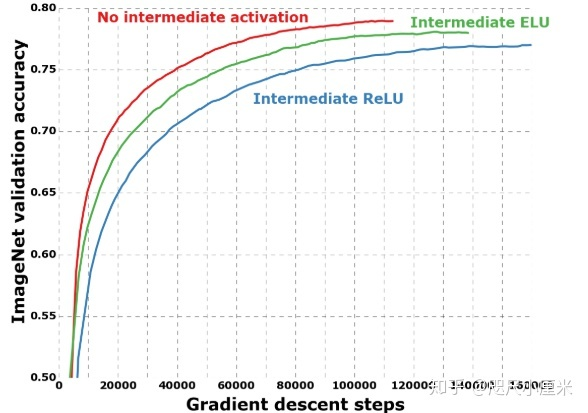

1. 作者从Inception v3是假设出发，即解耦通道相关性和空间相关性，进行简化，推导出深度可分离卷积 

2. Xception和MoblieNet的深度可分离卷积存在不同 

3. 性能比Inception v3 

4. 提出了一个新的Xception网络，并在DeepLab v3+被使用  

CVPR 2017，原文链接：https://arxiv.org/abs/1610.02357  

本文作于2020年4月7日。

## **1、摘要**

> We present an interpretation ofInception modules in convolutional neural  networks as being an intermediate step in-between regular convolution  and the depthwise separable convolution operation (a depthwise  convolution followed by a pointwise convolution). 

我们将卷积神经网络中的Inception模块解释为是常规卷积和深度可分离卷积操作（深度卷积然后是逐点卷积）之间的中间步骤。

> In this light, a depthwise separable convolution can be understood as an  Inception module with a maximally large number of towers. This  observation leads us to propose a novel deep convolutional neural  network architecture inspired by Inception, where Inception modules have been replaced with depthwise separable convolutions.

因此，可以将深度方向上可分离的卷积理解为具有最大数量的tower的Inception模块。这一发现使我们提出了一种受Inception启发的新颖的深度卷积神经网络体系结构，其中Inception模块已被深度可分离卷积替代。

> We show that this architecture, dubbed Xception, slightly outperforms  Inception V3 on the ImageNet dataset (which Inception V3 was designed  for), and significantly outperforms Inception V3 on a larger image  classification dataset comprising 350 million images and 17,000 classes. Since the Xception architecture has the same number of parameters as  Inception V3, the performance gains are not due to increased capacity  but rather to a more efficient use of model parameters.

我们展示了这种被称为Xception的架构，在ImageNet数据集（Inception V3专为该数据集设计）上略胜于Inception  V3，在包含3.5亿张图像和17,000个类别的较大图像分类数据集上，其性能明显优于Inception  V3。由于Xception体系结构具有与Inception  V3相同数量的参数，因此性能的提高并不是由于参数量的增加，而是由于模型参数的更有效使用。

## **2、引言**

CNN发展得很迅速，出现了很多新的网络架构。此时，出现了一种新的网络，即由Szegedy等人介绍的Inception体系结构， 在2014年叫做GoogLeNet（Inception V1），后来又改进为Inception V2、Inception  V3，以及最近的Inception-ResNet。Inception本身的灵感来自早期的Network-In-Network体系结构。  自从首次推出以来，Inception一直是ImageNet数据集以及Google使用的内部数据集（尤其是JFT）上性能最好的模型系列之一。
Inception-style模型的基本构建模块是Inception模块，其中存在几种不同的版本。在下图中，我们显示了Inception V3体系结构中的Inception模块的规范形式。初始模型可以理解为此类模块的堆栈。 这与早期的VGG样式网络不同，后者是简单的卷积层的堆栈。

尽管Inception模块在概念上与卷积相似（它们是卷积特征提取器），但从经验上看，它们似乎能够以较少的参数学习更丰富的表示形式。 它们是如何工作的，它们与常规卷积有何不同？ Inception之后会有哪些设计策略？

- **The Inception hypothesis**

卷积层尝试在三维空间中学习卷积核，该空间具有2个空间维度（宽度和高度）和一个通道维度；因此，单个卷积核的任务是同时映射**跨通道相关性**和**空间相关性**。

Inception模块背后的想法是，通过将其明确地分解为一系列可独立查看跨通道相关性和空间相关性的操作，从而使此过程更轻松、更高效。更准确地说，典型的Inception模块首先通过一组1x1卷积查看跨通道相关性，然后将输入数据映射到小于原始输入空间的3或4个独立空间中，然后将这些相关性映射到这些较小的3D空间中，通过常规3x3或5x5卷积。实际上，Inception背后的基本假设是**跨通道相关性和空间相关性充分解耦，因此最好不要将它们共同映射。**（该过程的一种变体是独立查看宽度方向的相关性和高度方向的相关性。这是由Inception  V3中的某些模块实现的，这些模块交替进行7x1和1x7卷积。这种在空间上可分离的卷积的使用在图像处理中已有很长的历史，并且至少从2012年开始（可能更早）就已在一些卷积神经网络实现中使用。）

考虑Inception模块的简化版本，该模块仅使用一种卷积大小（例如3x3），并且不包括average pooling tower（下图）。

可以将该Inception模块重新构造为大的1x1卷积，然后再进行空间卷积，这些卷积将在输出通道的非重叠段上进行操作（下图）。（相当于把1*1的卷积核拼接了起来成为一个整体，然后进行分组卷积）

这种观察自然会引起一个问题：分区中的分组数（及其大小）会产生什么影响？ 做出比Inception假设强得多的假设，并假设跨通道相关性和空间相关性可以完全分开映射，是否合理？

- **The continuum between convolutions and separable convolutions**

基于此更强的假设，Inception模块的“极端”版本将首先使用1x1卷积来映射跨通道相关性，然后分别映射每个输出通道的空间相关性，如上图。我们注意到，这种Inception模块的极端形式几乎与深度可分离卷积相同，该操作早在2014年就已用于神经网络设计中，并且自2016年被纳入TensorFlow框架以来就变得越来越流行。
深度可分离卷积，在深度学习框架（如TensorFlow和Keras）中通常称为“可分离卷积”，它包含深度卷积，即在输入的每个通道上独立执行的空间卷积，然后是逐点卷积，即1x1卷积，将通过深度卷积输出的通道投影到新的通道空间上。请勿将其与空间可分离卷积混淆，空间可分离卷积在图像处理社区中通常也称为“可分离卷积”。

Inception模块的“极端”版本与深度可分离卷积之间的两个小区别是：

\1. **操作顺序**：通常实现的深度可分离卷积（例如在TensorFlow中）首先执行通道空间卷积（深度卷积），然后执行1x1卷积，而Inception首先执行1x1卷积。
\2. **第一次操作后是否存在非线性**。在Inception中，两个操作都跟随ReLU非线性，但是通常在没有非线性的情况下实现深度可分离卷积。

我们认为第一个区别并不重要，特别是因为这些操作是要在堆叠的环境中使用的。 第二个差异可能很重要，我们将在实验部分对此进行研究（后文会详细描述）。

我们还注意到位于常规Inception模块和深度可分离卷积之间的Inception模块的其他中间形式也是可能的：实际上，在常规卷积和深度可分离卷积之间存在discrete  spectrum，其参数是用于执行空间卷积的独立通道空间分段的数量。在此spectrum的一个极端情况下，常规卷积（以1x1卷积为先）对应于单段通道情况；深度方向上可分离的卷积对应于每个通道仅有一个段的另一个极端；初始模块位于两者之间，将数百个通道分为3或4个段。这种中间模块的属性似乎尚未被探索。

进行了这些观察后，我们建议通过用深度可分离卷积代替Inception模块，即通过构建将深度可分离卷积堆叠的模型，可以改进Inception系列体系结构。通过TensorFlow中可用的高效深度卷积实现，这变得切实可行。接下来，我们将基于此思想提出一种卷积神经网络体系结构，其参数数量与Inception V3相似，并且在两个大规模图像分类任务上针对Inception V3评估其性能。

## **3、相关工作**

- 卷积神经网络，特别是VGG-16体系结构，在几个方面与我们提出的体系结构相似。
- 卷积神经网络的Inception家族，第一次展示了将卷积分解为在通道上和在空间上连续运行的多个分支的优点。
- 深度可分离卷积，这是我们提出的体系结构完全基于此的。在Google内部，Andrew Howard使用深度可分离卷积引入了称为MobileNets的高效移动模型。  2014年的Jin和Wang的2016年也做了相关工作,旨在减少使用可分离卷积的卷积神经网络的大小和计算成本。此外，由于TensorFlow框架中有效地实现了深度可分离卷积，因此我们的工作才有可能。
- 残差连接，我们提出的体系结构广泛使用了残差连接。

## **4、Xception架构**

我们提出了一种**完全基于深度可分离卷积层**的卷积神经网络体系结构。实际上，我们做出以下假设：卷积神经网络的特征图中跨通道相关性和空间相关性的映射可以完全解耦。因为此假设是Inception体系结构假设的更强版本，所以我们将提议的体系结构命名为Xception，它表示“Extreme Inception”。

上图给出了网络规格的完整描述。Xception体系结构具有36个卷积层，构成了网络的特征提取基础。在我们的实验评估中，我们将专门研究图像分类，因此我们的卷积基础将紧跟着逻辑回归层。可选地，可以在逻辑回归层之前插入完全连接的层，这将在实验评估部分中进行探讨。36个卷积层被构造为14个模块，除了第一个和最后一个模块外，所有这些模块周围都具有线性残差连接。

简而言之，Xception体系结构是具有残余连接的深度可分离卷积层的线性堆叠。这使得体系结构非常容易定义和修改。使用高级库（例如Keras或TensorFlow-Slim）仅需要30至40行代码，这与VGG-16等架构不同，但与Inception  V2或V3等架构定义起来要复杂得多。根据MIT许可，作为Keras应用程序模块的一部分，提供了使用Keras和TensorFlow的Xception的开源实现。（很不幸，我用的PyTorch）

## **5、实验评估**

由于它们在规模上的相似性，我们选择将Xception与Inception V3架构进行比较：Xception和Inception  V3具有几乎相同数量的参数，因此任何性能差距都不能归因于网络参数量的差异。我们对两个图像分类任务进行了比较：一个是ImageNet数据集上著名的1000类单标签分类任务，另一个是大规模JFT数据集上17000类多标签分类任务。

- JFT数据集
    JFT是用于大型图像分类数据集的内部Google数据集，其中包括超过3.5亿张高分辨率图像，这些图像带有来自17,000个类别的标签的注释。 为了评估在JFT上训练的模型的性能，我们使用了辅助数据集FastEval14k。 
    FastEval14k是14,000张图像的数据集，具有来自6,000个类别的密集注释（平均每张图像36.5个标签）。在此数据集上，我们使用mAP对前100个预测（MAP  @100）进行评估，并对每个类别对MAP@100的贡献进行加权，并给出一个分数，以估算该类别在社交媒体图像中的普遍程度（因此很重要）。此评估程序旨在从社交媒体上捕获频繁出现的标签上的效果，这对于Google的生产模型至关重要。

- 优化器配置
    ImageNet：Optimizer=SGD，Momentum=0.9，Initial learning rate=0.045，Learning rate decay=decay of rate 0.94 every 2 epochs
    JFT：Optimizer=RMSprop，Momentum=0.9，Initial learning rate=0.001，Learning rate decay=decay of rate 0.9 every 3,000,000 samples

- 正则化配置
    Weight decay：Inception v3为0.00004，Xception为0.00001
    Dropout：ImageNet为0.5，JFT无，因为数据太多，不太可能过拟合
    Auxiliary loss tower：没有使用

- 训练配置
    所有网络均使用TensorFlow框架实施，并分别在60个NVIDIA K80 GPU上进行了培训。  对于ImageNet实验，我们使用具有同步梯度下降的数据并行性来获得最佳的分类性能，而对于JFT，我们使用异步梯度下降来加快训练速度。  ImageNet实验每个大约花费3天，而JFT实验每个大约花费一个月。 JFT模型没有经过完全收敛的训练，而每个实验将花费三个月以上的时间。

- 与Inception V3相比

    在分类性能上，Xception在ImageNet领先较小，但在JFT上领先很多。

在参数量和速度，Xception参数量少于Inception，但速度更快。

作者还比较了residual connections，有了性能更强；还有点卷积之后要不要激活函数，没有非线性层效果最好。

## **6、未来方向**

前面我们注意到，在常规卷积和深度可分离卷积之间存在discrete  spectrum，其参数是用于执行空间卷积的独立通道空间段的数量。初始模块是这一范围的重点。我们在经验评估中表明，与常规的Inception模块相比，Inception模块的极端情况（深度可分离卷积）可能具有优势。但是，没有理由相信深度可分离卷积是最佳的。可能是discrete spectrum上的中间点位于常规的Inception模块与深度可分离的卷积之间，具有其他优势。这个问题留待将来调查。

##  **7、总结**

我们展示了卷积和深度可分离卷积如何位于discrete  spectrum的两个极端，而Inception模块是两者之间的中间点。这种观察导致我们提出在神经计算机视觉体系结构中用深度可分离卷积替换Inception模块。我们基于此思想提出了一种新颖的架构，名为Xception，它的参数计数与Inception V3相似。与Inception  V3相比，Xception在ImageNet数据集上的分类性能提高很小，而在JFT数据集上的分类性能提高了很多。我们期望深度可分离卷积在将来成为卷积神经网络体系结构设计的基石，因为它们提供与Inception模块相似的属性，但与常规卷积层一样容易使用。