# MoblieNet 优点

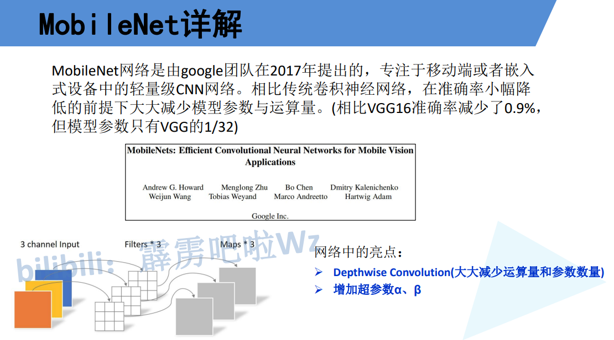

# 深度可分离卷积 = DW + PW

# DW卷积 分层卷积 

> **每个卷积核负责一个通道,输出一个通道,输出和输入的通道相同**
>
> 卷积核channel = 1

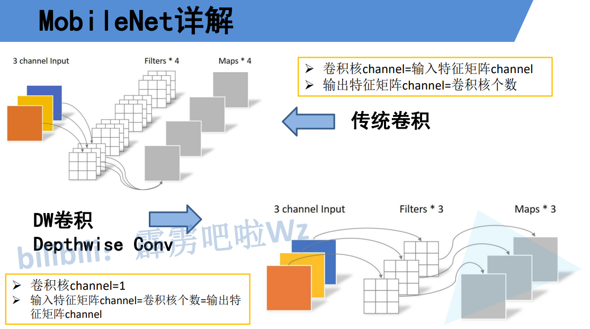

# PW卷积 

> 深度可分类卷积就是**普通卷积(卷积核大小是 1x1)**,将DW的卷积由m个channel变为n个channel
>
> 因为DW卷积不能改变channel,所以通过深度可分离卷积进行channel变换

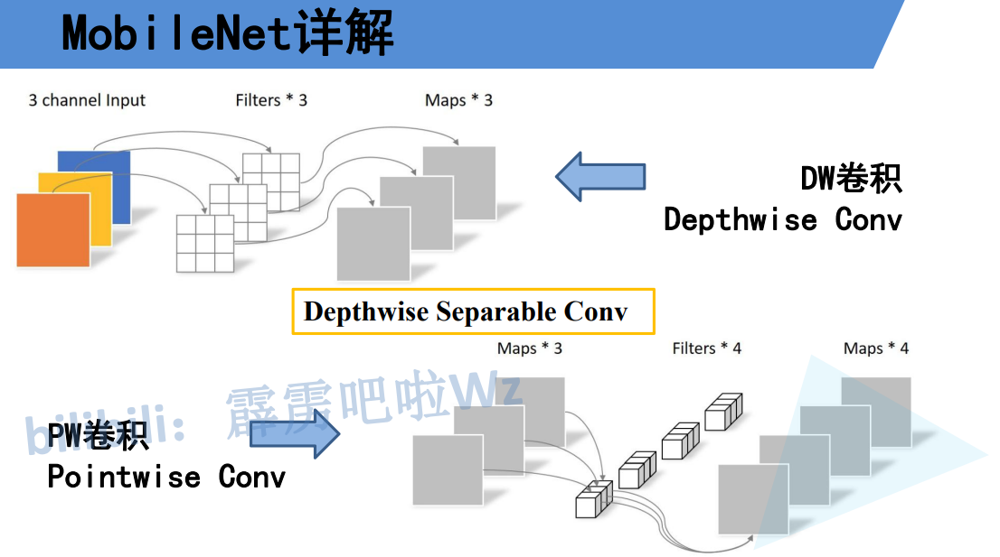

# DW+PW 计算量

> DF 输入高和宽
>
> DK 卷积核大小
>
> M in_channel
>
> N out_channel
>
> PW的卷积核是 1x1 ,所以就不用写了

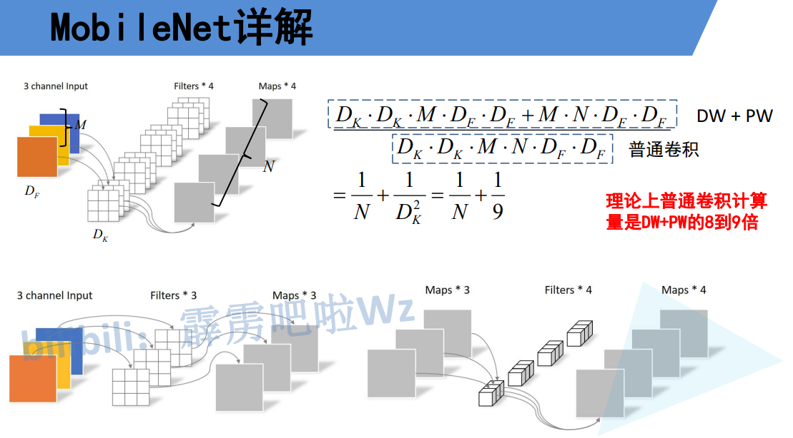

# MobileNet

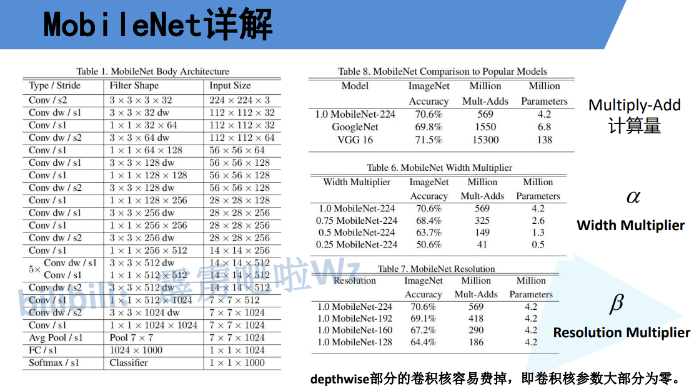

# MobileNetV2

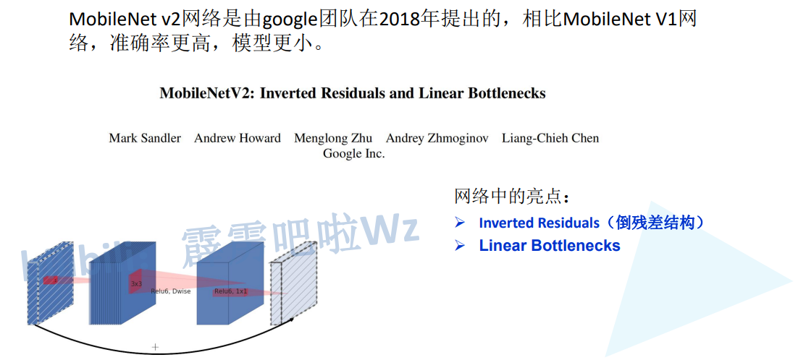

# 残差和倒残差

> 残差:   两端channel多,中间channel少
>
> ​    降维 --> 升维
>
> 倒残差: 两端channel少,中间channel多
>
> ​    升维 --> 降维

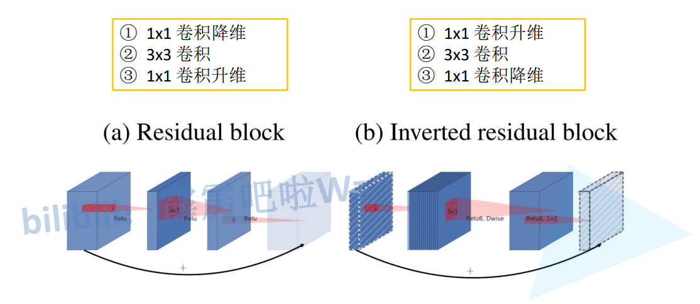

# ReLU6

> 小于0 = 0
>
> 0~6 不变
>
> 大于6 = 6

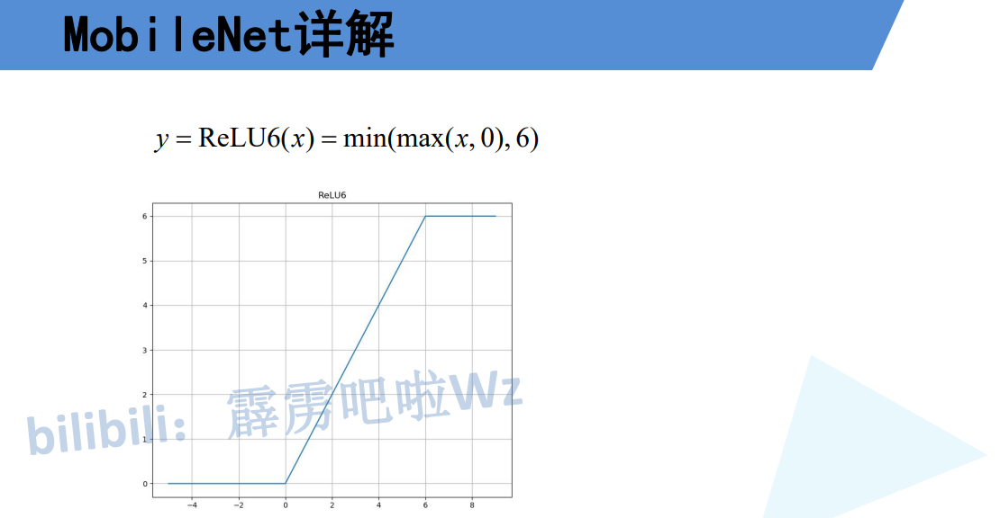

# 最后一层不使用ReLU,使用线性激活函数

> Output/dim=2 丢失很多信息
>
> Output/dim=3 丢失很多信息
>
> 因此ReLU 会对低维数据造成丢失

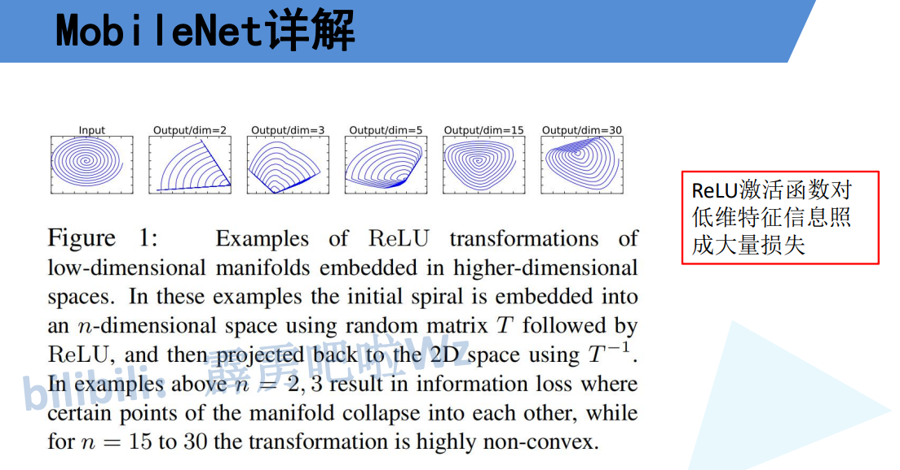

# 倒残差结构

> 第二层是 DW卷积
>
> 第三层激活函数是 Linear 线性激活
>
> h w 高 宽 k kernel数量
>
> 第一层让k变化为kt
>
> 第二层是DW卷积,kt不变,宽高根据stride变化
>
> 第三层在通过PW卷积让k变为k1**(维度进出可以变化)**     **这一层不使用激活函数**
>
> 只有当stride=1且inchannel=out_channel的时候才有短接

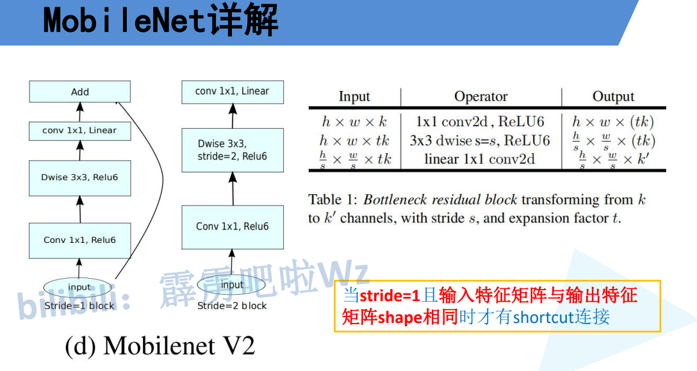

# V2结构

> t 扩展因子,第一层卷积让channel维度变多
>
> c out_channel 或 k
>
> n bottlenet 重复次数
>
> s 步长(每一个block的第一层步长)

> **针对上面的倒残差结构,每一个block的第一层不可能有shortcut连接,因为channel都会变化,不过后面的层可以有shortcut短接**

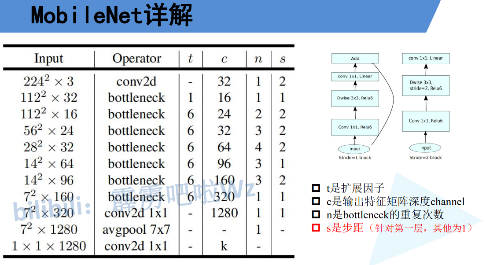

# V2 性能 CPU测试

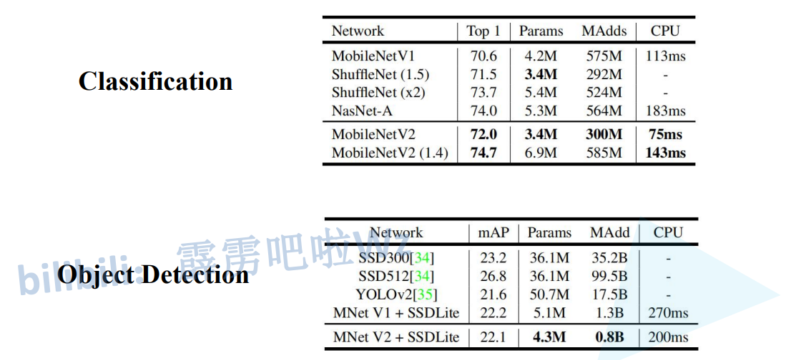
