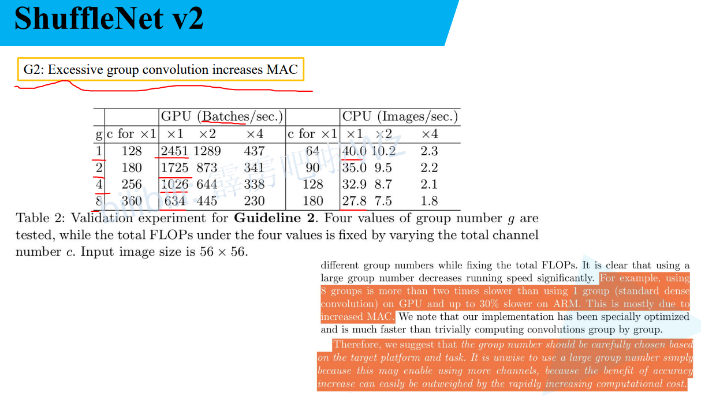

# 1 V1

> V1主要修改了ResNeXt的卷积结构


## 1.1 性能

> 错误率比 MobileNetV1 好


## 1.2 GConv Channel shuffle

> GConv是组卷积,不同层之间没有交流
>
> 不同channel之间混淆,融合不同通道的信息


## 1.3 ResNeXt 中 1x1 理论上占据了93.4%的计算量


## 1.4 对ResNeXt结构进行修改

> 在 3x3 之前增加了 channel shuffle
>
> 并且在步长为2的时候将短接层的卷积直接改为了avg_pool
>
> 最后不是相加,而是拼接 


## 1.5 V1 结构

> 最右侧是输出维度 g=3 最常用
>
> stage2 3 4 第一层stride=2,其余stride=1
>
> 输出维度每阶段翻倍
>
> 左侧图示是resnet的卷积层  中间channel是最终channel的四分之一
>
> ​	in_channel = 256
>
> ​	middle_channel = 64
>
> ​	out_channel  256   最终真是的输出维度
>
> shuffleNet中也类似,**第一个GConv(组卷积)和DW卷积的out_channel也是最终out_channel的四分之一**
>
> Stage2的**第一层不使用组卷积,使用 1x1 卷积,因为输入维度太少,没必要使用组卷积**


## 1.6 计算量和ResNet,ResNeXt对比

> ResNet:
>
> ​	hw 宽高
>
> ​	第一个 1x1 卷积:
>
> ​		hw(1 x 1 x c x m)
>
> ​		c =  in_channel
>
> ​		m = kernel数量 = out_channel
>
> ​	第二个 3x3 卷积:
>
> ​		hw(3 x 3 x m x m)
>
> ​		进出维度相同
>
> ​	第三个 1x1 卷积:
>
> ​		hw(3 x 3 x m x c)
>
> ​		out_channel变为开始维度
>
> ----
>
> ResNeXt:
>
> ​	在ResNet的 3x3 卷积使用了组卷积,让计算量变为原来的 1 / g
>
> ​	hw(3 x 3 x m x m) / g
>
> ----
>
> ShuffleNetV1
>
> ​	第一个 1x1 卷积使用了组卷积:
>
> ​		hw(1 x 1 x m x m) / g
>
> ​	第二个 3x3 卷积使用了DW卷积, 每个通道都进行一次卷积,out = in
>
> ​		hw(3 x 3 x m)
>
> ​	第三个也使用了组卷积:
>
> ​		hw(1 x 1 x m x c) / g


----

# 2 V2

## 2.1 FLOPs MAC(越小越好)


> FLOPs不是唯一衡量内存的指标
>
> 还有MAC(内存访问指标) 内存访问时间成本
>
> FLOPs主要是计算卷积的指标
>
> 计算卷积的时间指标只占了总时间的50%
>
> 并行等级,并行等级高的模型计算速度更快
>
> 不同平台速度消耗不同


## 2.2 设计高效模型的四条建议


### 2.2.1 当卷积层的输入特诊矩阵与输出特征矩阵channel相等时MAC最小(保持FLOPs不变时)

> MAC = hw(c1 + c2) + c1*c2
>
> ​          输入和输出消耗   卷积核消耗 
>
> 通过均值不等式可以求出输入和输出相等时


> FLOPs保持不变时
>
> 当 c1 == c2 时, 推理速度越快
>
> GPU受影响大,CPU受影响小


### 2.2.2 当CConv的groups增大时(保持FLOPs不变时),MAC也会增大

> MAC = hw(c1 + c2) + c1 * c2 / g
>
> ​		  输入和输出消耗   卷积核消耗要除以分组数
>
> MAC = hwc1 + Bg / c1 + B / hw  只有g会变化,其余都是定值,所以g变大,MAC也会变大


> group越高,推理速度越低
>
> GPU受影响大,CPU受影响小



### 2.2.3 网络设计的碎片化程度越高,速度越慢

> 虽然多分支会提高模型准确率,但是会降低模型效率
>
> 并行结构运算速度如果相差越大,就会出现等待
>
> 右图显示串行越多,推理速度越慢
>
> GPU受影响大,CPU受影响小


### 2.2.4 Element-wise操作带来的影响是不可忽视的

> 如: ReLU,相加AddTensor, AddBias 
>
> FLOPs很小,但是MAC很大
>
> 不使用shortcut和relu更快 


### 2.2.5 总结

> 平衡输入和输出通道个数
>
> 不能一直增加group数
>
> 高效网络不能设计太多分支
>
> 尽可能使用Element-wise


## 2.3 V2block

> a,b 是 V1
>
> c,d 是 V2
>
> ----
>
> channel_shuffle不在一条分支上,而是在concat之后了
>
> ----
>
> c
>
> ​    channel_split 将数据分为0.5 0.5, 最后进行拼接,总的维度不变
>
> ​	 左边分支没操作
>
> ​	 右边分支的输入输出都相同
>
> ​	 1x1 3x3 1x1 的输入和输出都相同
>
> ​     两个1x1 不使用 group 卷积,增加速度
>
> ​	 最后使用concat,不使用相加
>
> ​     ReLU, depthwise 只在一个分支上存在(右边),左边不操作
>
> d 下采样
>
> ​	 没有channel_split,不过两侧的计算都让维度减半,所以拼接后总维度不变
>
> ​	 左边分支
>
> ​         3x3pooling下采样改为了3x3 DW卷积(stride=2)和 1x1卷积


## V2结构

> 相比v1添加了 conv5
>
> 对于 stage2 的第一个block,它的两个分支中输出的channel并不等于输入的channel,而是直接设置为指定输出channel的一半,
>
> 比如对于1x版本,每分枝的channel应该是58,而不是116


## 性能对比


# Shuffle详解

> channels_per_group 和 groups 最好是整数倍关系,这样混淆之后数据是均匀的
>
> 最好 channels_per_group  == groups ,这样的混淆结果如下图所示


```python
def channel_shuffle(x: Tensor, groups: int) -> Tensor:
    '''
    将特征矩阵平均分成3组,将每个组的数据进一步划分为2块,再将相同块的放到一起
    group1    group2   
    a a a a   b b b b   这些都是不同的通道
    
       a         b  
       a         b  
       a         b  
       a         b     
		
	   a  a  a	a
	   b  b  b	b
		
    a b a b a b a b   交换的通道的位置,不是每个通道内部的数据
    '''
    # b c h w
    batch_size, num_channels, height, width = x.size()
    # 每个组合的通道个数
    channels_per_group = num_channels // groups

    # 改变形状,增加1个维度 num_channels => groups, channels_per_group
    # [batch_size, num_channels, height, width] -> [batch_size, groups, channels_per_group, height, width]
    x = x.view(batch_size, groups, channels_per_group, height, width)

    # 让不同group中的相同序号的channel到同一个维度
    # groups, channels_per_group 交换位置 
    x = x.transpose(1, 2).contiguous()   # contiguous() 将tensor数据转化为内存中连续的数据

    # flatten 将不同的组的相同序号的channel连接到一起
    x = x.view(batch_size, -1, height, width)

    return x
```


>   \# 改变形状,增加1个维度 num_channels => groups, channels_per_group
>
>   \# [batch_size, num_channels, height, width] -> [batch_size, groups, channels_per_group, height, width]
>
>   x = x.view(batch_size, groups, channels_per_group, height, width)


>   \# 让不同group中的相同序号的channel到同一个维度
>
>   \# groups, channels_per_group 交换位置 
>
>   x = torch.transpose(x, 1, 2).contiguous()  # contiguous() 将tensor数据转化为内存中连续的数据


>   \# flatten 将不同的组的相同序号的channel连接到一起
>
>   x = x.view(batch_size, -1, height, width)


