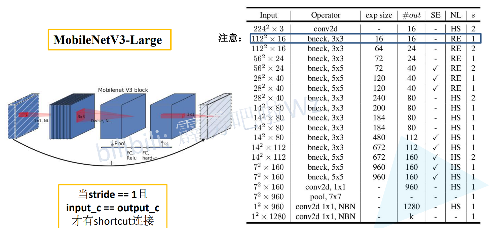

# MobileNetV3 更新

> 更新了Block
>
> 使用NAS搜索参数
>
> 重新设计耗时层结构

# 性能提升

> 后面的数字是 alpha因子,就是输出维度的倍数

# 添加SE注意力机制

> 1x1 变换维度
>
> DW卷积 (卷积核个数和输入通道个数,所以输出通道==输入通道个数)
>
> 注意力机制
>
> 1x1 变换维度
>
> `
>
> V2 激活函数 ReLU6
>
> V3 激活函数 RELU, HardSwish

> 注意力机制:
>
> ​    对特征矩阵每一个channel进行池化,得到长度为channel的一维向量,使用两个全连接层,
>
> ​    两个线性层的长度,最后得到权重,然后乘以每层矩阵的原值
>
> ​    线性层长度变化:    channel -> channel / 4 -> channel 
>
> ​		**mobilenetv3中: channel是经过DW卷积后的维度**
>
> ​		**efficientnetv1中是: channel是开始输入维度**
>
> 激活函数:
>
> ​	**mobilenetv3中是:  relu hardswish**
>
> ​	**efficientnetv1中是: swish sigmoid**
>
> **最后的 1x1Conv 没有激活函数**

# 重新设计耗时设计

> 减少第一个卷积层的卷积核个数到 16 

# V2 V3代码对比

> 根据图片可以看到V3的维度相比于V2更小

> 最后的线性层 V3比V2更复杂,多了一个Linear

# swish,h-swish和h-sigmoid

> swish计算求导复杂
>
> h-swish 更简单,图像和swish非常相似

$$
sigmoid(x) = \frac 1 {1 + e^{-x}}
$$

$$
h-sigmoid(x) = \frac {ReLU6(x + 3)} {6}
$$

$$
swish(x) = x * sigmoid(x) = \frac x {1 + e^{-x}}
$$

$$
h-swish(x) = x * {\frac {ReLU6(x + 3)} {6}}
$$

# large结构

> Input:        输入形状
>
> Operator:   操作 conv2d dw卷积
>
> exp size:    第一个 1x1 卷积升维的卷积维度升到多少
>
> #out:     	输出channel, v3相比v2,第一层的输出从32降为了16
>
> SE:            是否使用注意力机制
>
> NL:           激活函数 HS h-swish  RE ReLU6
>
> s:				stride
>
> 第1层bneck卷积,扩展维度和输入维度相同,没有升维,和v2相同,所以不使用 1x1 卷积,直接使用dw卷积
>
> 最下面的两个卷积, NBN 不使用BN ,他俩的作用类似于全连接层结构
>
> 捷径分支只有当 stride == 1 且 in_channel == out_channel 时才使用

# small结构

> Input:        输入形状
>
> Operator:   操作 conv2d dw卷积
>
> exp size:    第一个 1x1 卷积升维的卷积维度升到多少
>
> #out:     	输出channel, v3相比v2,第一层的输出从32降为了16
>
> SE:            是否使用注意力机制
>
> NL:           激活函数 HS h-swish  RE ReLU6
>
> s:				stride
>
> 第1层bneck卷积,扩展维度和输入维度相同,没有升维,和v2相同,所以不使用 1x1 卷积,直接使用dw卷积
>
> 最下面的两个卷积, NBN 不使用BN ,他俩的作用类似于全连接层结构
>
> 捷径分支只有当 stride == 1 且 in_channel == out_channel 时才使用

