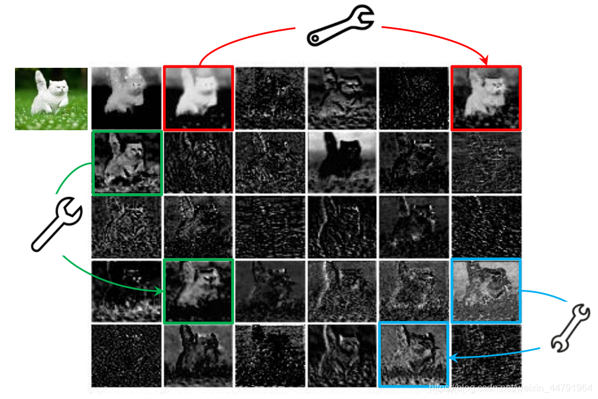
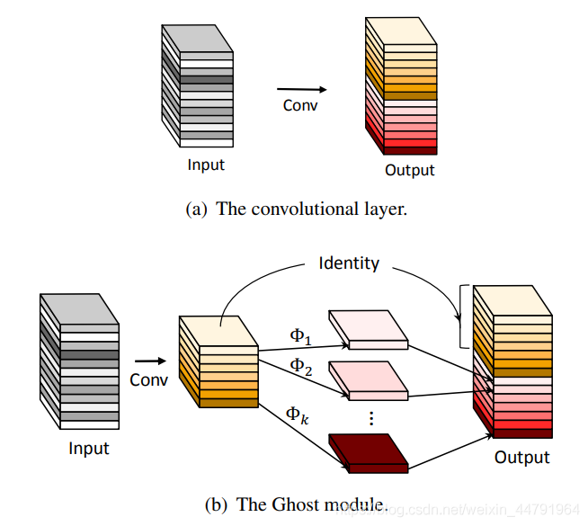
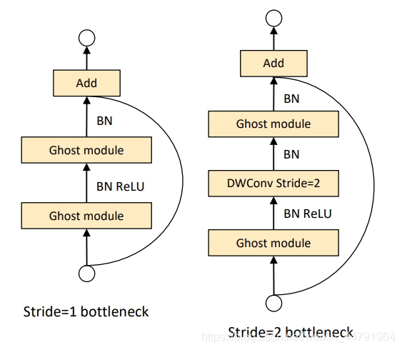
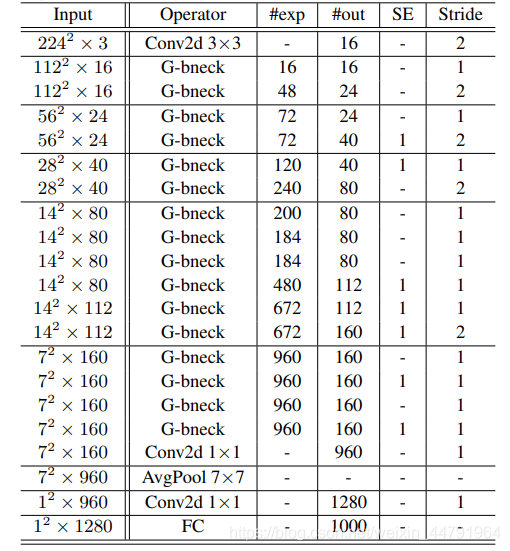

# 什么是GhostNet模型

**2020年，华为新出了一个轻量级网络，命名为GhostNet。**

在优秀CNN模型中，特征图存在冗余是非常重要的。如图所示，这个是对ResNet-50第一个残差块特征图进行可视化的结果，当我们给一个神经网络输入一张图片时，我们可以获得特别多的特征图。




**利用小扳手连接起来的两幅特征图，它们的相似性就特别高**，这个就是神经网络中存在的特征图冗杂的情况。

**作者将相似的特征图认为是彼此的Ghost，所以这个网络就叫做GhostNet（误）。**

在GhostNet这篇论文里面，作者认为可以使用一些**计算量更低（Cheap Operations）的操作去生成这些冗余的特征图**，这样就可以在保证良好检测效果的情况下，减少模型的参数量与提高模型的执行速度。

# 源码下载

https://github.com/bubbliiiing/mobilenet-[yolov4](https://so.csdn.net/so/search?q=yolov4&spm=1001.2101.3001.7020)-lite-pytorch

# GhostNet模型的实现思路

## 1、Ghost Module

通过上述的介绍，我们了解到了，**GhostNet的核心思想就是**使用一些**计算量更低（Cheap Operations）的操作去生成这些冗余的特征图**。

在论文中，作者设计了一个名为Ghost Module的模块，**他的功能是代替普通卷积**。

Ghost Module将普通卷积分为两部分，首先进行一个**普通的1x1卷积**，这是一个少量卷积，比如**正常使用32通道的卷积，这里就用16通道的卷积**，这个1x1卷积的作用类似于特征整合，**生成输入特征层的特征浓缩**。

然后我们再进行**深度可分离卷积**，这个**深度可分离卷积是逐层卷积**，它也就是我们上面提到的**Cheap Operations**。它利用上一步获得的**特征浓缩**生成**Ghost特征图**。

因此，如果我们从整体上去看这个Ghost Module，它其实就是两步简单思想的汇总：

1. 利用**1x1卷积获得输入特征的必要特征浓缩**(降低特征层数)。

2. 利用**深度可分离卷积获得特征浓缩的相似特征图**（Ghost）。



Ghost Module的实现代码如下：

```python
#------------------------------------------------------#
#   1x1Conv降低通道数,特征浓缩
#   3x3DWConv对降低的通道数进行计算
#   1x1Conv和3x3DWConv的输出拼接返回
#------------------------------------------------------#
class GhostModule(nn.Module):
    def __init__(self, inp, oup, kernel_size=1, ratio=2, dw_size=3, stride=1, relu=True):
        super(GhostModule, self).__init__()
        self.oup = oup

        # 输出通道数 / 2
        init_channels = math.ceil(oup / ratio)
        new_channels = init_channels*(ratio-1)

        #------------------------------------------------------#
        #   1x1Conv降低通道数,特征浓缩 通道数变为 oup_channel/2
        #   跨通道的特征提取
        #------------------------------------------------------#
        self.primary_conv = nn.Sequential(
            nn.Conv2d(inp, init_channels, kernel_size, stride, kernel_size//2, bias=False),
            nn.BatchNorm2d(init_channels),
            nn.ReLU(inplace=True) if relu else nn.Sequential(),
        )

        #------------------------------------------------------#
        #   3x3DWConv对降低的通道数进行计算
        #   跨特征点的特诊提取
        #------------------------------------------------------#
        self.cheap_operation = nn.Sequential(
            nn.Conv2d(init_channels, new_channels, dw_size, 1, dw_size//2, groups=init_channels, bias=False),
            nn.BatchNorm2d(new_channels),
            nn.ReLU(inplace=True) if relu else nn.Sequential(),
        )

    def forward(self, x):
        #------------------------------------------------------#
        #   1x1Conv和3x3DWConv的输出拼接返回
        #------------------------------------------------------#
        x1 = self.primary_conv(x)
        x2 = self.cheap_operation(x1)
        out = torch.cat([x1,x2], dim=1)

        # 如果通道数多的话只要需要的层数
        return out[:,:self.oup,:,:]
```

## 2、Ghost Bottlenecks

Ghost Bottlenecks是由Ghost Module组成的瓶颈结构，就像这样。

其实本质上就是用Ghost Module，来代替瓶颈结构里面的普通卷积。

**Ghost Bottlenecks可以分为两个部分，分别是主干部分和残差边部分，包含Ghost Module的，我们称它为主干部分。**

Ghost Bottlenecks有两个种类，如下图所示，**当我们需要对特征层的宽高进行压缩的时候，我们会设置这个Ghost Bottlenecks的Stride=2，即步长为2**。此时我们会Bottlenecks里面多添加一些卷积层，在主干部分里，我们会在两个Ghost Module中**添加一个步长为2x2的深度可分离卷积进行特征层的宽高压缩**。在残差边部分，我们也会添加上一个**步长为2x2的深度可分离卷积**和1x1的普通卷积。



Ghost Bottlenecks的实现代码如下：

```python
#------------------------------------------------------#
#   倒残差结构
#   GhostModule -> BN ReLU -> GhostModule -> BN
#   GhostModule -> BN ReLU -> DWConv s=2  -> BN -> GhostModule -> BN
#   都有残差部分
#------------------------------------------------------#
class GhostBottleneck(nn.Module):
    def __init__(self, in_chs, mid_chs, out_chs, dw_kernel_size=3, stride=1, act_layer=nn.ReLU, se_ratio=0.):
        super(GhostBottleneck, self).__init__()
        has_se = se_ratio is not None and se_ratio > 0.
        self.stride = stride

        #------------------------------------------------------#
        #   GhostModule提高通道数
        #------------------------------------------------------#
        self.ghost1 = GhostModule(in_chs, mid_chs, relu=True)

        #------------------------------------------------------#
        #   步长为2使用3x3DWConv进行宽高减半
        #------------------------------------------------------#
        if self.stride > 1:
            self.conv_dw = nn.Conv2d(mid_chs, mid_chs, dw_kernel_size, stride=stride,
                                    padding=(dw_kernel_size-1)//2,
                                    groups=mid_chs, bias=False)
            self.bn_dw = nn.BatchNorm2d(mid_chs)

        #------------------------------------------------------#
        #   注意力机制
        #------------------------------------------------------#
        if has_se:
            self.se = SqueezeExcite(mid_chs, se_ratio=se_ratio)
        else:
            self.se = None

        #------------------------------------------------------#
        #  GhostModule降低通道数
        #------------------------------------------------------#
        self.ghost2 = GhostModule(mid_chs, out_chs, relu=False)

        #------------------------------------------------------#
        #   是否调整短接边
        #   3x3DWConv -> BN -> 1x1Conv ->BN
        #------------------------------------------------------#
        if (in_chs == out_chs and self.stride == 1):
            self.shortcut = nn.Sequential()
        else:
            self.shortcut = nn.Sequential(
                nn.Conv2d(in_chs, in_chs, dw_kernel_size, stride=stride, padding=(dw_kernel_size-1)//2, groups=in_chs, bias=False),
                nn.BatchNorm2d(in_chs),
                nn.Conv2d(in_chs, out_chs, 1, stride=1, padding=0, bias=False),
                nn.BatchNorm2d(out_chs),
            )

    def forward(self, x):
        residual = x

        x = self.ghost1(x)

        if self.stride > 1:
            x = self.conv_dw(x)
            x = self.bn_dw(x)

        if self.se is not None:
            x = self.se(x)

        x = self.ghost2(x)

        x += self.shortcut(residual)
        return x
```

## 3、Ghostnet的构建

整个Ghostnet的构建方式如列表所示：



可以看到，整个Ghostnet都是由Ghost Bottlenecks进行组成的。

当一张图片输入到Ghostnet当中时，**我们首先进行一个16通道的普通1x1卷积块（卷积+标准化+激活函数）**。

之后我们就开始Ghost Bottlenecks的堆叠了，**利用Ghost Bottlenecks，我们最终获得了一个7x7x160的特征层（当输入是224x224x3的时候）**

然后我们**会利用一个1x1的卷积块进行通道数的调整，此时我们可以获得一个7x7x960的特征层。**

之后我们**进行一次全局平均池化，然后再利用一个1x1的卷积块进行通道数的调整**，获得一个1x1x1280的特征层。

**然后平铺后进行全连接就可以进行分类了。**

# GhostNet的代码构建

## 1、模型代码的构建

GhostNet的实现代码如下：

```python
# 2020.06.09-Changed for building GhostNet
#            Huawei Technologies Co., Ltd. <foss@huawei.com>
"""
华为官方实现的方法
https://github.com/huawei-noah/CV-Backbones/blob/master/ghostnet_pytorch/ghostnet.py

Creates a GhostNet Model as defined in:
GhostNet: More Features from Cheap Operations By Kai Han, Yunhe Wang, Qi Tian, Jianyuan Guo, Chunjing Xu, Chang Xu.
https://arxiv.org/abs/1911.11907
Modified from https://github.com/d-li14/mobilenetv3.pytorch and https://github.com/rwightman/pytorch-image-models
"""
import torch
import torch.nn as nn
import torch.nn.functional as F
import math


__all__ = ['ghost_net']


def _make_divisible(v, divisor, min_value=None):
    """
    将卷积核个数(输出通道个数)调整为最接近round_nearest的整数倍,就是8的整数倍,对硬件更加友好
    v:          输出通道个数
    divisor:    奇数,必须将ch调整为它的整数倍
    min_value:  最小通道数
    This function is taken from the original tf repo.
    It ensures that all layers have a channel number that is divisible by 8
    It can be seen here:
    https://github.com/tensorflow/models/blob/master/research/slim/nets/mobilenet/mobilenet.py
    """
    if min_value is None:
        min_value = divisor
    new_v = max(min_value, int(v + divisor / 2) // divisor * divisor)
    # Make sure that round down does not go down by more than 10%.
    if new_v < 0.9 * v:
        new_v += divisor
    return new_v

#--------------------------------------------#
#   sigmoid(x)   = \frac 1 {1 + e^{-x}}
#   h-sigmoid(x) = \frac {ReLU6(x + 3)} {6}
#--------------------------------------------#
def hard_sigmoid(x, inplace: bool = False):
    if inplace:
        return x.add_(3.).clamp_(0., 6.).div_(6.)
    else:
        return F.relu6(x + 3.) / 6.


class SqueezeExcite(nn.Module):
    def __init__(self, in_chs, se_ratio=0.25, reduced_base_chs=None, act_layer=nn.ReLU, gate_fn=hard_sigmoid, divisor=4, **_):
        super().__init__()

        self.gate_fn = gate_fn
        reduced_chs = _make_divisible((reduced_base_chs or in_chs) * se_ratio, divisor)
        self.avg_pool = nn.AdaptiveAvgPool2d(1)
        self.conv_reduce = nn.Conv2d(in_chs, reduced_chs, 1, bias=True)
        self.act1 = act_layer(inplace=True)
        self.conv_expand = nn.Conv2d(reduced_chs, in_chs, 1, bias=True)

    def forward(self, x):
        x_se = self.avg_pool(x)
        x_se = self.conv_reduce(x_se)
        x_se = self.act1(x_se)
        x_se = self.conv_expand(x_se)
        x = x * self.gate_fn(x_se)
        return x

class ConvBnAct(nn.Module):
    def __init__(self, in_chs, out_chs, kernel_size, stride=1, act_layer=nn.ReLU):
        super().__init__()

        self.conv = nn.Conv2d(in_chs, out_chs, kernel_size, stride, padding=kernel_size//2, bias=False)
        self.bn1 = nn.BatchNorm2d(out_chs)
        self.act1 = act_layer(inplace=True)

    def forward(self, x):
        x = self.conv(x)
        x = self.bn1(x)
        x = self.act1(x)
        return x

#------------------------------------------------------#
#   1x1Conv降低通道数,特征浓缩
#   3x3DWConv对降低的通道数进行计算
#   1x1Conv和3x3DWConv的输出拼接返回
#------------------------------------------------------#
class GhostModule(nn.Module):
    def __init__(self, inp, oup, kernel_size=1, ratio=2, dw_size=3, stride=1, relu=True):
        super().__init__()

        self.oup = oup
        init_channels = math.ceil(oup / ratio)
        new_channels = init_channels*(ratio-1)

        #------------------------------------------------------#
        #   1x1Conv降低通道数,特征浓缩 通道数变为 oup_channel/2
        #   跨通道的特征提取
        #------------------------------------------------------#
        self.primary_conv = nn.Sequential(
            nn.Conv2d(inp, init_channels, kernel_size, stride, kernel_size//2, bias=False),
            nn.BatchNorm2d(init_channels),
            nn.ReLU(inplace=True) if relu else nn.Sequential(),
        )

        #------------------------------------------------------#
        #   3x3DWConv对降低的通道数进行计算
        #   跨特征点的特诊提取
        #------------------------------------------------------#
        self.cheap_operation = nn.Sequential(
            nn.Conv2d(init_channels, new_channels, dw_size, 1, dw_size//2, groups=init_channels, bias=False),
            nn.BatchNorm2d(new_channels),
            nn.ReLU(inplace=True) if relu else nn.Sequential(),
        )

    def forward(self, x):
        #------------------------------------------------------#
        #   1x1Conv和3x3DWConv的输出拼接返回
        #------------------------------------------------------#
        x1 = self.primary_conv(x)
        x2 = self.cheap_operation(x1)
        out = torch.cat([x1,x2], dim=1)
        return out[:,:self.oup,:,:]

#------------------------------------------------------#
#   倒残差结构
#   GhostModule -> BN ReLU -> GhostModule -> BN
#   GhostModule -> BN ReLU -> DWConv s=2  -> BN -> GhostModule -> BN
#   都有残差部分
#------------------------------------------------------#
class GhostBottleneck(nn.Module):
    """ Ghost bottleneck w/ optional SE"""

    def __init__(self, in_chs, mid_chs, out_chs, dw_kernel_size=3, stride=1, act_layer=nn.ReLU, se_ratio=0.):
        super().__init__()

        has_se = se_ratio is not None and se_ratio > 0.
        self.stride = stride

        #------------------------------------------------------#
        #   GhostModule提高通道数
        #------------------------------------------------------#
        self.ghost1 = GhostModule(in_chs, mid_chs, relu=True)

        #------------------------------------------------------#
        #   步长为2使用3x3DWConv进行宽高减半
        #------------------------------------------------------#
        if self.stride > 1:
            self.conv_dw = nn.Conv2d(mid_chs, mid_chs, dw_kernel_size, stride=stride, padding=(dw_kernel_size-1)//2, groups=mid_chs, bias=False)
            self.bn_dw = nn.BatchNorm2d(mid_chs)

        #------------------------------------------------------#
        #   注意力机制
        #------------------------------------------------------#
        if has_se:
            self.se = SqueezeExcite(mid_chs, se_ratio=se_ratio)
        else:
            self.se = None

        #------------------------------------------------------#
        #  GhostModule降低通道数
        #------------------------------------------------------#
        self.ghost2 = GhostModule(mid_chs, out_chs, relu=False)

        #------------------------------------------------------#
        #   是否调整短接边
        #   3x3DWConv -> BN -> 1x1Conv ->BN
        #------------------------------------------------------#
        if (in_chs == out_chs and self.stride == 1):
            self.shortcut = nn.Sequential()
        else:
            self.shortcut = nn.Sequential(
                nn.Conv2d(in_chs, in_chs, dw_kernel_size, stride=stride, padding=(dw_kernel_size-1)//2, groups=in_chs, bias=False),
                nn.BatchNorm2d(in_chs),
                nn.Conv2d(in_chs, out_chs, 1, stride=1, padding=0, bias=False),
                nn.BatchNorm2d(out_chs),
            )


    def forward(self, x):
        residual = x

        # 1st ghost bottleneck
        x = self.ghost1(x)

        # Depth-wise convolution
        if self.stride > 1:
            x = self.conv_dw(x)
            x = self.bn_dw(x)

        # Squeeze-and-excitation
        if self.se is not None:
            x = self.se(x)

        # 2nd ghost bottleneck
        x = self.ghost2(x)

        x += self.shortcut(residual)
        return x


class GhostNet(nn.Module):
    def __init__(self, cfgs, num_classes=1000, width=1.0, dropout=0.2):
        super().__init__()

        # setting of inverted residual blocks
        self.cfgs = cfgs
        self.dropout = dropout

        #------------------------------------------------------#
        #   building first layer
        #   224,224,3 -> 112,112,16
        #------------------------------------------------------#
        output_channel = _make_divisible(16 * width, 4)
        self.conv_stem = nn.Conv2d(3, output_channel, 3, 2, 1, bias=False)
        self.bn1 = nn.BatchNorm2d(output_channel)
        self.act1 = nn.ReLU(inplace=True)
        input_channel = output_channel

        #------------------------------------------------------#
        #   building inverted residual blocks
        #   112,112,16 -> 7, 7,160
        #------------------------------------------------------#
        stages = []
        block = GhostBottleneck
        for cfg in self.cfgs:
            layers = []
            for k, exp_size, c, se_ratio, s in cfg:
                output_channel = _make_divisible(c * width, 4)
                hidden_channel = _make_divisible(exp_size * width, 4)
                layers.append(block(input_channel, hidden_channel, output_channel, k, s, se_ratio=se_ratio))
                input_channel = output_channel
            stages.append(nn.Sequential(*layers))

        #------------------------------------------------------#
        #   7, 7,160 -> 7, 7,960
        #------------------------------------------------------#
        output_channel = _make_divisible(exp_size * width, 4)
        stages.append(nn.Sequential(ConvBnAct(input_channel, output_channel, 1)))
        input_channel = output_channel

        self.blocks = nn.Sequential(*stages)

        #-----------------------------------------------------------#
        #   分类层
        #   7, 7,960 -> 1,1,960 -> 1,1,1280 -> 1280 -> num_classes
        #-----------------------------------------------------------#
        output_channel = 1280
        self.global_pool = nn.AdaptiveAvgPool2d((1, 1))
        self.conv_head = nn.Conv2d(input_channel, output_channel, 1, 1, 0, bias=True)
        self.act2 = nn.ReLU(inplace=True)
        self.classifier = nn.Linear(output_channel, num_classes)

    def forward(self, x):
        x = self.conv_stem(x)
        x = self.bn1(x)
        x = self.act1(x)
        x = self.blocks(x)
        x = self.global_pool(x)
        x = self.conv_head(x)
        x = self.act2(x)
        x = x.view(x.size(0), -1)
        if self.dropout > 0.:
            x = F.dropout(x, p=self.dropout, training=self.training)
        x = self.classifier(x)
        return x


def ghostnet(**kwargs):
    """
    Constructs a GhostNet model
    """
    cfgs = [
        # k: 卷积核大小,表示跨特征点能力
        # t: 第一个ghostnet模块的通道数大小,倒残差结构所以它比较大
        # c: GhostBottleneck输出通道数
        # SE:是否使用注意力机制,0不使用
        # s: 步长
        # k, t, c, SE, s
        # stage1    114,114,16 -> 114,114,16
        [[3,  16,  16, 0, 1]],
        # stage2    114,114,16 -> 52, 52, 24
        [[3,  48,  24, 0, 2]],
        [[3,  72,  24, 0, 1]],
        # stage3    52, 52, 24 -> 28, 28, 40
        [[5,  72,  40, 0.25, 2]],
        [[5, 120,  40, 0.25, 1]],
        # stage4    28, 28, 40 -> 14, 14, 80 -> 14, 14,112
        [[3, 240,  80, 0, 2]],
        [[3, 200,  80, 0, 1],
         [3, 184,  80, 0, 1],
         [3, 184,  80, 0, 1],
         [3, 480, 112, 0.25, 1],
         [3, 672, 112, 0.25, 1]
        ],
        # stage5    14, 14,112 ->  7, 7,160
        [[5, 672, 160, 0.25, 2]],
        [[5, 960, 160, 0, 1],
         [5, 960, 160, 0.25, 1],
         [5, 960, 160, 0, 1],
         [5, 960, 160, 0.25, 1]
        ]
    ]
    return GhostNet(cfgs, **kwargs)


if __name__=='__main__':
    pre_weights = torch.load(r"D:\\AI\\预训练权重\\ghostnet_1x.pth")
    model = ghostnet()
    model.load_state_dict(pre_weights)

    model.eval()
    input = torch.ones(32, 3, 224, 224)
    y = model(input)
    print(y.size())
```

