目录结构

1、轻量级网络概述

2、官方数据对比

3、实验对比

4、实验结论

如果嫌累，直接跳到第4部分，看实验结论

 

**1****、轻量级网络概述**

​    常规的CNN推理，由于需要很大的计算量，很难应用在移动端，物联网等资源受限的场景中。只有通过复杂的裁剪，量化才有可能勉强部署到移动端。从Squeezenet，MobileNet v1开始，CNN的设计开始关注资源受限场景中的效率问题。经过几年的发展，目前比较成熟的轻量级网络有：google的MobileNet系列，EfficientNet Lite系列，旷世的ShuffleNet系列，华为的GhostNet等。

 

**MobileNet****系列**

   MobileNet v1 最大的成就在于提出了depthwise卷积(DW)+pointwise卷积(PW)，将普通卷积的计算量近乎降低了一个数量级，成为第一个在轻量级领域取得成功的网络。如下图所示，对于一个常规的3*3卷积，使用dw+PW，计算量降低为原来的 1/(3*3)=1/9, 接近于降低了一个数量级。

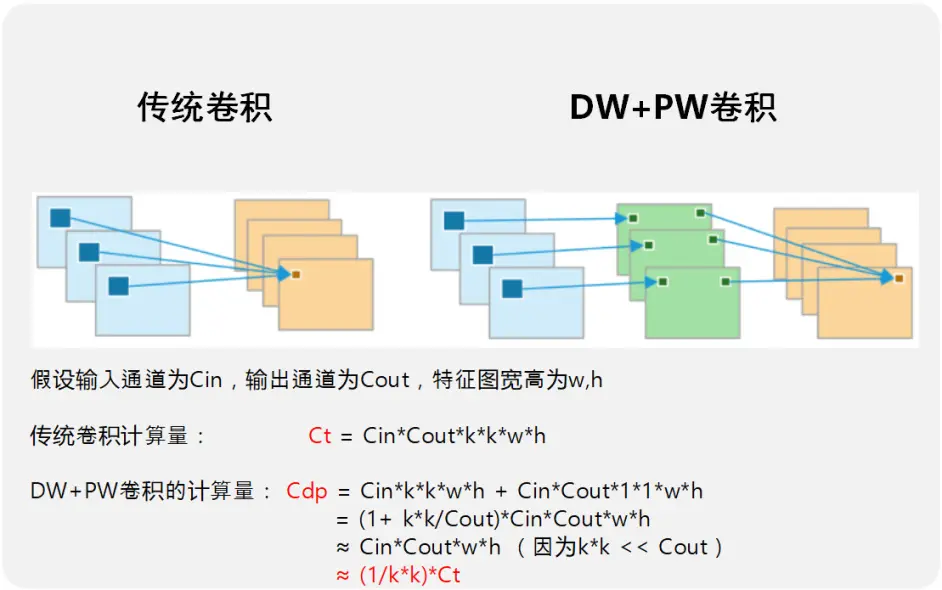

​    MobileNet v2借鉴了resnet的残差结构，引入了inverted resdual模块（倒置残差模块），进一步提升了MobileNet的性能。因为inverted resdual一方面有利于网络的学习，因为毕竟学的是残差（这也是resnet的精髓），另一方面，也降低了原来的PW卷积的计算量。在MobileNet v1的dw+pw卷积中，计算量主要集中在PW卷积上。使用了inverted resdual模块之后，原来的一个PW卷积，变成了一个升维PW+一个降维PW，其计算量有所下降，如下图所示：

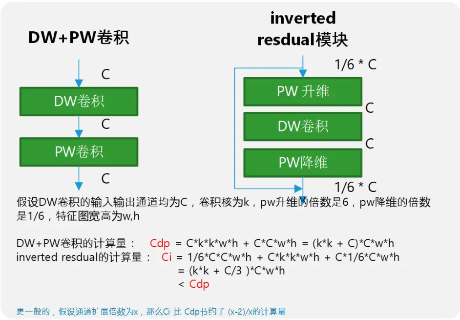

**ShuffleNet****系列**

​    DW卷积或者分组卷积虽然能够有效的降低计算量，但是缺少通道间的信息交互与整合，势必会影响网络的特征提取能力，MobileNet中使用PW卷积来解决这个问题，但是PW卷积的计算量比较大（相对dw卷积），大约是dw卷积的 C_out / K*k 倍。假设C_out=128, k=3, 那么pw卷积的计算量是dw卷积的14倍！所以MobileNet的计算量主要集中在point wise卷积上面。ShuffleNet v1使用了一种更加经济的方式，channel shuffe，使得不需要卷积操作，也能实现不同通道间的信息融合。如下图所示：

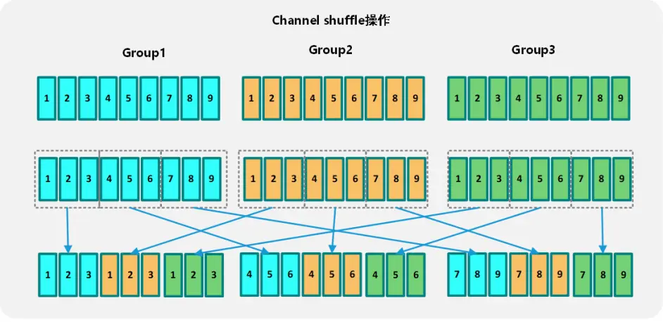

ShuffleNetv2从轻量级网络的本质出发，提出不应该只看计算量，而需要同时兼顾MAC（内存访问代价），并提出了4条轻量级网络设计的准则

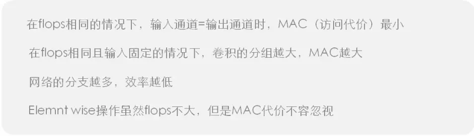

并以此为依据，更新了ShuffleNet v1的基本结构，得到了ShuffleNet v2，如下图所示：

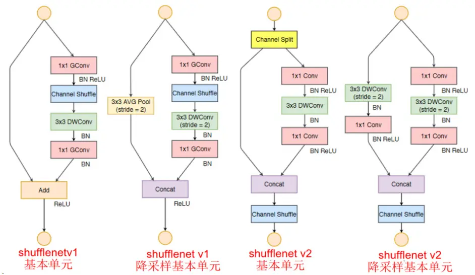

**GhostNet****网络**

GhostNet通过对传统卷积得到的特征图进行观察，发现有很多相似的特征图。那么是否可以通过改造让卷积这种重量级的OP只生成一些具有高度差异性的特征图，然后基于这些特征图，再用一些廉价的OP（相对于卷积）进行变换，得到传统卷积中的那些相似特征图。如下图所示。Ghostnet就是基于下图中的这种ghots module进行构建的轻量级网络。

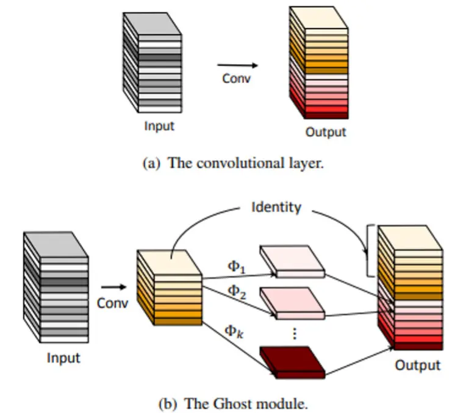

**2****、官方数据对比**

对上述网络的官方数据进行整理，提取精度（imagenet top1精度）与计算量FLOPS进行统计，如下表格所示:

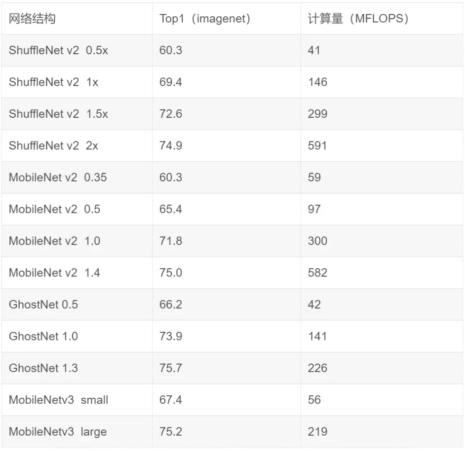

对上述信息进行可视化，使用matploblib打印各个网络的精度与计算量的关系，如下图所示：

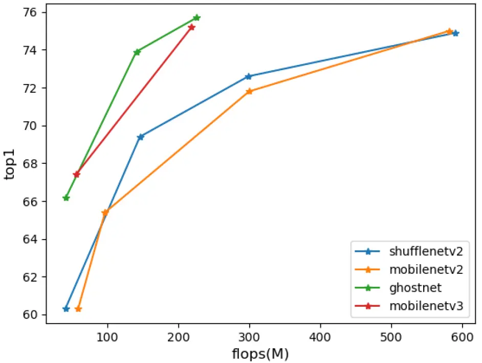

从图中明显可以看到，GhostNet的性能是最好的，MobileNetv3次之，而ShuffleNetv2与MobileNetv2显然要差一些。

 

**3****、实验对比**

通过官方数据的整理，可以大致得出如下的性能排序（只考虑精度和计算量）

GhostNet>MobileNetv3>ShuffleNetv2>MobileNetv2

这和论文的发表时间一致，越是后面发表的论文，在官方列出的数据中越好（否则论文也发不出来），那么真实使用场景下，性能是否还会如官方数据那样呢？这个是不一定的。首先是上述网络官方数据都是计算量，但是在移动端部署深度学习网络，不只是考虑计算量这一维度，例如内存消耗，访存延时，是否容易优化，网络的泛化性能如何，在小数据集上的表现如何，以及应用于检测的时候，特征是否容易提取等很多维度。

所以本次实验为了有一个较为全面的对比，针对上述四类网络（ShuffleNet v2 0.5、ShuffleNet v2 1.0、ShuffleNet v2 1.5、MobileNet v2 0.5、MobileNet v2 1.0、MobileNet v2 1.4、GhostNet 0.5、GhostNet 1.0、GhostNet 1.3、MobileNetv3 small、MobileNetv3 large）在cifar10数据集中进行如下维度测试：

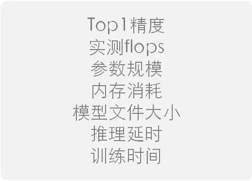

**Top1****精度对比**

首先在cifar10数据集上训练得到的top1精度，最意外的是GhostNet和mobilentv3，在官方数据中，top1的精度都很高，但是在cifar10上面的精度却不尽如人意。精度表现最好的是MobileNetv2。其次是ShuffleNetv2。

**实测flops对比**

使用torchstate工具统计，与官方给出的flops基本一致，。Mobilnetv3和GhostNet稍具优势。Mobilentv2的flops最大。

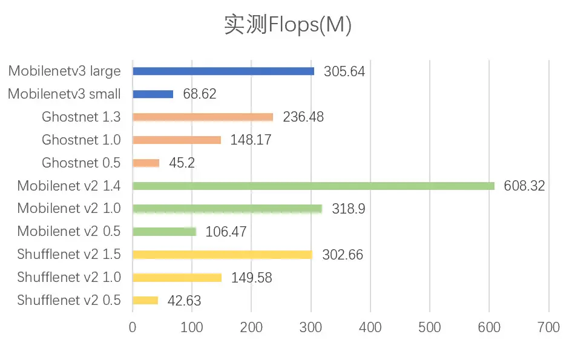

**参数规模对比**

使用的是torchstate工具统计，与官方能查询到的参数规模基本一致。ShuffleNetv2的参数规模最小，MobileNetv3的参数规模最大。

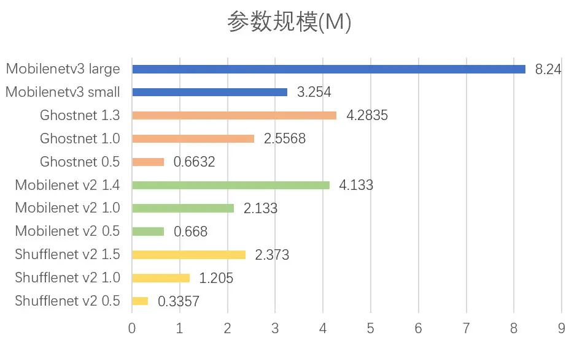

**内存消耗对比**

使用的是torchstate工具统计，ShuffleNetv2表现最好，GhostNet次之，最差的是MobileNetv2。

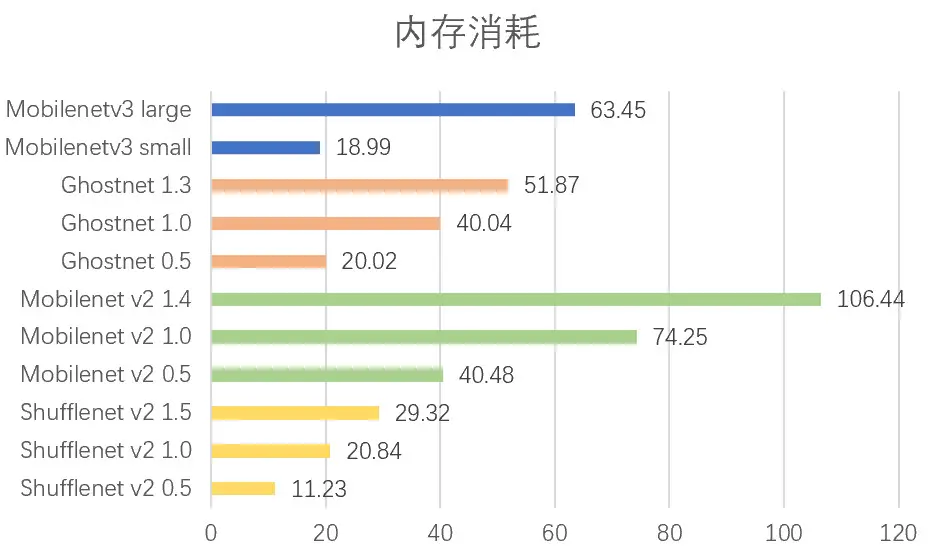

**模型文件大小对比**

使用pytorch保存的模型的state_dict大小，与参数规模大致为4倍的关系（1个float参数需要4个字节保存）。结论也和参数规模一致。ShuffleNetv2的模型文件最小，MobileNetv3的模型文件最大。

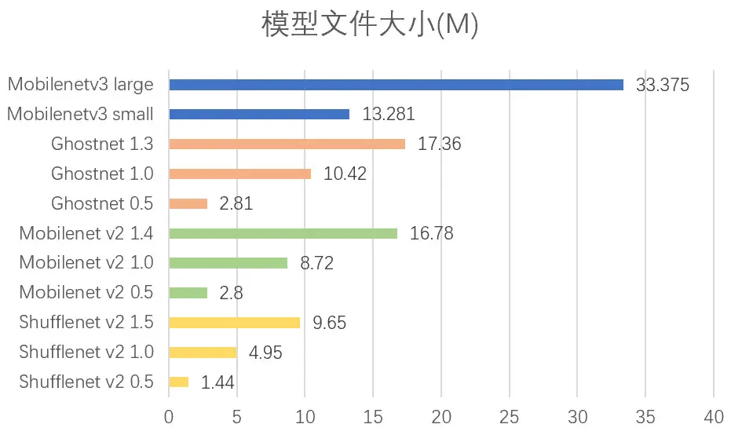

**推理延时对比**

再来看看推理延时指标，这个可能是很多人最关心的问题。因为推理延时直接决定了能否产品化。由于训练模型无法直接进行推理，这里我使用了开源的NCNN推理库作为推理框架，将pytorch训练出来的模型，首先转换到ncnn上面，然后使用ncnn在树莓派4B(CPU:CM2711（ARM Cortex-A72 1.5GHz四核）)上面进行推理测试，每个网络使用100次测试平均值作为最后的推理延时，结果如下图:

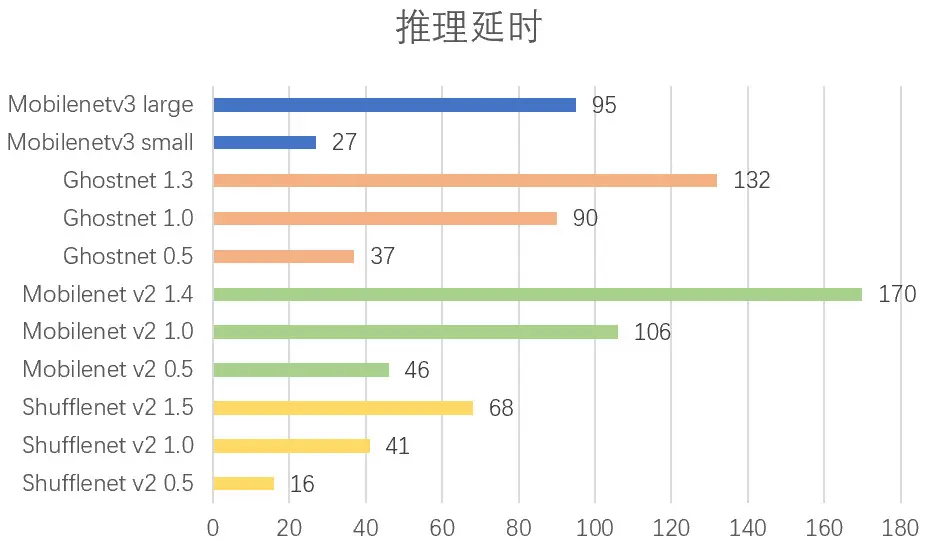

表现最好的是ShuffleNetv2，这个符合预期，因为ShuffleNetv2在设计的时候就考虑了推理延时的问题，没有只看重flops，因此能够做的比较好。最差的是MobileNetv2以及GhostNet。

 

**训练时间对比**

训练时间其实对推理没有影响，但是还是有必要看一下各个网络的训练时间。除了mobilentv3 large训练时间稍长，其余网络的训练时间差别相差不大，但是ShuffleNetv2的整体训练时间最低。

**3****、实验结论**

通过上面各个维度的测试分析，不同的网络有不同的侧重点。例如MobileNet v2在精度上确实最好，但是在很多其他指标中也是最差的。下面对两个最重要的指标进行可视化分析，推理延时与精度。这两个指标应该是所有指标中起到决定性作用的。如下图所示：

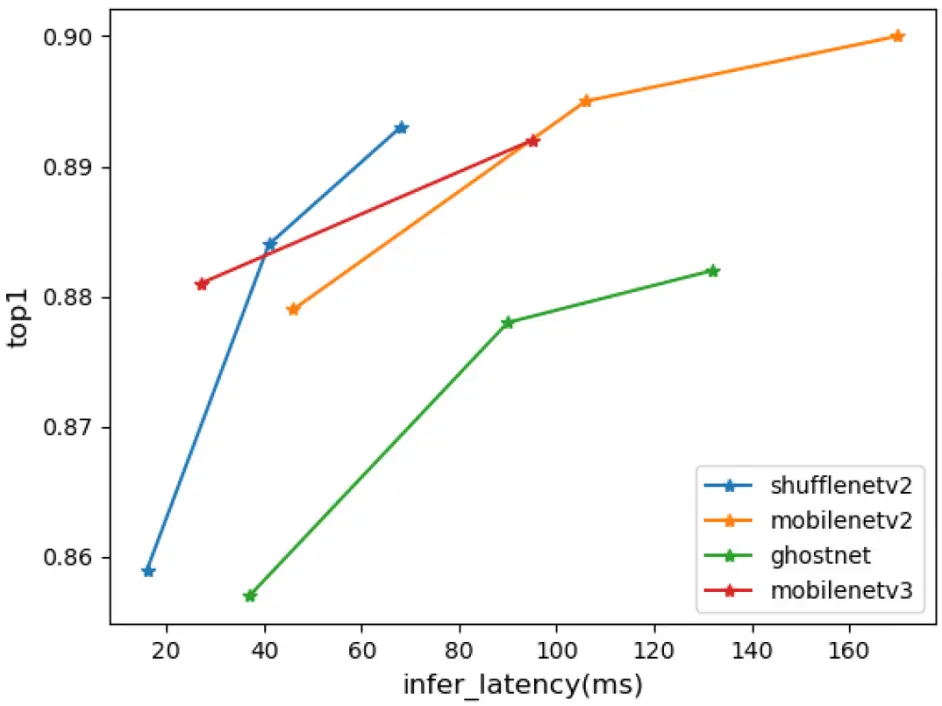

从图中可以看出，表现最好的是ShuffleNetv2，其曲线整体位于左侧，表现最差的是GhostNet，其曲线完全被其他模型碾压。因此本次测试中的轻量级网络之王称号，颁发给ShuffleNet V2网络。

备注：由于实验基于cifar10训练，推理框架使用的是ncnn，测试硬件使用的是树莓派4B。以上结论是基于这些条件测试得到的。