https://blog.csdn.net/qq_37541097/article/details/117691873

# 详解Transformer中Self-Attention以及Multi-Head Attention

原文名称：Attention Is All You Need

原文链接：https://arxiv.org/abs/1706.03762

如果不想看文章的可以看下我在b站上录的视频：https://b23.tv/gucpvt

最近[Transformer](https://so.csdn.net/so/search?q=Transformer&spm=1001.2101.3001.7020)在CV领域很火，Transformer是2017年Google在`Computation and Language`上发表的，当时主要是针对[自然语言处理](https://so.csdn.net/so/search?q=自然语言处理&spm=1001.2101.3001.7020)领域提出的（之前的RNN模型记忆长度有限且无法并行化，只有计算完 $t_i$ 时刻后的数据才能计算 $1 t_{i+1}$时刻的数据，但Transformer都可以做到）。在这篇文章中作者提出了Self-Attention的概念，然后在此基础上提出`Multi-Head Attention`，所以本文对`Self-Attention`以及`Multi-Head Attention`的理论进行详细的讲解。在阅读本文之前，建议大家先去看下李弘毅老师讲的Transformer的内容。本文的内容是基于李宏毅老师讲的内容加上自己阅读一些源码进行的总结。


# 前言

如果之前你有在网上找过self-attention或者transformer的相关资料，基本上都是贴的原论文中的几张图以及公式，如下图，讲的都挺抽象的，反正就是看不懂（可能我太菜的原因）。就像李弘毅老师课程里讲到的"不懂的人再怎么看也不会懂的"。那接下来本文就结合李弘毅老师课上的内容加上原论文的公式来一个个进行详解。

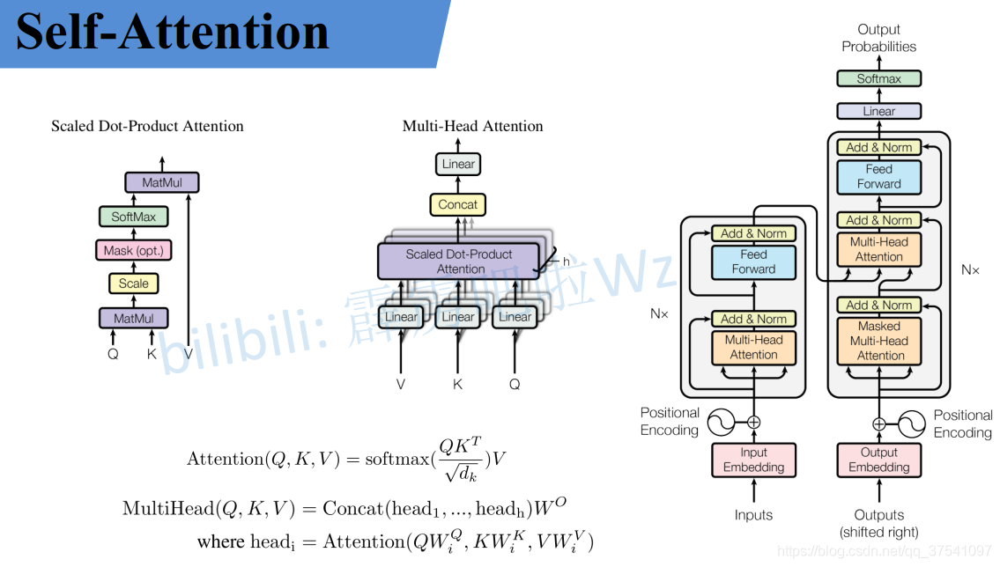

# Self-Attention

> `[b, position, channel] @ [b, channel, position] 从前面一个的position来看,一行代表一个position,它会乘以后面的每一列,后面的列也是position,就意味着求位置之间的相似度`

下面这个图是我自己画的，为了方便大家理解，假设输入的序列长度为2，输入就两个节点 $x_1, x_2$，然后通过Input Embedding也就是图中的 $f(x)$ 将输入映射到 $a_1, a_2$。紧接着分别将 $a_1, a_2$ 分别通过三个变换矩阵 $W_q, W_k, W_v$（**这三个参数是可训练的，是共享的**）得到对应的 $q^i, k^i, v^i$（**这里在源码中是直接使用全连接层实现的**，这里为了方便理解，忽略偏执）。


其中

- **q代表query，后续会去和每一个 $k$ 进行匹配**
- **k代表key，后续会被每个 $q$ 匹配**
- **v代表从 $a$ 中提取得到的信息**
- 后续 $q$ 和 $k$ 匹配的过程可以理解成计算两者的相关性(softmax得到每个点的权重)，相关性越大对应 $v$ 的权重也就越大

假设 $a_1=(1, 1), a_2=(1,0), W^q= \binom{1, 1}{0, 1}$ **W是共享的**那么：


$$
q^1 = 
(1,1)
\begin{pmatrix}
 1 & 1 \\
 0 & 1
\end{pmatrix}
=
(1,2), \;
q^2 = 
(1,0)
\begin{pmatrix}
 1 & 1 \\
 0 & 1
\end{pmatrix}
=
(1,1)
$$
>前面有说Transformer是可以并行化的，所以可以直接写成：
$$
\begin{pmatrix}
 q^1  \\
 q^2
\end{pmatrix}
 = 
\begin{pmatrix}
 1 & 1 \\
 1 & 0
\end{pmatrix}
\begin{pmatrix}
 1 & 1 \\
 0 & 1
\end{pmatrix}
=
\begin{pmatrix}
 1 & 2 \\
 1 & 1
\end{pmatrix}
$$
> **同理我们可以得到 $\binom{k^1}{k^2}$和 $\binom{v^1}{v^2}$ ，那么求得的 $\binom{q^1}{q^2}$ 就是原论文中的 $Q$， $\binom{k^1}{k^2}$ 就是 $K$ ， $\binom{v^1}{v^2}$就是 $V$ **。接着先拿 $q^1$ 和每个 $k$ 进行match，**点乘操作(相同位置相乘再相加)求内积**，接着除以 $\sqrt{d}$得到对应的 $\alpha$ ，其中 $d$代表向量 $k^i$ 的长度，在本示例中等于2，除以 $\sqrt{d}$ 的原因在论文中的解释是“进行点乘后的数值很大，导致通过softmax后梯度变的很小”，所以通过除以 $\sqrt{d}$ 来进行缩放。比如计算 $\alpha_{1, i}$ ：

$$
\alpha_{1,1}
=
\frac {q^1 \cdot k^1} {\sqrt d}
=
\frac {1 \times 1 + 2 \times 0} {\sqrt 2}
=
0.71 \\
\alpha_{1,2}
=
\frac {q^1 \cdot k^2} {\sqrt d}
=
\frac {1 \times 0 + 2 \times 1} {\sqrt 2}
=
1.41
$$
> 同理拿 $q^2$ 去匹配所有的 $k$ 能得到 $\alpha_{2, i}$，统一写成矩阵乘法形式：

$$
\begin{pmatrix}
 α_{1,1} & α_{1,2} \\
 α_{2,1} & α_{2,2}
\end{pmatrix}
=
\frac {
\begin{pmatrix}
q^1 \\
q^2
\end{pmatrix}
\begin{pmatrix}
k^1 \\
k^2
\end{pmatrix}^T
}
{\sqrt d}
=
\frac {
\begin{pmatrix}
q^1 \\
q^2
\end{pmatrix}
\begin{pmatrix}
k^1 & k^2
\end{pmatrix}
}
{\sqrt d} \quad \quad \quad (自己写的转置后面的)
$$
> 接着对每一行即$(\alpha_{1, 1}, \alpha_{1, 2})$ 和 $(\alpha_{2, 1}, \alpha_{2, 2})$ 分别进行softmax处理得到 $(\hat\alpha_{1, 1}, \hat\alpha_{1, 2})$ 和 $(\hat\alpha_{2, 1}, \hat\alpha_{2, 2})$，**这里的 $\hat{\alpha}$ 相当于计算得到针对每个 $v$ 的权重**。到这我们就完成了 ${\rm Attention}(Q, K, V)$ 公式中 ${\rm softmax}(\frac{QK^T}{\sqrt{d_k}})部$ 分。

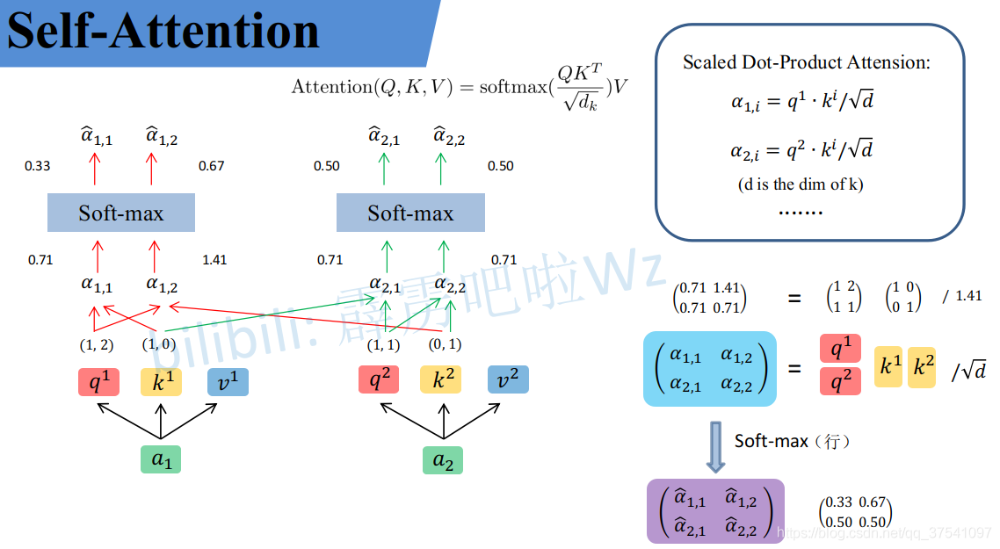

> 上面已经计算得到 $\alpha$，即针对每个 $v$ 的权重，接着进行加权得到最终结果：

$$
b_1 = \hat \alpha_{1,1} \times v^1 + \hat \alpha_{1,2} \times v^2 = (0.33,0.67) \\
b_2 = \hat \alpha_{2,1} \times v^1 + \hat \alpha_{2,2} \times v^2 = (0.50,0.50)
$$
写成矩阵乘法形式：
$$
\begin{pmatrix}
b_1 \\
b_2 
\end{pmatrix}
=
\begin{pmatrix}
 \hat \alpha_{1,1} & \hat \alpha_{1,2} \\
 \hat \alpha_{2,1} & \hat \alpha_{2,2}
\end{pmatrix}
\begin{pmatrix}
v^1 \\
v^2
\end{pmatrix}
=
\begin{pmatrix}
 0.33 & 0.67 \\
 0.50 & 0.50
\end{pmatrix}
$$
> **注意下图 $\hat \alpha$ 和 $v$ 相乘之后是二维向量,全部 $v$ 相加之后依然是二维向量**

> $v^1 = (1, 0) \quad\quad v^2 = (0, 1)$

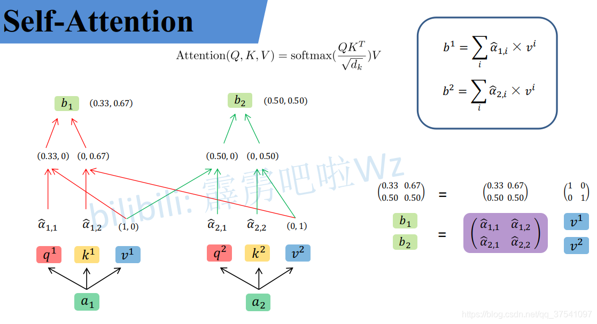

> 到这，`Self-Attention`的内容就讲完了。总结下来就是论文中的一个公式：

$$
Attention(Q,K,V) = softmax(\frac {QK^T} {\sqrt{d_k}})V
$$

> 抽象之后的`Self-Attention`

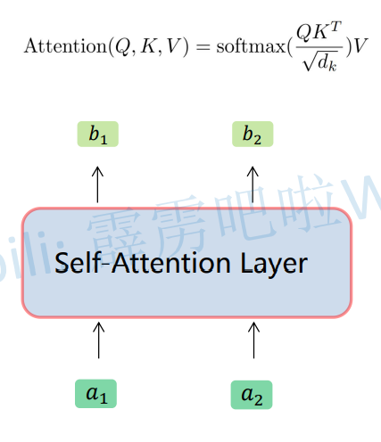


# Multi-Head Attention(类似组卷积)

> 刚刚已经聊完了Self-Attention模块，接下来再来看看Multi-Head Attention模块，实际使用中基本使用的还是Multi-Head Attention模块。原论文中说使用多头注意力机制能够联合来自不同head部分学习到的信息。`Multi-head attention allows the model to jointly attend to information from  different representation subspaces at different positions.`其实只要懂了Self-Attention模块Multi-Head Attention模块就非常简单了。

> 首先还是和Self-Attention模块一样将 $a_i$ 分别通过 $W^q, W^k, W^v$ 得到对应的 $q^i, k^i, v^i$，**然后再根据使用的head的数目 $h$ 进一步把得到的 $q^i, k^i, v^i$ 均分成 $h$ 份**。比如下图中假设 $h=2$ 然后 $q^1$ 拆分成 $q^{1,1}$ 和 $q^{1,2}$ 那么 $q^{1,1}$ 就属于head1， $q^{1,2}$ 属于head2。

> **长度为768分2组之后就为768/2**

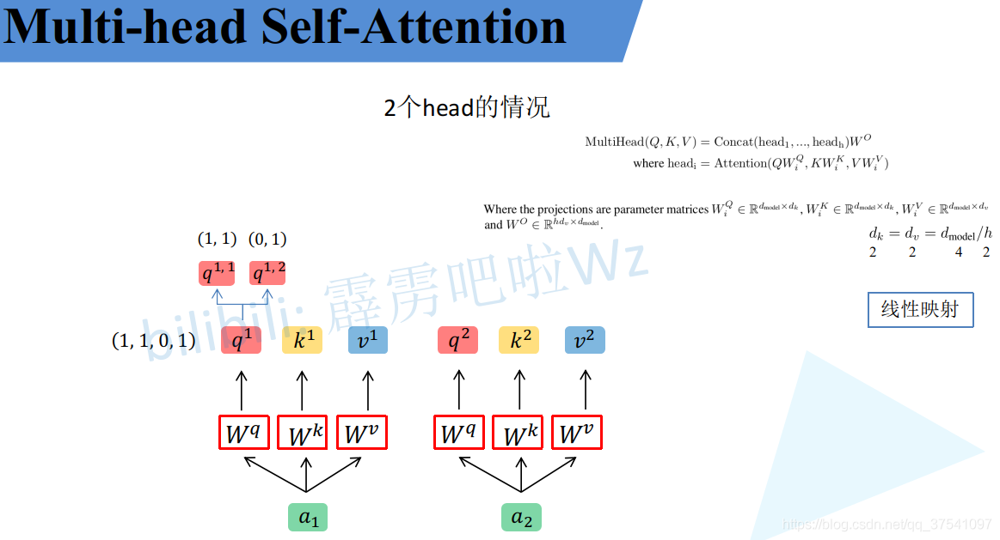

看到这里，如果读过原论文的人肯定有疑问，论文中不是写的通过 $W^Q_i, W^K_i, W^V_i$ 映射得到每个head的 $Q_i, K_i, V_i$ i吗：
$$
head_i = Attention(QW^Q_i,KW^K_i,VW^V_i)
$$
> 但我在github上看的一些源码中就是简单的进行均分，其实也可以将 $W^Q_i, W^K_i, W^V_i$ 设置成对应值来实现均分，比如下图中的Q通过 $W^Q_1$ 就能得到均分后的 $Q_1$。
>
> **右侧公式的 $W_1^Q$ 可以看做类似于one-hot编码,取对应位置的数据 **

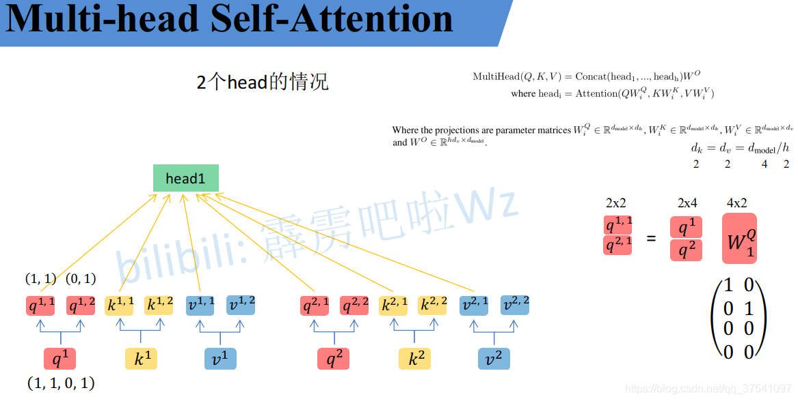

> **通过上述方法就能得到每个 $head_i$ 对应的 $Q_i, K_i, V_i$参数，接下来针对每个head使用和Self-Attention中相同的方法即可得到对应的结果。**

$$
Attention(Q_i, K_i, V_i) = softmax(\frac {Q_iK_i^T} {\sqrt {d_k}})V_i
$$
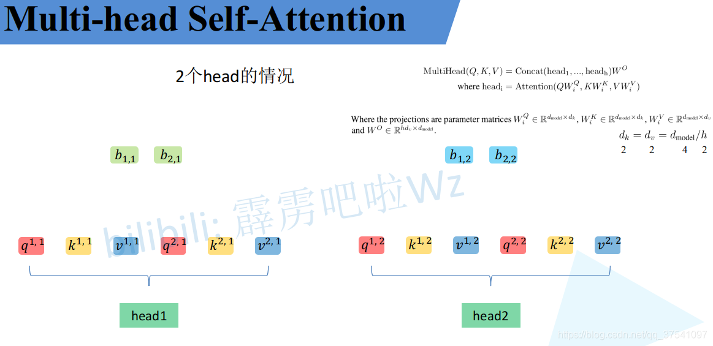

> **接着将每个head得到的结果进行concat拼接，比如下图中 $b_{1,1}$ （ $head_1$ 得到的 $b_1$）和 $ b_{1,2}$（ $head_2$ 得到的 $b_1$）拼接在一起，$b_{2,1}$（ $head_1$ 得到的 $b_2$）和 $b_{2,2}$（ $head_2$ 得到的 $b_2$）拼接在一起。**

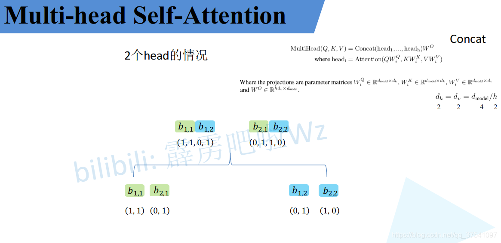

> **接着将拼接后的结果通过 $W^O$（可学习的参数）进行融合，如下图所示，融合后得到最终的结果 $b_1, b_2$。**

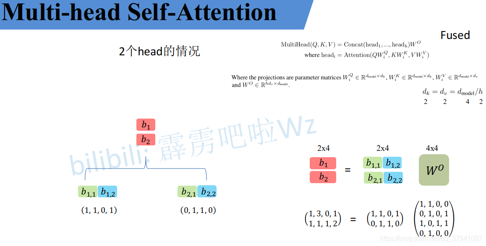

到这，`Multi-Head Attention`的内容就讲完了。总结下来就是论文中的两个公式：
$$
MultiHead(Q,K,V) = Concat(head_1,...,head_h)W^O \\
where \; head_i = Attention(QW^Q_i,KW^K_i,VW^V_i)
$$

抽象之后的`Multi-Head Attention`

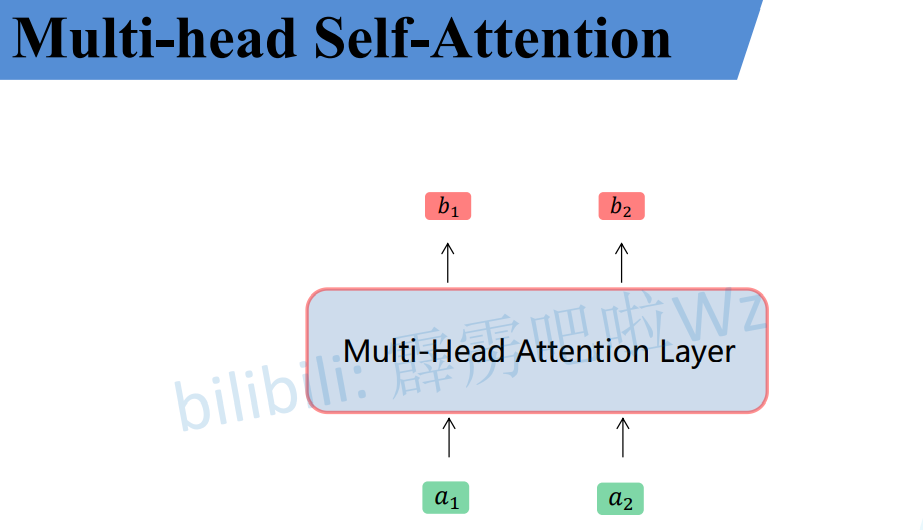

------

# Self-Attention与Multi-Head Attention计算量对比

在原论文章节3.2.2中最后有说两者的计算量其实差不多。`Due to the reduced dimension of each head, the total computational cost is similar to that of single-head attention with full dimensionality.`下面做了个简单的实验，这个model文件大家先忽略哪来的。这个`Attention`就是实现`Multi-head Attention`的方法，其中包括上面讲的所有步骤。

1. 首先创建了一个`Self-Attention`模块（单头）`a1`，然后把proj变量置为Identity（Identity对应的是`Multi-Head Attention`中最后那个 $W^o$ 的映射，单头中是没有的，所以置为Identity即不做任何操作）。

2. 再创建一个`Multi-Head Attention`模块（多头）`a2`，然后设置8个head。
3. 创建一个随机变量，注意shape
4. 使用fvcore分别计算两个模块的FLOPs

```python
import torch
from fvcore.nn import FlopCountAnalysis

from model import Attention


def main():
    # Self-Attention
    a1 = Attention(dim=512, num_heads=1)
    a1.proj = torch.nn.Identity()  # remove Wo

    # Multi-Head Attention
    a2 = Attention(dim=512, num_heads=8)

    # [batch_size, num_tokens, total_embed_dim]
    t = (torch.ones(32, 1024, 512),)

    flops1 = FlopCountAnalysis(a1, t)
    print("Self-Attention FLOPs:", flops1.total())

    flops2 = FlopCountAnalysis(a2, t)
    print("Multi-Head Attention FLOPs:", flops2.total())


if __name__ == '__main__':
    main()
```

终端输出如下， 可以发现确实两者的FLOPs差不多，`Multi-Head Attention`比`Self-Attention`略高一点：

```python
Self-Attention FLOPs: 60129542144
Multi-Head Attention FLOPs: 68719476736
```

其实两者FLOPs的差异只是在最后的 $W^O$ 上，如果把`Multi-Head Attentio`的 $W^O$ 也删除（即把`a2`的proj也设置成Identity），可以看出两者FLOPs是一样的：

```python
Self-Attention FLOPs: 60129542144
Multi-Head Attention FLOPs: 60129542144
```

# Positional Encoding

> 如果仔细观察刚刚讲的Self-Attention和Multi-Head Attention模块，在计算中是没有考虑到位置信息的。假设在Self-Attention模块中，输入 $a_1,a_2,a_3$ 得到 $b_1, b_2, b_3$ 。对于 $a_1$ 而言， $a_2$ 和 $a_3$ 离它都是一样近的而且没有先后顺序。假设将输入的顺序改为 $a_1, a_3, a_2$ ，对结果 $b_1$ 是没有任何影响的。下面是使用Pytorch做的一个实验，首先使用`nn.MultiheadAttention`创建一个`Self-Attention`模块（`num_heads=1`），注意这里在正向传播过程中直接传入 $QKV$ ，接着创建两个顺序不同的 $QKV$ 变量t1和t2（主要是将 $q^2, k^2, v^2$和 $q^3, k^3, v^3$ 的顺序换了下），分别将这两个变量输入Self-Attention模块进行正向传播。

```python
import torch
import torch.nn as nn


m = nn.MultiheadAttention(embed_dim=2, num_heads=1)

t1 = [[[1., 2.],   # q1, k1, v1
       [2., 3.],   # q2, k2, v2
       [3., 4.]]]  # q3, k3, v3

t2 = [[[1., 2.],   # q1, k1, v1
       [3., 4.],   # q3, k3, v3
       [2., 3.]]]  # q2, k2, v2

q, k, v = torch.as_tensor(t1), torch.as_tensor(t1), torch.as_tensor(t1)
print("result1: \n", m(q, k, v))

q, k, v = torch.as_tensor(t2), torch.as_tensor(t2), torch.as_tensor(t2)
print("result2: \n", m(q, k, v))
```

对比结果可以发现，即使调换了 $q^2, k^2, v^2$ 和 $q^3, k^3, v^3$ 的顺序，但对于 $b_1$ 是没有影响的。

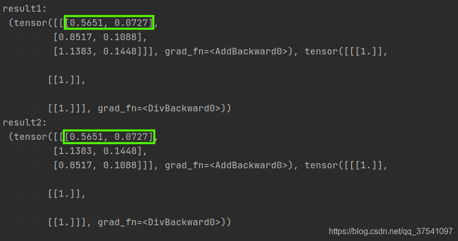

> 为了引入位置信息，在原论文中引入了位置编码`positional encodings`。`To this end, we add "positional encodings" to the input embeddings at the bottoms of the encoder and decoder stacks.` **如下图所示，位置编码是直接加在输入的 $a=\{a_1,...,a_n\}$ 中的，即 $pe=\{pe_1,...,pe_n\}$ 和 $a=\{a_1,...,a_n\}$ 拥有相同的维度大小。**
>
> 关于位置编码在原论文中有提出两种方案，一种是原论文中使用的固定编码，即论文中给出的`sine and cosine functions`方法，按照该方法可计算出位置编码；另一种是可训练的位置编码，作者说尝试了两种方法发现结果差不多（但在ViT论文中使用的是可训练的位置编码）。

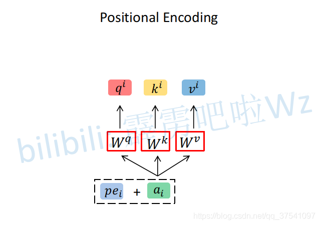

# 超参对比

关于Transformer中的一些超参数的实验对比可以参考原论文的表3，如下图所示。其中：

- $N$ 表示重复堆叠Transformer Block的次数
- $d_{model}$ 表示Multi-Head Self-Attention输入输出的token维度（向量长度）

- $d_{ff}$ 表示在MLP（feed forward）中隐层的节点个数
- $h$ 表示Multi-Head Self-Attention中head的个数
- $d_k,d_v$ 表示Multi-Head Self-Attention中每个head的key（K）以及query（Q）的维度
- $P_{drop}$ 表示dropout层的drop_rate

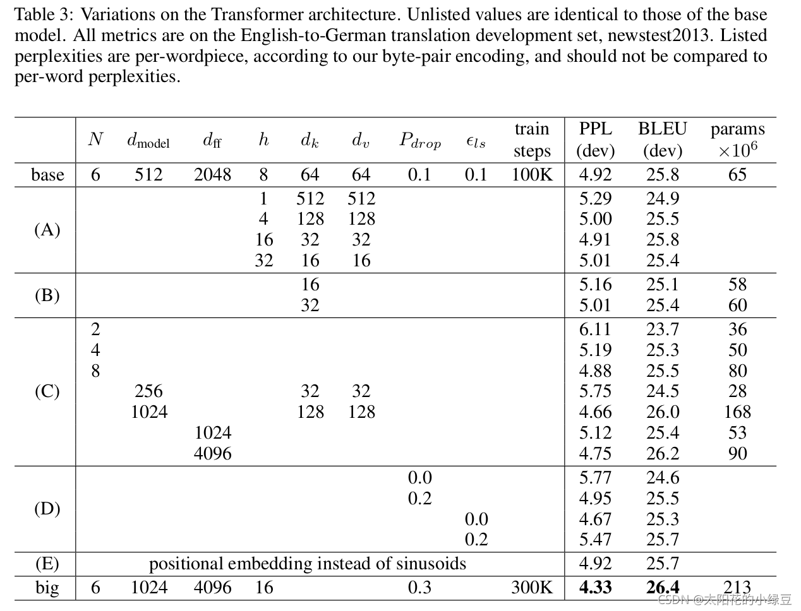

到这，关于Self-Attention、Multi-Head Attention以及位置编码的内容就全部讲完了，如果有讲的不对的地方希望大家指出。

