https://blog.csdn.net/qq_37541097/article/details/118242600

论文名称： An Image Is Worth 16x16 Words: Transformers For Image Recognition At Scale
论文下载链接：https://arxiv.org/abs/2010.11929
原论文对应源码：https://github.com/google-research/vision_transformer

Pytorch实现代码： [pytorch_classification/vision_transformer](https://github.com/WZMIAOMIAO/deep-learning-for-image-processing/tree/master/pytorch_classification/vision_transformer)
Tensorflow2实现代码：[tensorflow_classification/vision_transformer](https://github.com/WZMIAOMIAO/deep-learning-for-image-processing/tree/master/tensorflow_classification/vision_transformer)
在bilibili上的视频讲解：https://www.bilibili.com/video/BV1Jh411Y7WQ

前言

`Transformer`最初提出是针对NLP领域的，并且在NLP领域大获成功。这篇论文也是受到其启发，尝试将Transformer应用到CV领域。关于Transformer的部分理论之前的博文中有讲，链接，这里不在赘述。通过这篇文章的实验，给出的最佳模型在ImageNet1K上能够达到88.55%的准确率（先在Google自家的JFT数据集上进行了预训练），说明Transformer在CV领域确实是有效的，而且效果还挺惊人。

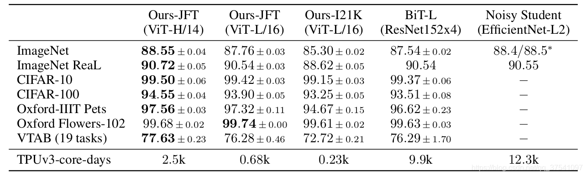

# 模型详解

在这篇文章中，作者主要拿ResNet、ViT（纯Transformer模型）以及Hybrid（卷积和Transformer混合模型）三个模型进行比较，所以本博文除了讲ViT模型外还会简单聊聊Hybrid模型。

## Vision Transformer模型详解

下图是原论文中给出的关于Vision Transformer(ViT)的模型框架。简单而言，模型由三个模块组成：

- Linear Projection of Flattened Patches(Embedding层)

- Transformer Encoder(图右侧有给出更加详细的结构)

- MLP Head（最终用于分类的层结构）

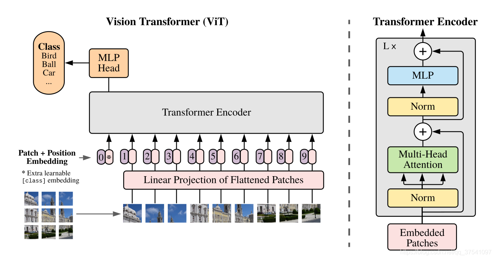

### Embedding层结构详解

**对于标准的Transformer模块，要求输入的是token（向量）序列，即二维矩阵[num_token, token_dim]，如下图，token0-9对应的都是向量，以ViT-B/16为例，每个token向量长度为768。**

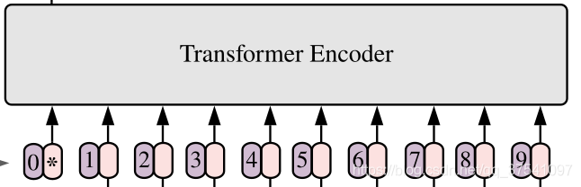

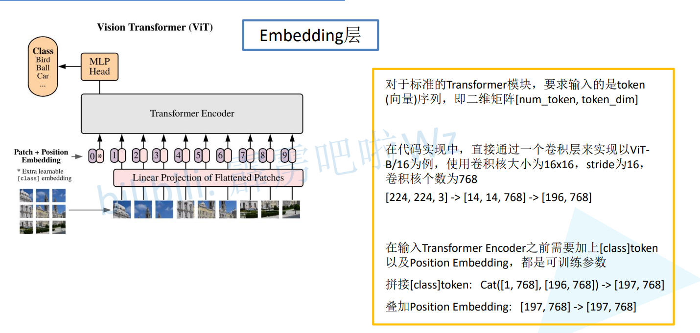

> 通过卷积实现，卷积核和步长均为16，卷积核个数为768，输出结果为 `[14,14,768]`，展平后为 `[196,768]`，代表 `[每个小图片, 所在位置的token]`
>
> 拼接一个 `[1,768]` 的分类参数，**1代表分类，768是为了方便拼接**
>
> 加上一个 `[197,768]` 的位置参数
>
> 最后形状为 `[197,768]`

> 对于图像数据而言，其数据格式为[H, W, C]是三维矩阵明显不是Transformer想要的。所以需要先通过一个Embedding层来对数据做个变换。如下图所示，首先将一张图片按给定大小分成一堆Patches。以ViT-B/16为例，将输入图片(224x224)按照16x16大小的Patch进行划分，划分后会得到 $(224/16)^2=196$ 个Patches。接着通过线性映射将每个Patch映射到一维向量中，以ViT-B/16为例，每个Patche数据shape为[16, 16, 3]通过映射得到一个长度为768的向量（后面都直接称为token）。`[16, 16, 3] -> [768]`

> **在代码实现中，直接通过一个卷积层来实现。** 以ViT-B/16为例，直接使用一个卷积核大小为16x16，步距为16，卷积核个数为768的卷积来实现。
>
> 通过卷积`[224, 224, 3] -> [14, 14, 768]`，然后把H以及W两个维度展平即可`[14, 14, 768] -> [196, 768]`，代表 `[每个小图片, 所在位置的token]`，此时正好变成了一个二维矩阵，正是Transformer想要的。
>
> `[b, 196, 768] as [b, position, channel]`

> **在输入Transformer Encoder之前注意需要加上[class]token以及Position Embedding。** 
>
> 在原论文中，作者说参考BERT，在刚刚得到的一堆tokens中插入一个专门用于分类的[class]token，这个[class]token是一个可训练的参数，数据格式和其他token一样都是一个向量，以ViT-B/16为例，就是一个长度为768的向量，与之前从图片中生成的tokens拼接在一起，`Cat([1, 768], [196, 768]) -> [197, 768]`。
>
> 然后关于Position Embedding就是之前Transformer中讲到的Positional Encoding，这里的Position Embedding采用的是一个可训练的参数（`1D Pos. Emb`.），
>
> 是直接叠加在tokens上的（**add**），所以shape要一样。以ViT-B/16为例，刚刚拼接[class]token后shape是`[197, 768]`，那么这里的Position Embedding的shape也是`[197, 768]`。

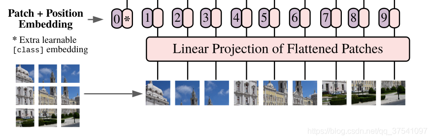

对于Position Embedding作者也有做一系列对比试验，**在源码中默认使用的是`1D Pos. Emb.`**，对比不使用Position Embedding准确率提升了大概3个点，和`2D Pos. Emb.`比起来没太大差别。

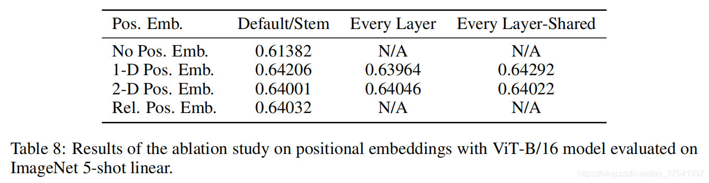

> 位置编码的余弦相似度
>
> 自己位置相似度最高，和所在行和列的相似度也很高，其他位置很低
>
> 说明学习到了位置信息

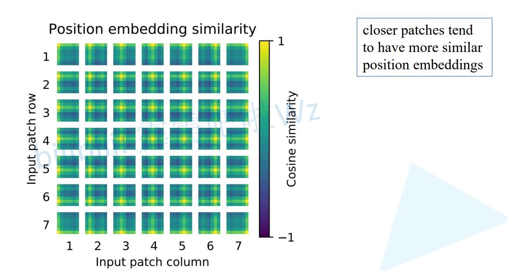

### Transformer Encoder详解

Transformer Encoder其实就是重复堆叠Encoder Block L次，下图是我自己绘制的Encoder Block，主要由以下几部分组成：

- Layer Norm，这种Normalization方法主要是针对NLP领域提出的，这里是对每个token进行Norm处理，之前也有讲过Layer Norm不懂的可以参考[链接](https://blog.csdn.net/qq_37541097/article/details/117653177)
- Multi-Head Attention，这个结构之前在讲Transformer中很详细的讲过，不在赘述，不了解的可以参考[链接](https://blog.csdn.net/qq_37541097/article/details/117691873)
- Dropout/DropPath，在原论文的代码中是直接使用的Dropout层，在但`rwightman`实现的代码中使用的是DropPath（stochastic depth），可能后者会更好一点。
- MLP Block，如图右侧所示，就是全连接+GELU激活函数+Dropout组成也非常简单，**需要注意的是第一个全连接层会把输入节点个数翻4倍**`[197, 768] -> [197, 3072]`，**第二个全连接层会还原回原节点个数**`[197, 3072] -> [197, 768]`

### MLP Head详解

> 上面通过Transformer Encoder后输出的shape和输入的shape是保持不变的，以ViT-B/16为例，输入的是`[197, 768]`输出的还是`[197, 768]`。注意，在Transformer Encoder后其实还有一个Layer Norm没有画出来，后面有我自己画的ViT的模型可以看到详细结构。**这里我们只是需要分类的信息，所以我们只需要提取出[class]token生成的对应结果就行**，即`[197, 768]`中抽取出[class]token对应的`[1, 768]`。接着我们通过MLP Head得到我们最终的分类结果。**MLP Head原论文中说在训练ImageNet21K时是由`Linear`+`tanh激活函数`+`Linear`组成。但是迁移到ImageNet1K上或者你自己的数据上时，只用一个`Linear`即可**。

**下图只要第一个class数据**

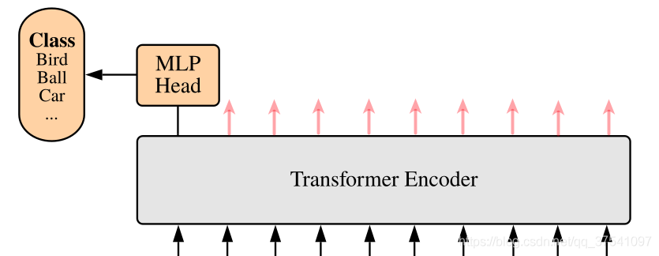

### 自己绘制的Vision Transformer网络结构

为了方便大家理解，我自己根据源代码画了张更详细的图(以ViT-B/16为例)：

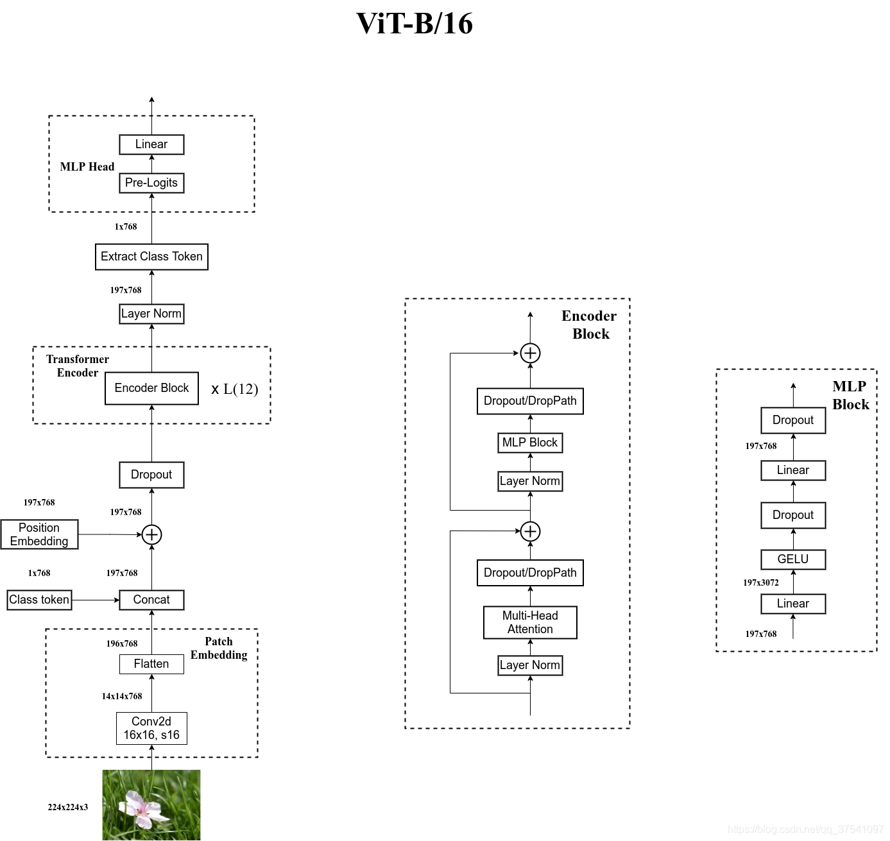

## Hybrid模型详解

> 在论文4.1章节的`Model Variants`中有比较详细的讲到Hybrid混合模型，就是将传统CNN特征提取和Transformer进行结合。下图绘制的是以ResNet50作为特征提取器的混合模型，但这里的Resnet与之前讲的Resnet有些不同。**首先这里的R50的卷积层采用的StdConv2d不是传统的Conv2d，然后将所有的BatchNorm层替换成GroupNorm层**。在原Resnet50网络中，stage1重复堆叠3次，stage2重复堆叠4次，stage3重复堆叠6次，stage4重复堆叠3次，但在这里的R50中，把stage4中的3个Block移至stage3中，所以stage3中共重复堆叠9次。

> 通过R50 Backbone进行特征提取后，得到的特征矩阵shape是`[14, 14, 1024]`，接着再输入Patch Embedding层，注意Patch Embedding中卷积层Conv2d的kernel_size和stride都变成了1，只是用来调整channel。后面的部分和前面ViT中讲的完全一样，就不在赘述。

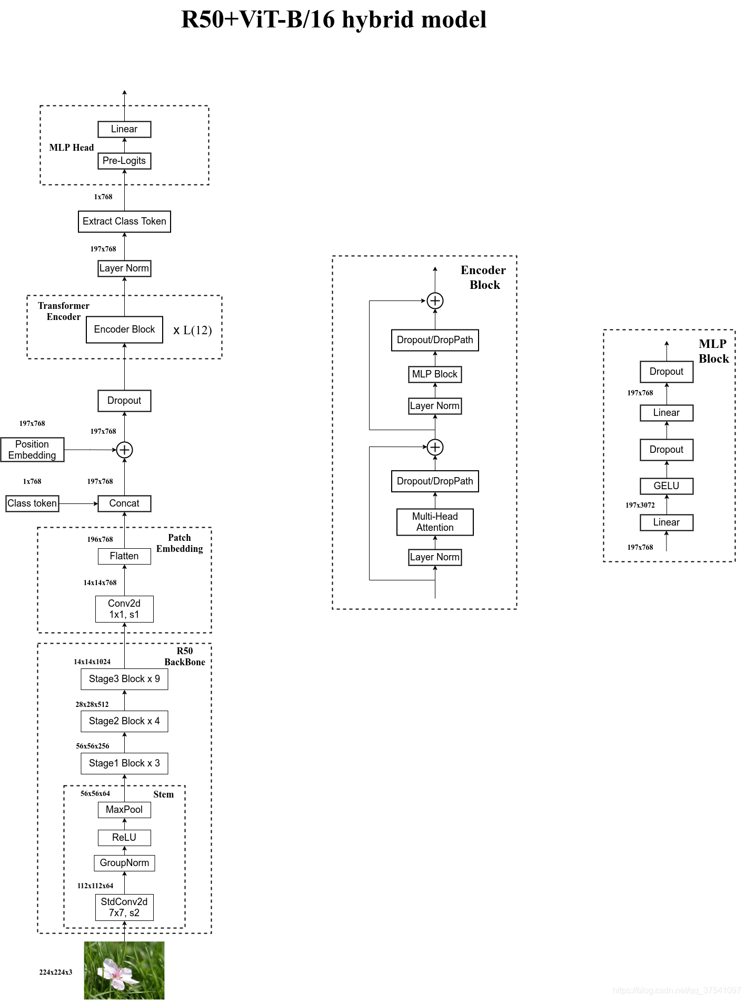

下表是论文用来对比ViT，Resnet（和刚刚讲的一样，使用的卷积层和Norm层都进行了修改）以及Hybrid模型的效果。通过对比发现，在训练epoch较少时Hybrid优于ViT，但当epoch增大后ViT优于Hybrid。

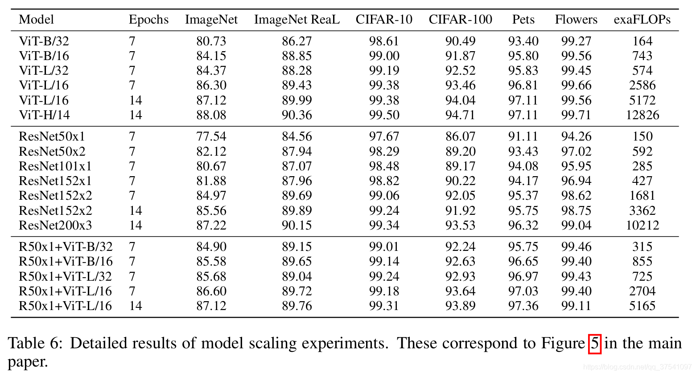

# ViT模型搭建参数

在论文的Table1中有给出三个模型（Base/ Large/ Huge）的参数，在源码中除了有Patch Size为`16x16`的外还有`32x32`的。其

- Layers就是Transformer Encoder中重复堆叠Encoder Block的次数
- Hidden Size就是对应通过Embedding层后每个token的dim（向量的长度）
- MLP size是Transformer Encoder中MLP Block第一个全连接的节点个数（是Hidden Size的四倍）
- Heads代表Transformer中Multi-Head Attention的heads数。

| Model     | Patch Size | Layers | Hidden Size D | MLP size | Heads | Params |
| --------- | ---------- | ------ | ------------- | -------- | ----- | ------ |
| ViT-Base  | 16x16      | 12     | 768           | 3072     | 12    | 86M    |
| ViT-Large | 16x16      | 24     | 1024          | 4096     | 16    | 307M   |
| ViT-Huge  | 14x14      | 32     | 1280          | 5120     | 16    | 632M   |
