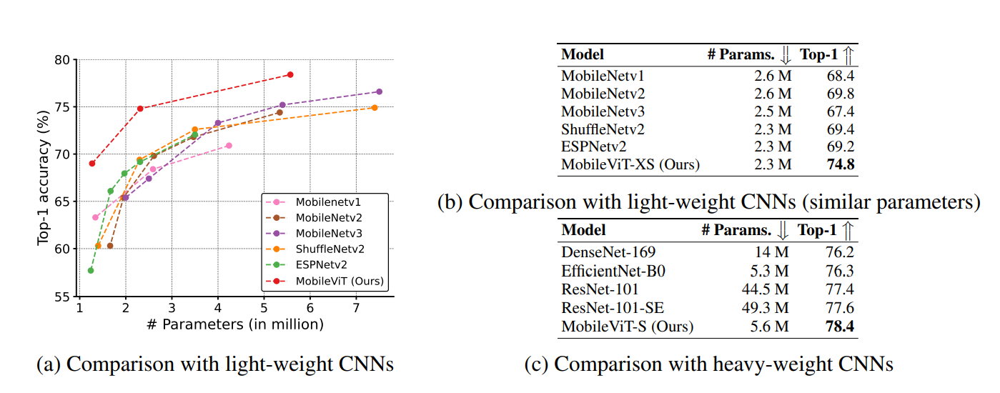
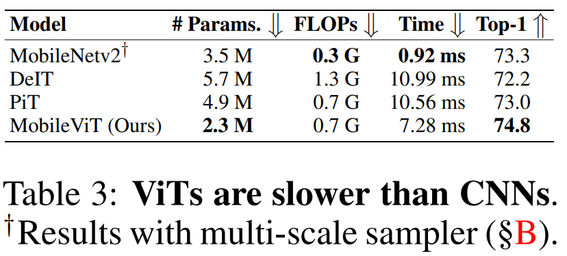
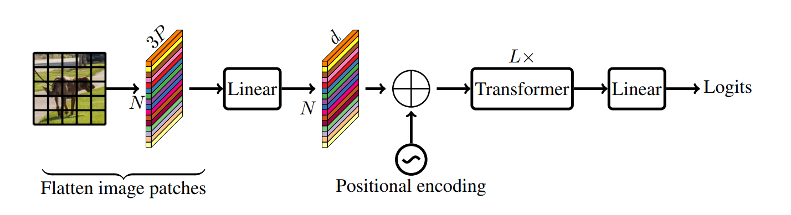
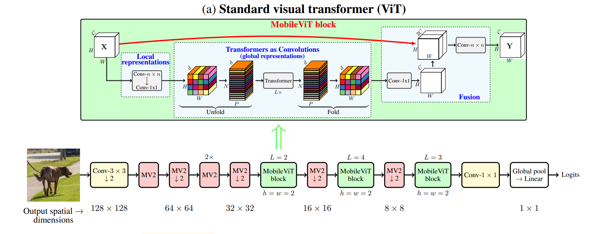
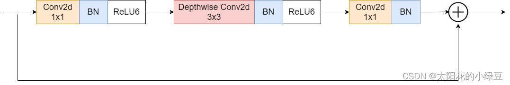
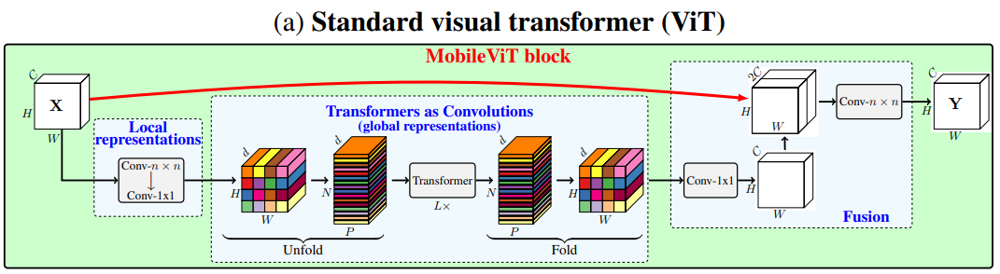
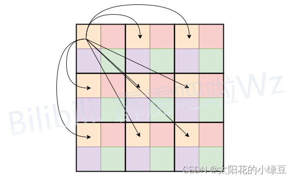
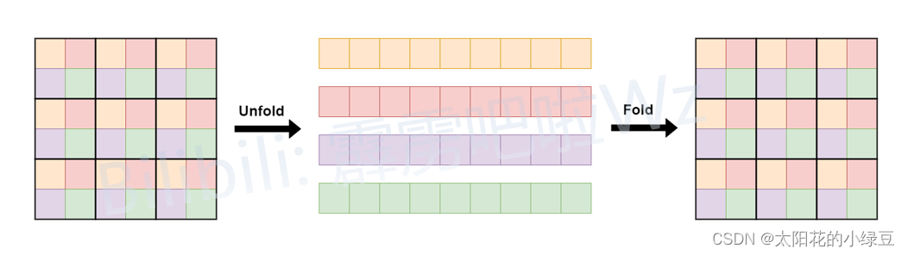
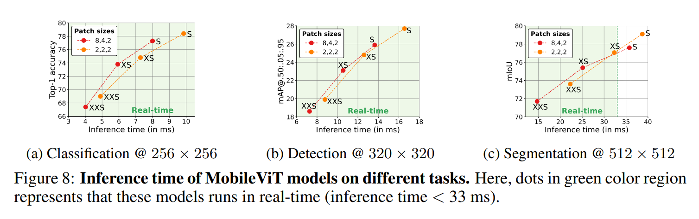
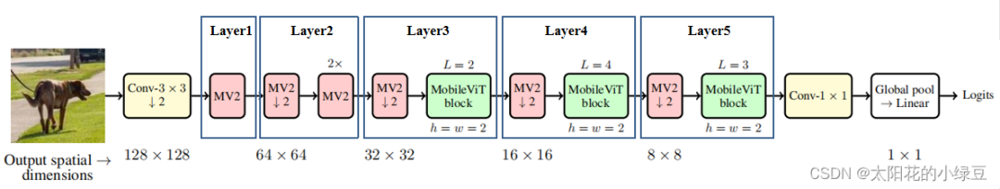

https://mp.weixin.qq.com/s/yOt8YD4Q2IHfr0JX4ryT7A

https://blog.csdn.net/qq_37541097/article/details/126715733

论文名称：**MobileViT: Light-Weight, General-Purpose, and Mobile-Friendly Vision Transformer**

论文下载地址：https://arxiv.org/abs/2110.02178

官方源码（Pytorch实现）：https://github.com/apple/ml-cvnets

自己从ml-cvnets仓库中剥离的代码：https://github.com/WZMIAOMIAO/deep-learning-for-image-processing/tree/master/pytorch_classification/MobileViT

## 0 前言

自从2020年ViT(Vision Transformer)模型的横空出世，人们发现了Transformer架构在视觉领域的巨大潜力。近些年，越来越多的科研人员投入Transformer的怀抱，视觉领域的各项任务也不断被Transformer架构模型刷新。Transformer虽然强大，但在现在看来落地仍存在很多难点。比如模型参数太大（比如ViT Large  Patch16模型光权重就有1个多G），而且算力要求太高，这基本就给移动端部署Transformer模型判了死刑。

尽管近两年Transformer架构在视觉领域出现了很多优秀的工作，比如2021年的Swin-Transformer，它相比ViT效果更好且更轻量，但相比基于CNN的轻量级模型（比如MobileNet系列）无论是在模型参数上还是推理速度上都还有很大的差距。当然毕竟CNN从2012年的AlexNet发表至今已经过去10年了，无论是在模型结构的设计上，还是软硬件的调优上都已经优化的非常到位了。

而Transformer模型才刚刚开始，我相信再过个几年，会有越来越多的学者从事研究Transformer轻量化设计，并且各软硬件厂商会针对Transformer做更多的优化，那时Transformer落地移动端将不再是问题。话题扯远了，言归正传今天我们来简单聊聊MobileViT，Apple公司（对，就是那个被啃了一口的苹果）在2021年发表的一篇CNN与Transfomrer的混合架构模型。近两年CNN和Transformer混合架构研究也是一大热点，CNN的轻量和高效+Transformer的自注意力机制和全局视野。为什么不用纯Transformer架构，前面提到了它很“重”，除此之外还有一些其他的问题，比如说:

- Transformer缺少空间归纳偏置(spatial inductive biases)。这个之前在讲Transformer  self-attention时有提到过。计算某个token的attention时如果将其他token的顺序打乱对最终结果没有任何影响。但在图像数据中，空间信息是很重要且有意义的。为了解决这个问题，常见的方法是加上位置偏置(position bias)/位置编码，比如Vision Transformer中使用的绝对位置偏置，Swin Transformer中的相对位置偏置，加上位置偏置虽然在一定程度上解决了空间位置的信息丢失的问题，但又引入了一个新的问题。迁移到别的任务上时，位置偏置信息往往需要调整。
- Transformer模型迁移到其他任务(输入图像分辨率发生改变)时比较繁琐。这里所说的繁琐是相对CNN而言的，而主要原因是引入位置偏置导致的。比如在Imagenet上预训练好的Vision Transformer(输入图片大小为`224x224`)模型后，现在要迁移到更大尺度的任务中，但由于Vision Transformer的绝对位置偏置的序列长度是固定的，等于 $\frac {H \times W} {16 \times 16}$，其中H、W代表输入图片的高和宽，所以只要改变输入图像的尺度就无法直接复用了。现在最常见的处理方法是通过插值的方式将位置编码插值到对应图像的序列长度。但如果不对网络进行微调直接使用实际效果可能会掉点，比如在`224x224`尺度上训练的网络，直接对位置偏置进行插值不去微调，在`384x384`的尺度上进行验证可能会出现掉点(CNN一般会涨点)。如果每次改变输入图像尺度都要重新对位置偏置进行插值和微调，那也太麻烦了。这里有人会说可以使用Swin Transformer中的相对位置偏置，确实如此，Swin Transformer相对位置偏置的序列长度只和Windows大小有关，与输入图像尺度无关。但在实际使用中，Windows的尺度和输入图像尺度又有一定关系。一般输入图像尺度越大，Windows的尺度也会设置的大些。只要Windows尺度发生变化，相对位置偏置也要进行插值了，那么问题又来了。当然这里并不是说位置偏置引入了一堆问题就去否定它的作用，只是现在所采用的位置偏置方式还有很多值得优化的地方。比如在Swin Transformer v2中就对v1的相对位置偏置进行了优化。

- Transformer模型训练困难。根据现有的一些经验，Transformer相比CNN要更难训练。比如Transformer需要更多的训练数据，需要迭代更多的epoch，需要更大的正则项(L2正则)，需要更多的数据增强(且对数据增强很敏感，比如在MobileViT论文的引言中提到，如果将CutMix以及DeIT-style的数据增强移除，模型在Imagenet上的Acc直接掉6个点)。

> 针对以上问题，现有的、最简单的方式就是采用CNN与Transformer的混合架构，CNN能够提供空间归纳偏置所以可以摆脱位置偏执，而且加入CNN后能够加速网络的收敛，使网络训练过程更加的稳定。下图展示了MobileViT与当时主流的一些Transformer模型对比，通过下图可以看出，即使使用普通的数据增强方式MobileViT也能达到更高的Acc并且参数数量更少。

除此之外，作者还将MobileViT与一些传统的轻量级CNN进行了对比，如下图所示，在近似的参数数量下MobileViT的Acc要更高。

以上只提到了参数数量和Acc，并没有明确的推理速度对比，在论文中唯一能找到的一个有推理速度对比是表3，通过对比能够看到基于Tranaformer的模型(无论是否为混合架构)推理速度比纯CNN的模型还是要慢很多的(移动端)。作者在论文中给出解释主要还是说当前移动端对Transformer架构优化的还太少。

## 1 模型结构解析

### 1.1 Vision Transformer结构

在讲MobileViT网络之前先简单回顾下Vision Transformer的网络结构，如果还不了解，建议先看下之前写的有关Vision  Transformer的文章：https://blog.csdn.net/qq_37541097/article/details/118242600。下图是MobileViT论文中绘制的`Standard visual Transformer`。首先将输入的图片划分成一个个`Patch`，然后通过线性变化将每个`Patch`映射到一个一维向量中（视为一个个`Token`），接着加上位置偏置信息（可学习参数），再通过一系列Transformer Block，最后通过一个全连接层得到最终预测输出。

### 1.2 MobileViT结构

简单回顾完Vision Transformer后，再来看看本文要讲的MobileViT。下图对应的是论文中的图1(b)，通过下图可以看到MobileViT主要由普通卷积，`MV2`（MobiletNetV2中的`Inverted Residual block`），`MobileViT block`，全局池化以及全连接层共同组成。

> 关于`MV2`结构之前在讲MobileNetV2时有讲过，这里不再赘述，下图是当stride等于1时的`MV2`结构。上图中标有向下箭头的`MV2`结构代表stride等于2的情况，即需要进行下采样。
>
> 1x1Conv提高通道数为6倍，3x3DWConv提取特征，1x1Conv还原通道数

> 接下来就是最核心的`MobileViT block`，在论文的图1(b)中作者已经绘制出了`MobileViT block`的大致结构。首先将特征图通过一个卷积核大小为`nxn`（代码中是`3x3`）的卷积层进行局部的特征建模，然后通过一个卷积核大小为`1x1`的卷积层调整通道数。接着通过`Unfold -> Transformer -> Fold`结构进行全局的特征建模，然后再通过一个卷积核大小为`1x1`的卷积层将通道数调整回原始大小。接着通过shortcut捷径分支与原始输入特征图进行`Concat`拼接（沿通道channel方向拼接），最后再通过一个卷积核大小为`nxn`（代码中是`3x3`）的卷积层做特征融合得到输出。

> 我个人认为有关`Unfold -> Transformer -> Fold`这块介绍的并不是很清楚（可能是我太菜），所以看了下源码自己重新绘制了一个方便大家理解的版本。
>
> 这里为了方便我们将`Unfold -> Transformer -> Fold`简写成`Global representations`，它的具体计算过程如下图所示。
>
> 首先对特征图划分`Patch`（这里为了方便忽略通道channels），图中的`Patch`大小为`2x2`，即每个`Patch`由4个`Pixel`组成。在进行`Self-Attention`计算的时候，每个`Token`（图中的每个`Pixel`或者说每个小颜色块）只和自己颜色相同的`Token`进行`Attention`，这样就达到了减少计算量的目的，没错就这么简单。
>
> 对于原始的`Self-Attention`计算每个`Token`是需要和所有的`Token`进行`Attention`，假设特征图的高宽和通道数分别为`H, W, C`，这里记计算成本为`Cost=O(WHC)`。
>
> `[b, position, channel] @ [b, channel, position] 从前面一个的position来看,一行代表一个position,它会乘以后面的每一列,后面的列也是position,就意味着求位置之间的相似度`
>
> 如果按照刚刚说的，每个`Token`只和自己颜色相同的`Token`做`Attention`，假设`Patch`大小为`2x2`，计算时高宽和通道数分别为`H/2, W/2, C`，那么计算成本为`Cost=O(WHC/4)`，即理论上的计算成本仅为原始的 $\frac 1 4$。
>
> 至于为什么能这么做，这里简单谈谈我的看法。对于图像数据本身就存在大量的数据冗余，比如对于较浅层的特征图（`H, W`下采样倍率较低时），相邻像素间信息可能没有太大差异，如果每个`Token`做`Attention`的时候都要去看下相邻的这些像素，个人感觉有些浪费算力。这里并不是说看相邻的像素没有意义，只是说在分辨率较高的特征图上收益可能很低，增加的计算成本远大于Accuracy上的收益。而且前面已经通过`nxn`的卷积层进行局部建模了，进行全局建模时就没必要再看这么细了。
>
> 假设宽高为14,则有196个patch,对于原始的`Self-Attention`计算为 `[B, 196, C] @ [B, C, 196] @ [b, 196, C]` 中 `196*196*C=38416C`
>
> 划分为2x2后计算 `Attention` `[B, 49, C] @ [B, C, 49] @ [B, 49, C]` 中  `49*49*4*C=9604C`

> 而刚刚提到的`Unfold`和`Fold`只是为了将数据给reshape成计算`Self-Attention`时所需的数据格式。对于普通的`Self-Attention`计算前，一般是直接展平`H, W`两个维度得到一个`Token`序列，即将`[N, H, W, C] -> [N, H*W, C]`其中N表示Batch维度。
>
> 但在`MobileViT block`的`Self-Attention`计算中，只是将颜色相同的`Token`进行了`Attention`，所以不能简单粗暴的展平`H, W`维度。如下图所示，文中的`Unfold`就是将相同颜色的`Token`展平在一个序列中，这样就可以直接使用普通的`Self-Attention`并行计算每个序列的`Attention`了。最后再通过`Fold`折叠回原特征图即可。

### 1.3 Patch Size对性能的影响

> 在上面1.2章节中我们已经讲完了MobileViT结构，接着我们再来聊聊有关`patch_size`对网络性能的影响。前面有提到大的`patch_size`能够提升网络推理速度，但是会丢失一些细节信息。这里直接看下论文中给的图8，这里展示了两组不同的`patch_size`组合在三个任务中的性能，包括图像分类，目标检测以及语义分割。其中配置A的`patch_size`为`{2, 2, 2}`，配置B的`patch_size`为`{8, 4, 2}`，这三个数字分别对应下采样倍率为8，16，32的特征图所采用的`patch_size`大小。通过对比可以发现，在图像分类和目标检测任务中（对语义细节要求不高的场景），配置A和配置B在Acc和mAP上没太大区别，但配置B要更快。但在语义分割任务中（对语义细节要求较高的场景）配置A的效果要更好。

## 2 模型详细配置

> 在论文中，关于MobileViT作者提出了三种不同的配置，分别是MobileViT-S(small)，MobileViT-XS(extra small)和MobileViT-XXS(extra extra  small)。三者的主要区别在于特征图的通道数不同。下图为MobileViT的整体框架，最开始的`3x3`卷积层以及最后的`1x1`卷积层、全局池化、全连接层不去赘述，主要看下图中的标出的Layer1~5，这里是根据源码中的配置信息划分的。下面只列举了部分配置信息，更加详细的配置可查看源码。

其中：

- `in/out_channels`表示该模块输入/输出的通道数
- `mv2_exp_ratio`表示`Inverted Residual Block`中的expansion ratio
- `transformer_channels`表示`Transformer`模块输入`Token`的序列长度（特征图通道数）,通道变化为 `[N, P, C] -> [N, h, P, c] @ [N, h, c, P] @ [N, h, P, c] = [N, P, C]`
- `num_heads`表示多头自注意力机制中的head数
- `ffn_dim`表示FFN中间层`Token`的序列长度，从下表可以看到相比输入的`channel`翻倍，因此ffn通道变化为`[N, P, C] -> [N, P, 2C] -> [N, P, C]`
- `patch_h`表示每个patch的高度
- `patch_w`表示每个patch的宽度

对于MobileViT-XXS，Layer1~5的详细配置信息如下：

| layer  | in/out_channels | mv2_exp_ratio | transformer_channels | ffn_dim | patch_h | patch_w | num_heads |
| :----- | :-------------- | :------------ | :------------------- | :------ | :------ | :------ | :-------- |
| layer1 | 16              | 2             | None                 | None    | None    | None    | None      |
| layer2 | 24              | 2             | None                 | None    | None    | None    | None      |
| layer3 | 48              | 2             | 64                   | 128     | 2       | 2       | 4         |
| layer4 | 64              | 2             | 80                   | 160     | 2       | 2       | 4         |
| layer5 | 80              | 2             | 96                   | 192     | 2       | 2       | 4         |

对于MobileViT-XS，Layer1~5的详细配置信息如下：

| layer  | in/out_channels | mv2_exp_ratio | transformer_channels | ffn_dim | patch_h | patch_w | num_heads |
| :----- | :-------------- | :------------ | :------------------- | :------ | :------ | :------ | :-------- |
| layer1 | 32              | 4             | None                 | None    | None    | None    | None      |
| layer2 | 48              | 4             | None                 | None    | None    | None    | None      |
| layer3 | 64              | 4             | 96                   | 192     | 2       | 2       | 4         |
| layer4 | 80              | 4             | 120                  | 240     | 2       | 2       | 4         |
| layer5 | 96              | 4             | 144                  | 288     | 2       | 2       | 4         |

对于MobileViT-S，Layer1~5的详细配置信息如下：

| layer  | in/out_channels | mv2_exp_ratio | transformer_channels | ffn_dim | patch_h | patch_w | num_heads |
| :----- | :-------------- | :------------ | :------------------- | :------ | :------ | :------ | :-------- |
| layer1 | 32              | 4             | None                 | None    | None    | None    | None      |
| layer2 | 64              | 4             | None                 | None    | None    | None    | None      |
| layer3 | 96              | 4             | 144                  | 288     | 2       | 2       | 4         |
| layer4 | 128             | 4             | 192                  | 384     | 2       | 2       | 4         |
| layer5 | 160             | 4             | 240                  | 480     | 2       | 2       | 4         |

------

到此，有关MobileViT的内容就基本讲完了。如果觉得这篇文章对你有用，记得点赞、收藏并分享给你的小伙伴们哦😄。