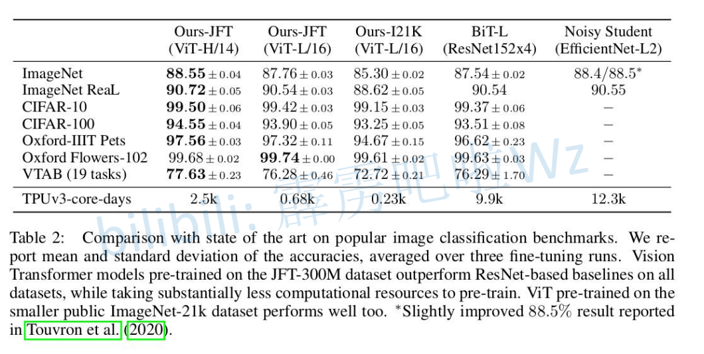
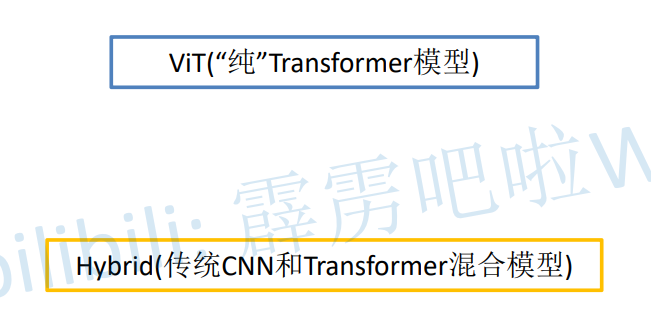
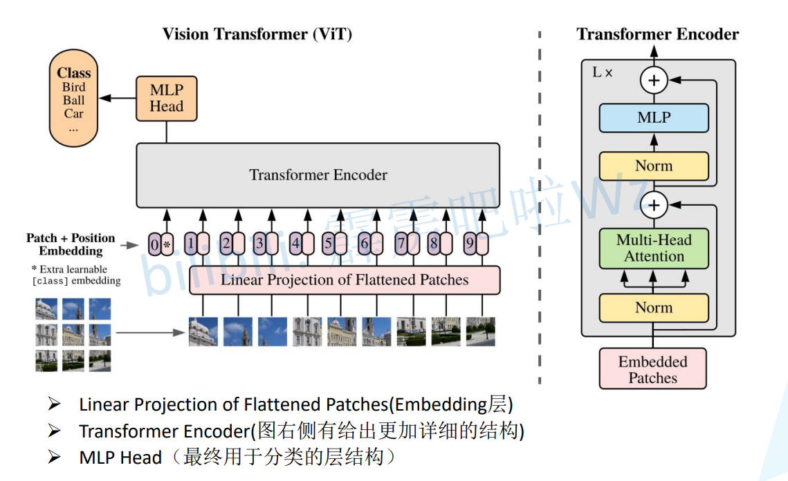
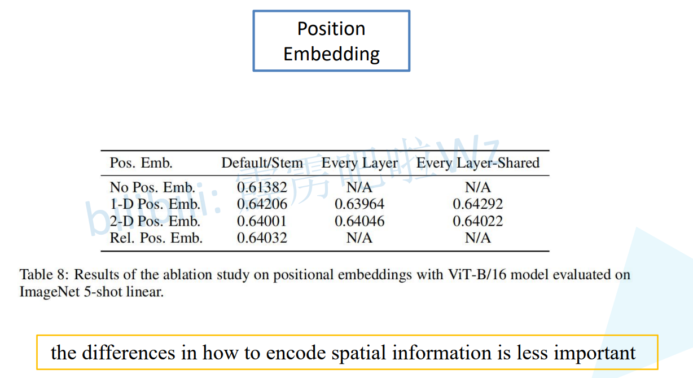
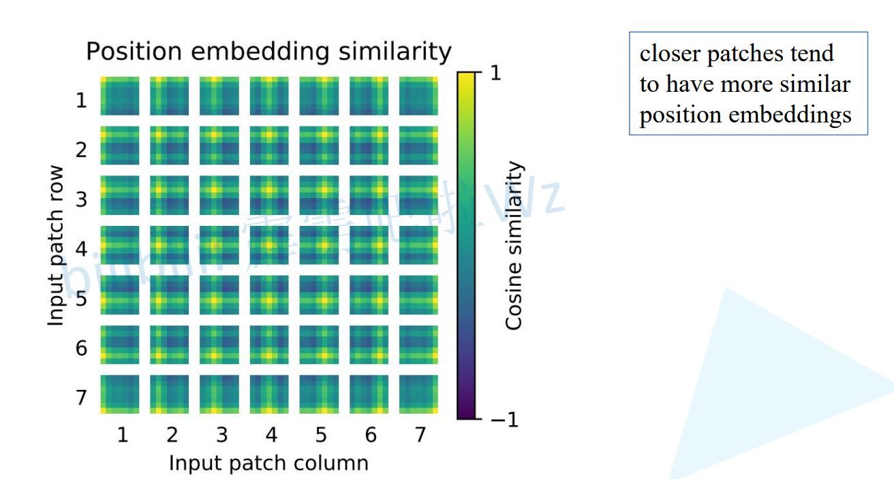
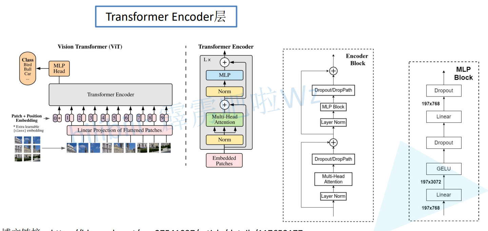
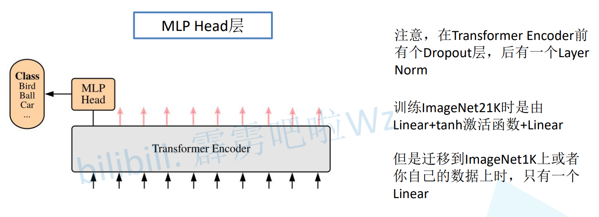
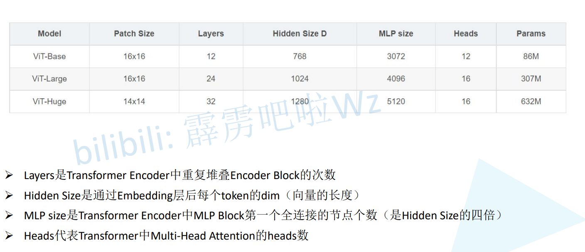
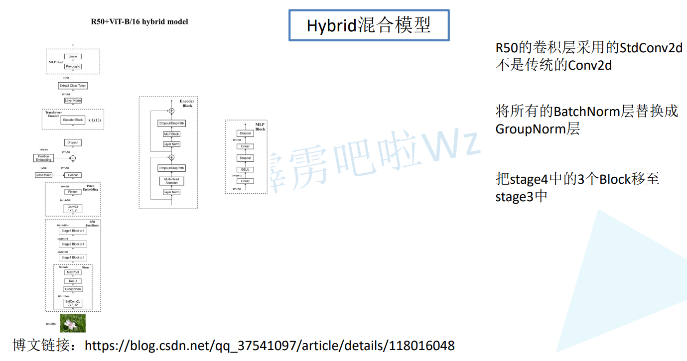
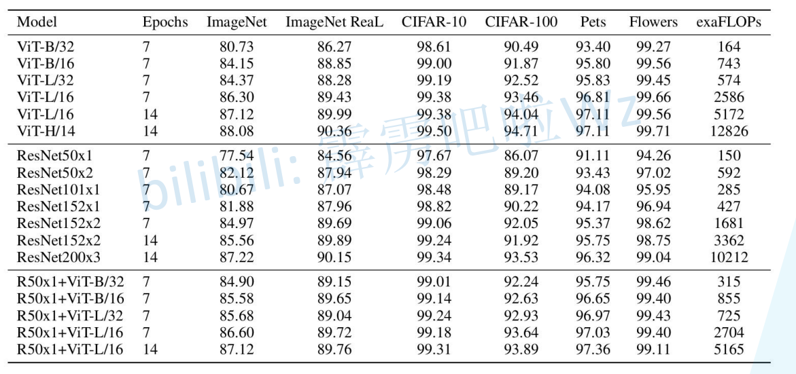

# ViT性能

## 

## Vit(纯Transformer) Hybrid(CNN+Transformer)

# 

> 先将图片分成小块,然后通过Linear(Embedding)层,得到向量,称作Token
>
> 在Linear后面加上分类的token,然后添加位置信息token(Posotion Embedding)
>
> Transformer Encoder会重复L次
>
> 提取针对Class的输出

# 

# Linear(Embedding层) 通过卷积来运算

> ViT-B/16
>
> 卷积核大小是 16x16, 步长是16, out_channel=768
>
> 224 / 16 = 14
>
> 14 * 14 = 196 宽高展平
>
> [224, 224, 3] => [14, 14, 768] => [196, 768]
>
> ------
>
> 拼接 [class]token: [1, 768] 就是向量 768层,就拼接768个
>
> [196, 768] => [197, 768]
>
> ------
>
> 叠加Position Embedding 相加 形状是 [197, 768]
>
> [197, 768] => [197, 768]

## 

## 位置编码的重要性

> 准确率提高了3%
>
> 一维编码效果很好

> 针对每一个位置的编码与图像位置进行余弦相似度编码,和自己得位置相似度最高,和自己的行列的相似度都很高

# 

# Transformer Encoder层

> Layer Norm: [Layer Normalization解析_霹雳吧啦Wz-CSDN博客](https://blog.csdn.net/qq_37541097/article/details/117653177)
>
> Multi-Head: 注意力
>
> Dropout/DropPath: 这两个都可以
>
> ------
>
> Layer Norm:
>
> MLP Block: 右图 全连接层(in, in x 4),激活函数,Dropout,全连接层(in x 4, in),Dropout
>
> in => in x 4 => in
>
> Dropout/DropPath: 这两个都可以

# 

# MLP Head

> 注意: 在Transformer Encoder前有一个Dropout层,后有一个Layer Norm

# 

# ViT-B/16

> ​                                                通道位置改变        拼接class     加上PositionEmbedding    Dropout       Encoder Block * 12次
>
> [3, 224, 224]    =>     [14, 14, 768]    =>    [196, 768]    =>    [197, 768]    =>     [197, 768]    =>    [197, 768]    =>    [197, 768]
>
> Layer Norm     提取Class输出(切片) MLPHead(Image21K需要Pre-Logits,自己的数据只需要Linear)
>
> =>    [179, 768]    =>    [1, 768]    =>    最终输出

# 

# Base Large Huge

> Patch Size:      卷积核大小
>
> Layers:           TransformerEncoder重复次数
>
> Hidden Size:   Linear(Embedding层)映射的长度
>
> MLP Size:       MLP Block第一个全连接层的节点个数
>
> Heads:           Multi-Head Attention的heads个数

# 

# Hybrid混合模型

> 通过resnet50提取特征,再通过 Encoder
>
> **针对stage4中的3个block移至stage3中: 有stage4下采样率是32, 没有它的话下采样率是16**

# 

# 性能对比

