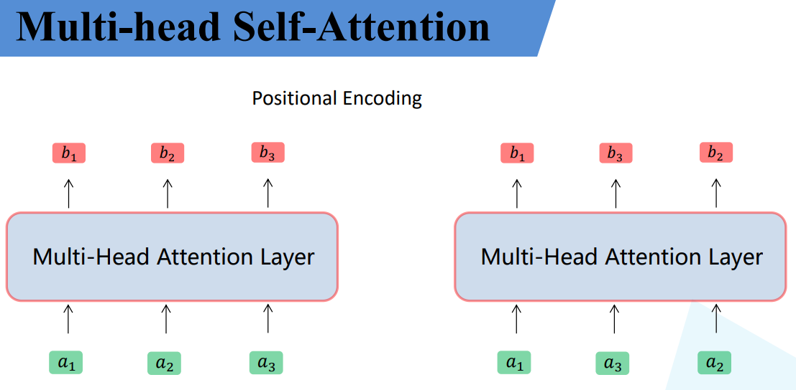

# 注意力机制

> 最开始使用在NLP领域
>
> RNN,LSTM,GRU记录数据较短,无法并行化
>
> 给每一层赋予权重

# 3张图

# 基本

 x1 => embedding  => a1 embedding是变为高维数据 然后和 Wq Wk Wv 分别相乘 得到 q k v

Wq Wk Wv 所有的 a 都共享

上图右下角说明了 Wq Wk Wv 是共享的

- q query 全都放到一起就是公式中的Q
- k key     全都放到一起就是公式中的K

- v 从a中学习到的信息   全都放到一起就是公式中的V

# q与每一个k进行match 得到权重

> q与每一个k进行match 
>
> **每一个q点乘所有k 对应位置相乘再相加,最后除以根号d**
>
> **d值得是k的维度,k是向量,所以d指的就是k的长度**
>
> ​	(1, 2) 点乘 (1, 1) = 3 再 /根号2 就是 2.12
>
> ​	(1, 2) 点乘 (0, 1) = 2 再 /根号2 就是 1.41
>
> 最后通过softmax,得到每一个v的权重,权重越大,说明v越重要
>
> 

> 右下角是所有的q和k相乘
>
> q按照行排列
>
> k按照列排列
>
> 可以进行并行化计算
>
> 得到 α1,1 α1,2, 它们都是单个值,分别对应不同的v
>
> - α1,1 是q1求出的关于v1的权重
>
> - α1,2 是q1求出的关于v2的权重
>
> - α2,1 是q2求出的关于v1的权重
>
> - α2,2 是q2求出的关于v2的权重

# 将权重应用到所有v

> 将得到的 **α1,1权重** 乘以q1得到关于v1的最终值
>
> 将得到的 **α1,2权重** 乘以q1得到关于v2的最终值
>
> 将他俩相加就得到q1关于 v1,v2 的权重值

> 将得到的 **α2,1权重** 乘以q2得到关于v1的最终值
>
> 将得到的 **α2,2权重** 乘以q2得到关于v2的最终值
>
> 将他俩相加就得到q2关于 v1,v2 的权重向量
>
> ---
>
> 这个步骤同样也可使用矩阵相乘
>
> 将 α1,1 α1,2 按照行排列
>
> 将 v1,v2 按照列排列
>
> 最后相乘即可

# SE模块

> 输入 a1 a2 
>
> 输入 经过权重变化的值 b1 B2

# Multi-head Self-Attention

> 1个head和上面完全相同

> 先得到对应的 q k v
>
> 根据head拆分数据,假设两个head,就均分处理
>
> 将最终数据均分即可

> 所有的 q k v 都进行拆分,再计算
>
> 位置为1的都归为head1
>
> 右下角
>
> $W^q$的下面两位为0,是因为求的的 1,1 2,1 ,结果是 head1 的; 如果求 head2 的,上面两个数值就为0了
>
> 对应位置数字位1,其余为0,最终相同位置结果不发生变化
>
> 数据均匀分为两份了

> k 和 v 也是用上面的方法进行处理,可以进行矩阵相乘

> 再将关于 head2 的部分求出来

> 数据分为两个部分
>
> head1 得到 b1,1 b2,1
>
> head2 得到 b1,2 b2,2

> 最后将head1,2的结果进行拼接
>
> 将第一个数字相同的部分进行拼接
>
> b1,1 b1,2 进行拼接
>
> b2,1 b2,2 进行拼接

> WO将数据进一步融合
>
> 得到b1, b2
>
> 类似 GConv组卷积

> 封装的Multi-head Self-Attention模块

# 位置编码

> b2 b3 位置变化对 b1没有影响,这样有问题
>
> 论文提出了位置编码的思想

> $ pe_i$ 就是位置编码,可以和 $a_i$相加说明形状相同
>
> 提出了两种位置编码

