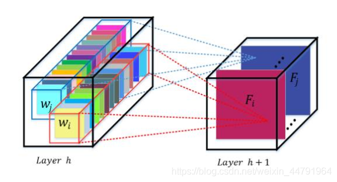
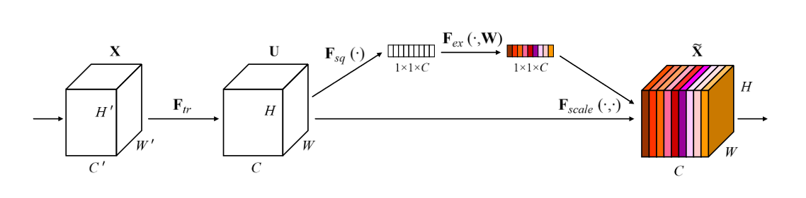
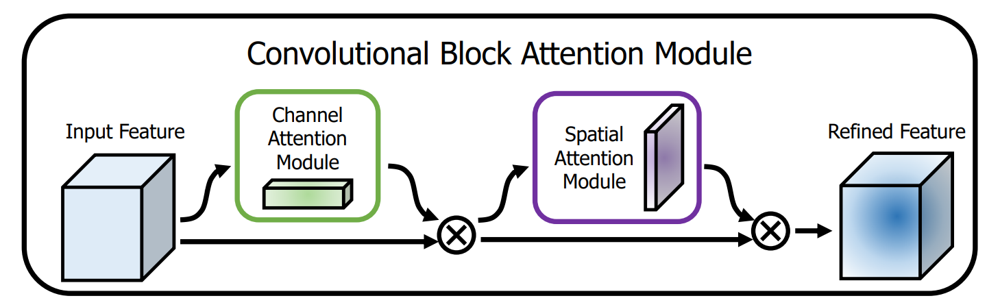
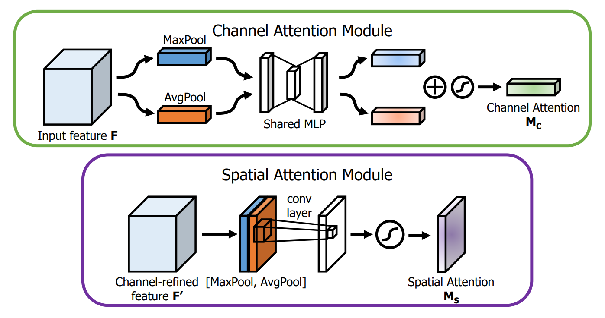
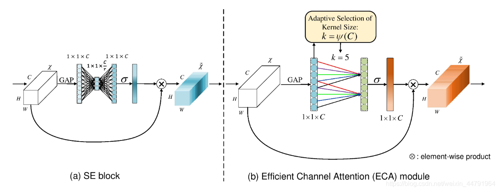
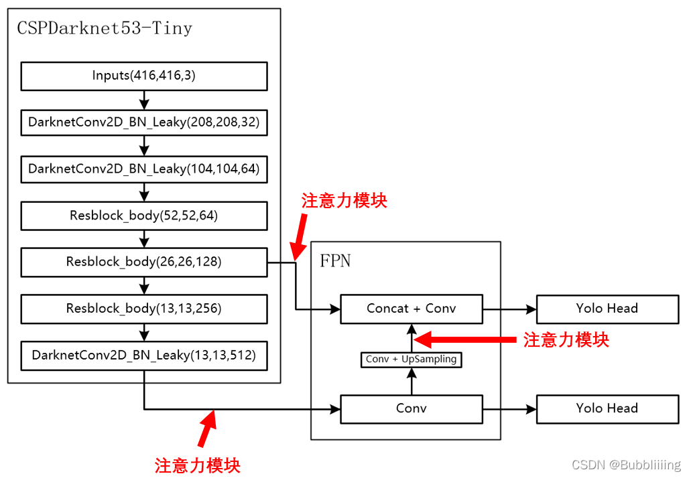

# 什么是注意力机制

注意力机制是**深度学习常用的一个小技巧**，它有多种多样的实现形式，尽管实现方式多样，但是**每一种注意力机制的实现的核心**都是类似的，就是**注意力**。

**注意力机制的核心重点就是让网络关注到它更需要关注的地方**。

当我们使用卷积神经网络去处理图片的时候，**我们会更希望卷积神经网络去注意应该注意的地方，而不是什么都关注**，我们不可能手动去调节需要注意的地方，这个时候，如何让**卷积神经网络去自适应的注意重要的物体**变得极为重要。

**注意力机制**就是实现**网络自适应注意**的一个方式。

> 空间注意力: 注意某一个区域的特征,一个框
>
> 通道注意力: 注意某一个通道

一般而言，注意力机制可以分为通道注意力机制，空间注意力机制，以及二者的结合。



# 代码下载

Github源码下载地址为：
https://github.com/bubbliiiing/yolov4-tiny-pytorch

# 注意力机制的实现方式

在深度学习中，常见的注意力机制的实现方式有SENet，CBAM，ECA等等。

## 1、SENet 通道注意力

SENet是通道注意力机制的典型实现。

2017年提出的SENet是最后一届ImageNet竞赛的冠军，其实现示意图如下所示，对于输入进来的特征层，我们关注其每一个通道的权重，对于SENet而言，**其重点是获得输入进来的特征层，每一个通道的权值**。利用SENet，我们可以让网络关注它最需要关注的通道。

其具体实现方式就是：

1. 对输入进来的**特征层进行全局平均池化**。
2. 然后进行两次全连接，第一次**全连接神经元个数较少**，第二次**全连接神经元个数和输入特征层相同**。
3. 在完成两次全连接后，我们再取一次Sigmoid将值固定到0-1之间，此时我们获得了**输入特征层每一个通道的权值**（0-1之间）。
4. 在获得这个权值后，我们将**这个权值乘上原输入特征层即可。**



实现代码如下：

```python
#---------------------------------------------------#
#   se,通道注意力
#   特征层高宽全局平均池化,进行两次全连接层,第一次降低特征数,第二次还原特征数,进行sigmoid变换到0~1之间
#   最后将原值和输出结果相乘
#---------------------------------------------------#
class se_block(nn.Module):
    def __init__(self, channel, ratio=16):
        super().__init__()
        self.avg_pool = nn.AdaptiveAvgPool2d(1)
        self.fc = nn.Sequential(
                #---------------------------------------------------#
                #   降低通道
                #---------------------------------------------------#
                nn.Linear(channel, channel // ratio, bias=False),
                nn.ReLU(inplace=True),
                nn.Linear(channel // ratio, channel, bias=False),
                nn.Sigmoid()
        )

    def forward(self, x):
        b, c, _, _ = x.size()
        y = self.avg_pool(x).view(b, c)
        y = self.fc(y).view(b, c, 1, 1)
        return x * y


#---------------------------------------------------#
#   pytorch自带的se
#   两个1x1Conv代替全连接层,不需要变换维度
#---------------------------------------------------#
class SqueezeExcitation(nn.Module):
    def __init__(
        self,
        input_channels:   int,  # in_channels&out_channels
        squeeze_channels: int,  # 中间维度,是输入block维度的1/4
        activation       = nn.ReLU,
        scale_activation = nn.Sigmoid,
    ) -> None:
        super().__init__()
        self.avgpool = nn.AdaptiveAvgPool2d(1)
        # 两个卷积作为全连接层,kernel为1
        self.fc1 = nn.Conv2d(input_channels, squeeze_channels, 1)
        self.activation = activation()
        self.fc2 = nn.Conv2d(squeeze_channels, input_channels, 1)
        self.scale_activation = scale_activation()

    def _scale(self, input: Tensor) -> Tensor:
        # [batch, channel, height, width] -> [batch, channel, 1, 1]
        scale = self.avgpool(input)
        scale = self.fc1(scale)
        scale = self.activation(scale)
        scale = self.fc2(scale)
        return self.scale_activation(scale)

    def forward(self, input: Tensor) -> Tensor:
        scale = self._scale(input)
        # [batch, channel, 1, 1] * [batch, channel, height, width]
        # 高维度矩阵相乘是最后两个维度相乘,所以是 [1, 1] 点乘 [h, w]
        return scale * input
```

## 2、CBAM 通道和空间注意力

CBAM将**通道注意力机制和空间注意力机制**进行一个结合，相比于**SENet只关注通道的注意力机制**可以取得更好的效果。其实现示意图如下所示，CBAM会对输入进来的特征层，分别进行**通道注意力机制的处理和空间注意力机制的处理**。



下图是**通道注意力机制和空间注意力机制**的具体实现方式：

> channel: 在宽高做处理
>
> 图像的上半部分为**通道注意力机制**，**通道注意力机制的实现**可以分为**两个部分**
>
> 我们会对输入进来的**单个特征层**，分别进行**全局平均池化**和**全局最大池化**。
>
> 之后对**平均池化**和**最大池化**的结果，利用**共享的全连接层**进行处理
>
> 我们会对**处理后的两个结果**进行相加，然后取一个sigmoid，此时我们获得了**输入特征层每一个通道的权值**（0-1之间）。
>
> 在获得这个权值后，我们将**这个权值乘上原输入特征层即可。**

> pixel: 在每个点上做处理
>
> 图像的下半部分为**空间注意力机制**，
>
> 我们会对输入进来的特征层，在**每一个特征点的通道上取最大值和平均值**。
>
> 之后将这两个结果进行一个堆叠，利用一次**输出通道数为1的卷积调整通道数**，然后取一个**sigmoid**，
>
> 此时我们获得了**输入特征层每一个特征点的权值**（0-1之间）。
>
> 在获得这个权值后，我们将**这个权值乘上原输入特征层即可。**
>
> 不关注通道数量,所以不用给channel



实现代码如下：

```python
#---------------------------------------------------#
#   cbam通道注意力
#   将输入内容在宽高上分别进行平均池化和最大池化,然后经过共用的两个全连接层,然后将两个结果相加,取sigmoid,最后和原值相乘
#---------------------------------------------------#
class ChannelAttention(nn.Module):
    def __init__(self, channel, ratio=8):
        super().__init__()
        self.avg_pool = nn.AdaptiveAvgPool2d(1)
        self.max_pool = nn.AdaptiveMaxPool2d(1)

        # 利用1x1卷积代替全连接
        self.fc  = nn.Sequential(
            nn.Conv2d(channel, channel // ratio, 1, bias=False),
            nn.ReLU(),
            nn.Conv2d(channel // ratio, channel, 1, bias=False)
        )
        self.sigmoid = nn.Sigmoid()

    def forward(self, x):
        # 将输入内容分别进行平均池化和最大池化,然后经过共用的两个全连接层
        avg_out = self.fc(self.avg_pool(x))
        max_out = self.fc(self.max_pool(x))
        # 将两个结果相加,取sigmoid
        out     = avg_out + max_out
        return self.sigmoid(out)

#---------------------------------------------------#
#   cbam空间注意力
#   不关注通道数量,所以不用给channel
#   在每一个特征点的通道上取最大值和平均值。
#   之后将这两个结果进行一个堆叠，利用一次输出通道数为1的卷积调整通道数，然后取一个sigmoid
#   在获得这个权值后，我们将这个权值乘上原输入特征层即可。
#   b, c, h, w -> b, 1, h, w
#---------------------------------------------------#
class SpatialAttention(nn.Module):
    def __init__(self, kernel_size=7):
        super().__init__()

        assert kernel_size in (3, 7), 'kernel size must be 3 or 7'
        padding = 3 if kernel_size == 7 else 1
        self.conv = nn.Conv2d(2, 1, kernel_size, padding=padding, bias=False)
        self.sigmoid = nn.Sigmoid()

    def forward(self, x):
        # b, c, h, w -> b, 1, h, w
        avg_out = torch.mean(x, dim=1, keepdim=True)
        # b, c, h, w -> b, 1, h, w
        max_out, _ = torch.max(x, dim=1, keepdim=True)      # 注意 torch.max(x, dim, keepdim=True) 返回值和下标
        # b, 1, h, w + b, 1, h, w -> b, 2, h, w
        x = torch.cat([avg_out, max_out], dim=1)
        # b, 2, h, w -> b, 1, h, w
        x = self.conv(x)
        return self.sigmoid(x)

#---------------------------------------------------#
#   cbam: 通道+空间注意力
#   先进行通道,再进行宽高
#---------------------------------------------------#
class cbam_block(nn.Module):
    def __init__(self, channel, ratio=8, kernel_size=7):
        super().__init__()
        self.channelattention = ChannelAttention(channel, ratio=ratio)
        self.spatialattention = SpatialAttention(kernel_size=kernel_size)

    def forward(self, x):
        x = x * self.channelattention(x)
        x = x * self.spatialattention(x)
        return x
```

## 3、ECA SENet的改进版

ECANet是也是通道注意力机制的一种实现形式。ECANet可以看作是SENet的改进版。

ECANet的作者认为**SENet对通道注意力机制的预测带来了副作用**，**捕获所有通道的依赖关系是低效并且是不必要的**。

在ECANet的论文中，作者认为**卷积具有良好的跨通道信息获取能力**。

> ECA模块的思想是非常简单的，它去除了原来SE模块中的全连接层，直接在全局平均池化之后的特征上通过一个1D卷积进行学习。
>
> 既然使用到了1D卷积，那么**1D卷积的卷积核大小的选择就变得非常重要了**，了解过卷积原理的同学很快就可以明白，1D卷积的卷积核大小**会影响注意力机制每个权重的计算要考虑的通道数量**。用更专业的名词就是**跨通道交互的覆盖率**。
>
> 全连接层使用上一层全部数据得到下一层的全部数据
>
> 1D卷积使用上一层的n个数据得到下一层的全部数据,减少计算量

如下图所示，左图是常规的SE模块，右图是ECA模块。ECA模块用1D卷积替换两次全连接。




实现代码如下：

```python
#---------------------------------------------------#
#   eca
#   去除原来SE模块中的全连接层，直接在全局平均池化之后的特征上通过一个1D卷积进行学习
#   全连接层使用上一层全部数据得到下一层的全部数据
#   1D卷积使用上一层的n个数据得到下一层的全部数据,减少计算量
#---------------------------------------------------#
class eca_block(nn.Module):
    def __init__(self, channel, b=1, gamma=2):
        super(eca_block, self).__init__()
        kernel_size = int(abs((math.log(channel, 2) + b) / gamma))
        kernel_size = kernel_size if kernel_size % 2 else kernel_size + 1

        self.avg_pool = nn.AdaptiveAvgPool2d(1)
        # 1d卷积,特征长条上进行特征提取
        self.conv = nn.Conv1d(1, 1, kernel_size=kernel_size, padding=(kernel_size - 1) // 2, bias=False)
        self.sigmoid = nn.Sigmoid()

    def forward(self, x):
        y = self.avg_pool(x)
        # b, c, 1, 1 -> b, c, 1 -> b, 1, c 进行1D卷积 对C进行计算,相当于得到每个通道的权重
        # b, 1, c -> b, c, 1 -> b, c, 1, 1
        y = self.conv(y.squeeze(-1).transpose(-1, -2).contiguous()).transpose(-1, -2).contiguous().unsqueeze(-1)
        y = self.sigmoid(y)
        return x * y.expand_as(x)
```

# 注意力机制的应用

**注意力机制是一个即插即用的模块，理论上可以放在任何一个特征层后面**，可以放在主干网络，也可以放在加强特征提取网络。

由于放置在主干会导致网络的预训练权重无法使用，本文以YoloV4-tiny为例，将注意力机制应用加强特征提取网络上。

如下图所示，我们在主干网络提取出来的**两个有效特征层上增加了注意力机制**，同时**对上采样后的结果增加了注意力机制**。



实现代码如下：

```python
attention_block = [se_block, cbam_block, eca_block]

#---------------------------------------------------#
#   yolo_body
#---------------------------------------------------#
class YoloBody(nn.Module):
    def __init__(self, anchors_mask, num_classes, phi=0, pretrained=False):
        super().__init__()
        self.phi            = phi
        self.backbone       = darknet53_tiny(pretrained)

        #---------------------------------------------------#
        #   feat2经过一次卷积就得到P5,然后直接进入yolo_head
        #---------------------------------------------------#
        self.conv_for_P5    = BasicConv(512, 256, 1)
        self.yolo_headP5    = yolo_head([512, len(anchors_mask[0]) * (5 + num_classes)], 256)

        #---------------------------------------------------#
        #   P5上采样和feat1拼接后没有5次卷积,直接进入yolo_head
        #---------------------------------------------------#
        self.upsample       = Upsample(256, 128)
        self.yolo_headP4    = yolo_head([256, len(anchors_mask[1]) * (5 + num_classes)], 384)

        #---------------------------------------------------#
        #   特征层->最后的输出添加
多种注意力机制
        #---------------------------------------------------#
        if 1 <= self.phi and self.phi <= 3:
            self.feat1_att      = attention_block[self.phi - 1](256)
            self.feat2_att      = attention_block[self.phi - 1](512)
            self.upsample_att   = attention_block[self.phi - 1](128)

    def forward(self, x):
        #---------------------------------------------------#
        #   生成CSPdarknet53_tiny的主干模型
        #   feat1的shape为 26,26,256
        #   feat2的shape为 13,13,512
        #---------------------------------------------------#
        feat1, feat2 = self.backbone(x)
        if 1 <= self.phi and self.phi <= 3:
            feat1 = self.feat1_att(feat1)
            feat2 = self.feat2_att(feat2)

        #---------------------------------------------------#
        #   feat2经过一次卷积就得到P5,然后直接进入yolo_head
        #   13,13,512 -> 13,13,256
        #---------------------------------------------------#
        P5 = self.conv_for_P5(feat2)
        #   13,13,256 -> 13,13,512 -> 13,13,75  75 = 3 * (25 + 1 + 4)
        out0 = self.yolo_headP5(P5)

        #---------------------------------------------------#
        #   P5上采样和feat1拼接后没有5次卷积,直接进入yolo_head
        #   13,13,256 -> 13,13,128 -> 26,26,128
        #---------------------------------------------------#
        P5_Upsample = self.upsample(P5)
        if 1 <= self.phi and self.phi <= 3:
            P5_Upsample = self.upsample_att(P5_Upsample)
        #   26,26,256 + 26,26,128 -> 26,26,384
        P4 = torch.cat([P5_Upsample, feat1], axis=1)
        #   26,26,384 -> 26,26,256 -> 26,26,75  75 = 3 * (25 + 1 + 4)
        out1 = self.yolo_headP4(P4)

        #---------------------------------------------------#
        #   13,13,75
        #   26,26,75
        #---------------------------------------------------#
        return out0, out1
```

