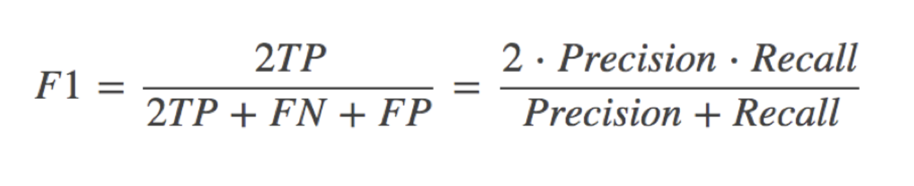

# 混淆矩阵

> x轴代表真实类别
>
> y轴代表预测类别
>
> **交叉代表真实类别被预测为了哪一类,对角线代表真实类别,尽可能让数据在对角线上**
>
> 

# 准确率,精确率与召回率

## 混淆矩阵

> T:   Ture	P:  Positive	F:  False	N:  Negative
>
> 在分类任务下，预测结果(Predicted Condition)与正确标记(True Condition)之间存在四种不同的组合，构成混淆矩阵(适用于多分类)

T是True；

F是False；

P是Positive；

N是Negative。

T或者F代表的是该样本 是否被正确分类。

P或者N代表的是该样本 被预测成了正样本还是负样本。

TP（True Positives）意思就是被分为了正样本，而且分对了。

TN（True Negatives）意思就是被分为了负样本，而且分对了，

FP（False Positives）意思就是被分为了正样本，但是分错了（事实上这个样本是负样本）。

FN（False Negatives）意思就是被分为了负样本，但是分错了（事实上这个样本是这样本）。

## 准确率

> (TP+TN) / (TP+TN+FP+FN)     查的对不对
>
> 正确 / 全部

## 精确率(Precision)与召回率(Recall)

> **在某些情况下精确率越高,召回率越低**

- 精确率：预测结果为正例样本中真实为正例的比例（了解）

- 召回率：真实为正例的样本中预测结果为正例的比例（查得全，对正样本的区分能力）

## F1-score

还有其他的评估标准，F1-score，反映了模型的稳健型

# 混淆矩阵实例 

## 准确率

## 精确率 查的对不对

## 召回率 查的全不全

## 特异度 nagetive的召回率

> 认为不是的是不是都对

